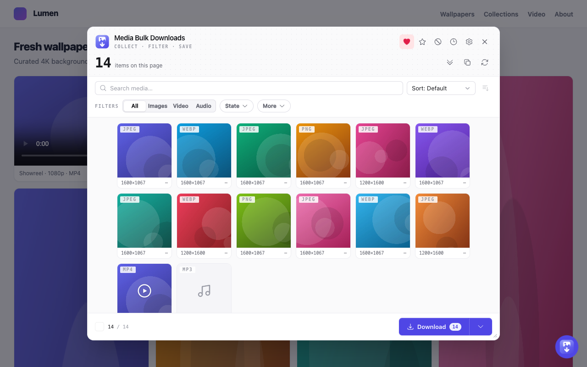

<div align="center">


# Media Bulk Downloads

**Grab every image, video, and audio file on a page — filter, preview, and download in bulk.**
Fast, network-free by default, and built for Chrome, Firefox, Edge, and Safari from one codebase.

[](https://chromewebstore.google.com/detail/media-bulk-downloads/jmdhkdengijmmkelofaleinbipophckn)
[](https://microsoftedge.microsoft.com/addons/detail/media-bulk-downloads/ihhhecmabfocelgmjafijchhhlpdlnll)
[](https://addons.mozilla.org/en-US/firefox/addon/media-bulk-downloads/)
[](https://extensionlaunch.com/product/media-bulk-downloads-jmdhkd)
[](./LICENSE)
[](https://developer.chrome.com/docs/extensions/develop/migrate)
[](./CONTRIBUTING.md)
[](https://github.com/mralaminahamed/media-bulk-downloads/actions/workflows/test.yml)
[](https://github.com/mralaminahamed/media-bulk-downloads/actions/workflows/extension-ci.yml)
[](https://github.com/mralaminahamed/media-bulk-downloads/actions/workflows/release.yml)



</div>

---

## What it does

Your browser's **Save image as…** grabs one file at a time and never sees lazy-loaded
images, responsive `srcset` sources, CSS backgrounds, or gallery links. Media Bulk
Downloads scans the whole page, gathers every image, video, and audio file it can find,
upgrades thumbnails to their originals, and lets you **filter, preview, and download the
lot** — one click for one file, one click for the entire filtered set.

It reads only what the page already loaded, so nothing leaves your device.

## Features

**Finds what the browser misses**
- Lazy-loaded images (`data-src`, `data-lazy-src`, WordPress `data-orig-file` /
  `data-large-file` originals, and other `data-*` sources)
- Responsive `srcset` / `<picture>` sources and `<noscript>` fallbacks
- CSS `background-image` URLs, including `image-set()` (highest-resolution candidate)
- Media inside **open Shadow DOM** (web components) and **same-origin iframes**
- `og:image` / `twitter:image` and `<link rel=preload as=image>` hero images
- Gallery `<a href>` links (Reddit, Wallhaven, and similar)
- Direct-file `<video>` and `<audio>` sources, plus direct `og:video` mp4s (news,
  product, and embed pages that expose the file only in a meta tag)
- **HLS streams** (`.m3u8`) exposed in the page **or fetched by its player**
  (`hls.js`, via a passive network sniffer) — captured (manifest + segments
  fetched, AES-128 decrypted, assembled into one `.ts`/`.mp4`). DRM and live
  streams are refused; see [Capture below](#hls--dash-stream-capture)
- **YouTube video posters** — an embedded player `<iframe>` or a link to a video
  (`watch`, `youtu.be`, `/embed`, `/shorts`, `/live`, `youtube-nocookie`) becomes
  its downloadable poster thumbnail, even with no `` on the page

**Upgrades to original quality**
- **De-proxies** wrapped URLs (Next.js `_next/image` — absolute and relative —
  weserv, Cloudinary fetch)
- **CDN upgrades** thumbnails to full size (Twitter/X `name=orig`, YouTube
  `hqdefault`, Pinterest `/originals/`, Google `=s0`, and 50+ more families)
- **Deep scan** — an opt-in, bounded auto-scroll that surfaces virtualized and
  infinite-scroll media (it scrolls the page and any nested scroll panes; the page
  loads its own media). Its limits — max items, time, and scroll steps — are
  configurable in Settings, it tells you when a limit stopped it early, and it can
  optionally click **“Load more”** buttons (off by default)
- **Resolve originals** — an optional setting that fetches the exact
  highest-resolution file from supported hosts (off by default)

**Filters and downloads cleanly**
- Filter by **kind** (image / video / audio), **format** (jpg, png, gif, webp, mp4,
  webm, mp3…), and **size**
- **Search** the grid by filename, alt text, type, or URL, and **sort** by name,
  size, dimensions, or type — handy on pages with hundreds of items
- **Find near-duplicates** — an on-demand perceptual-hash (pHash) pass that hides
  lower-resolution copies of the same image, keeping the largest; reversible via
  the **Duplicates** filter, with a configurable similarity threshold in Settings
- **Collect across tabs** — pull media from **all** or **selected** open tabs in a
  single pass and download the combined set, each file tagged with its own source
  tab (tab picker in the popup)
- Download one item or the entire filtered set — as separate files or bundled
  into a single **ZIP archive** (same folder layout inside; items a CDN blocks
  fall back to individual downloads automatically)
- Correct file extensions (never a `.jpg` on a real `.png`)
- Optional **format conversion** on download — re-encode raster images (incl.
  WebP/AVIF) to **PNG** or **JPEG** (Settings → Downloads). Embedded **EXIF/XMP
  metadata is preserved** by default across the re-encode (copyright, author,
  capture info); switch to **Strip** to intentionally remove it (e.g. GPS)
- Configurable naming scheme and a **download-path template** — `{host}`,
  `{domain}`, `{date}`, `{kind}` tokens save each site to its own folder
- **Copy or export links** — copy the shown/selected URLs to the clipboard, or
  export them as a `.txt`, from the download button's menu
- **Download queue** — batches run through a persistent queue with a popup panel;
  it survives closing the popup and resumes interrupted items
- **Download history** with open-file, reveal-in-folder, and re-download actions
- **Favourites** — star media to a saved list that persists across sessions,
  re-downloadable anytime
- **Backup & restore** — export your settings, favourites, and history to a JSON
  file and import it back (Settings → Backup)
- **Reset & clear** — reset all settings to defaults, or clear all local data
  (history, favourites, blocked sources) in one step (Settings → Data)

**Private by design**
- **Network-free by default** — collection reads only what the page already loaded
- No accounts, no analytics, no servers; settings and history never leave your device
- Full policy in [PRIVACY.md](./PRIVACY.md)

## Install

**Store availability** — where you can install it today. Opera and Safari
submissions are in the stores' review queues and will go live once approved:

| Store                            | Status          | Get it                                                                                                     |
|----------------------------------|-----------------|------------------------------------------------------------------------------------------------------------|
| Chrome Web Store                 | ✅ Live          | [Install](https://chromewebstore.google.com/detail/media-bulk-downloads/jmdhkdengijmmkelofaleinbipophckn)  |
| Firefox Add-ons (AMO)            | ✅ Live          | [Install](https://addons.mozilla.org/en-US/firefox/addon/media-bulk-downloads/)                            |
| Microsoft Edge Add-ons           | ✅ Live          | [Install](https://microsoftedge.microsoft.com/addons/detail/media-bulk-downloads/ihhhecmabfocelgmjafijchhhlpdlnll) |
| Opera Add-ons                    | 🕓 Under review  | Chromium build works meanwhile — install from the Chrome Web Store                                          |
| Safari (Mac App Store)           | 🕓 Under review  | macOS wrapper submitted; see the [Safari note](#build--package) below                                      |

**From the Chrome Web Store** —
[**install Media Bulk Downloads**](https://chromewebstore.google.com/detail/media-bulk-downloads/jmdhkdengijmmkelofaleinbipophckn),
one click, no account. Other Chromium browsers (Brave, Opera, Vivaldi) can install the
Chrome build too.

**From Firefox Add-ons (AMO)** —
[**install Media Bulk Downloads**](https://addons.mozilla.org/en-US/firefox/addon/media-bulk-downloads/)
for Firefox 140+.

**From the Microsoft Edge Add-ons store** —
[**install Media Bulk Downloads**](https://microsoftedge.microsoft.com/addons/detail/media-bulk-downloads/ihhhecmabfocelgmjafijchhhlpdlnll),
one click, no account.

**From source** — requires **Node 20.19+** and Corepack Yarn (`.nvmrc` pins 22). The
build runs on [WXT](https://wxt.dev), which targets every browser from one codebase:

```bash
git clone https://github.com/mralaminahamed/media-bulk-downloads.git
cd media-bulk-downloads
corepack enable
yarn install
yarn dev            # Chrome: builds apps/extension/.output/chrome-mv3 and auto-reloads on change
# yarn dev:firefox  # Firefox: builds apps/extension/.output/firefox-mv3 and opens a dev profile
```

`yarn dev` opens a browser with the extension loaded. To load a build by hand:
open `chrome://extensions`, enable **Developer mode**, click **Load unpacked**, and
select `apps/extension/.output/chrome-mv3`.

## Build & package

WXT produces an MV3 build and a store-ready zip per browser:

```bash
yarn build:all      # chrome · firefox · edge  → apps/extension/.output/<browser>-mv3
yarn zip:all        # store zips for all three  → apps/extension/.output/*.zip
```

| Store                  | Upload                                                            |
|------------------------|-------------------------------------------------------------------|
| Chrome Web Store       | `media-bulk-downloads-<version>-chrome.zip`                       |
| Microsoft Edge Add-ons | `media-bulk-downloads-<version>-edge.zip`                         |
| Firefox Add-ons (AMO)  | `media-bulk-downloads-<version>-firefox.zip` + the `-sources.zip` |

Per-browser scripts (`build:firefox`, `zip:edge`, …) exist too. Validate the Firefox
package with `yarn lint:firefox`. To load it by hand:
`about:debugging#/runtime/this-firefox` → **Load Temporary Add-on…** → pick
`apps/extension/.output/firefox-mv3/manifest.json`.

> **Safari** ships as a native macOS wrapper (`apps/safari-native/`, generated by
> `safari-web-extension-converter`) around the `yarn build:safari` output
> (`apps/extension/.output/safari-mv3`); the extension code targets Safari through
> the `@mbd/platform` capability seam. The Mac App Store submission is **under
> review** — not yet live. Building and submitting it require macOS + Xcode. See
> [#307](https://github.com/mralaminahamed/media-bulk-downloads/issues/307) and
> [`docs/store-submissions/SAFARI_APPSTORE.md`](./docs/store-submissions/SAFARI_APPSTORE.md).

## Usage

1. **Click the toolbar icon** on any page — the popup opens and scans for media.
2. **Browse the grid** — hover to preview, click a tile for the full-size view.
3. **Filter** by kind, format, or file size — or **search** and **sort** the grid
   from the row above the filters.
4. **Download** one item (click it) or every filtered item (**Download all**).
   Use the button's caret to grab the set **As ZIP archive** instead of separate
   files.
5. **Deep scan** (optional) — trigger the auto-scroll to pull in media on
   infinite-scroll pages. Tune its limits — and enable optional **“Load more”**
   clicking — under **Settings → Deep scan**.

Prefer to stay on the page? The optional **on-page bubble** gives you the same tools in
a draggable panel without opening the toolbar popup.

In a hurry? **Right-click** anywhere for **Download all media on this page**, or right-click
an image for **Download image (original quality)** and **Add image to Favourites** — no popup needed.

**Keyboard shortcuts** (rebind at `chrome://extensions/shortcuts`):

| Shortcut | Action |
|----------|--------|
| `Ctrl/⌘ + Shift + M` | Open the popup |
| `Ctrl/⌘ + Shift + Y` | Download all media on the current page |

## Permissions

| Permission       | Why it's needed                                                           |
|------------------|---------------------------------------------------------------------------|
| `downloads`      | Save selected media via the browser's download manager                    |
| `downloads.open` | Open a downloaded file from the in-app history                            |
| `storage`        | Keep your settings and download history locally on your device            |
| `tabs`           | Read the active tab's URL/title to label downloads and open a source page |
| `contextMenus`   | Add right-click actions (download all / this image, add to favourites)    |
| `offscreen`      | Assemble HLS/DASH video streams (fetch + join segments) in the background  |
| `<all_urls>`     | Read media on whatever page you run the extension on                      |

Optional (requested only when you turn the feature on, never at install):

| Permission             | Why it's needed                                                                          |
|------------------------|------------------------------------------------------------------------------------------|
| `notifications`        | Show a desktop toast when a download batch finishes (Settings → Downloads)                |
| `declarativeNetRequestWithHostAccess` | Retry a hotlink-blocked download (HTTP 403) with the source page as `Referer` — requested only when you use "Retry w/ referer" on a failed item, and used only for that one request |

## Supported sites

The engine works on **any website** through its generic pipeline — `srcset` /
`<picture>`, de-proxying, and 90+ CDN-family upgrade rules. On top of that it ships
**dedicated per-site resolvers** for platforms where the original hides behind page
JSON, signed CDNs, or embeds. A representative selection:

| Category            | Sites                                                                          |
|---------------------|--------------------------------------------------------------------------------|
| Social              | Twitter/X · Instagram · Facebook · Threads · Bluesky · Mastodon · Reddit · Pinterest · Xiaohongshu/RED · VK · Odnoklassniki |
| Video & audio       | YouTube · Vimeo · Dailymotion · Twitch · Kick · SoundCloud · PeerTube · Coub · Loom |
| Art & photography   | Pixiv · ArtStation · Behance · DeviantArt · Flickr · Unsplash · Pexels · Wallhaven · Civitai · WikiArt · Inkbunny · Itaku |
| Reference & wiki    | Wikipedia · Wikimedia Commons · any MediaWiki wiki                             |
| Manga & comics      | MangaDex (full-resolution chapter pages)                                       |
| E-commerce          | Amazon · eBay · Etsy · Walmart · Shopify stores · AliExpress                   |
| News & publishing   | BBC · NYT · Der Spiegel · Arc XP publishers · self-hosted WordPress            |
| Gaming              | Steam (community screenshots & artwork)                                       |
| Image hosts         | imgur · Image Chest · Tenor · Postimages · and more                           |
| Creator platforms   | Patreon · Pixiv Fanbox                                                         |

…plus **100+ more sites and CDN families**. The full, live-verified list — every
site, its upgrade mechanism, and how coverage was established — is the
[**coverage matrix**](./docs/website/src/content/docs/benchmark/coverage-matrix.md).

> **A note on how coverage is verified.** Most sites here were recon'd and
> validated by **AI agents** — probing the live site, comparing byte sizes, and
> confirming the upgrade mechanism — rather than exhaustively hand-tested by a
> person. Sites change their markup and CDNs without notice, so a resolver that
> worked at validation time can drift. If a site stops resolving correctly,
> please [open an issue](https://github.com/mralaminahamed/media-bulk-downloads/issues).

## HLS & DASH stream capture

When a page exposes an adaptive-streaming manifest — **HLS** (`.m3u8`) or **DASH**
(`.mpd`) — via a native `<video>`/`<source>`, an `og:video`, or a direct link, it
appears in the grid tagged **HLS · capture**. **Capture** fetches the manifest and every
segment, decrypts standard **AES-128** where present, and assembles them into a
single file: MPEG-TS `.ts` or `.mp4` for video (audio muxed in), or `.m4a` / AAC for
audio-only streams — which can optionally be **transcoded to MP3** (128 / 192 /
320 kbps) instead of the M4A passthrough (Settings → Stream capture). It selects
the variant closest to 720p by default — change this
under **Settings → Stream capture quality** (auto / best / worst / 1080 / 720 / 480) —
and runs in the background service worker plus a hidden **offscreen document**, so
capture keeps running even if you close the popup.

**Not captured, by design:** **DRM** (Widevine / PlayReady / FairPlay,
`SAMPLE-AES`) and **live** streams — capturing them would breach the stream's DRM
and Chrome Web Store policy. Streams larger than the ~1 GB size cap report a
message rather than exhausting memory.

Streams are found two ways: in the page DOM, and via a passive, MAIN-world
**network sniffer** that notes the `.m3u8` manifests `hls.js` / native players
fetch over XHR — the common modern case, where the manifest never touches the
DOM. The sniffer only observes request URLs (never response bodies) and forges no
requests of its own.

## Tech stack

- **[WXT](https://wxt.dev)** — multi-browser MV3 build (Chrome · Firefox · Edge · Safari)
  from one codebase, with dev auto-reload and per-browser zips
- **React 19** + **TypeScript** — type-safe UI
- **Tailwind CSS v4** — utility-first styling on a small design-token system
- **Vite** (via WXT) — fast bundling
- **Vitest** + **Testing Library** — unit/integration suite; each package runs as its own
  project (`packages/*/tests/`) with per-package coverage, the app under `apps/extension/tests/unit/`
- **Playwright** — end-to-end tests under `apps/extension/tests/e2e/` that load the built
  extension in real Chromium and drive the on-page bubble (`yarn test:e2e`)
- **web-ext** — Firefox package validation

## Dependencies

Media Bulk Downloads runs **entirely inside your browser**. It does **not** use
**Scrapfly**, any third-party scraping API, or an external proxy service — no request
is ever routed through a server operated by us or anyone else. There is no backend.

- **Collection is network-free by default** — it reads the media already present in
  the page's DOM. The optional HLS sniffer only *observes* the manifest URLs a player
  fetches (URLs only, never response bodies) and forges no requests of its own.
- **When it does fetch** — the opt-in *Resolve originals* setting and HLS/DASH
  **Capture** — it uses the browser's built-in `fetch`/XHR to request the file
  **directly from the site's own origin/CDN**, with no intermediary.
- **Saving** goes through the browser's own download manager (`chrome.downloads`).

The only runtime libraries bundled are small, pure-in-browser helpers — no HTTP
client, no headless browser:

| Package                | Role                                                |
|------------------------|-----------------------------------------------------|
| `fflate`               | ZIP archive assembly (in-memory)                    |
| `mp4box`               | MP4 muxing for assembled video streams              |
| `@breezystack/lamejs`  | MP3 transcoding for captured audio                  |
| `idb-keyval`           | IndexedDB storage for settings / history / favourites |
| `react` / `react-dom`  | popup and on-page-bubble UI                         |
| `@heroicons/react`     | UI icons                                            |

Everything else in the repo is build / test tooling (see [Tech stack](#tech-stack)),
not a runtime dependency.

## Project structure

A **yarn-workspaces monorepo** — three browser-agnostic packages consumed by one
WXT app (import direction: app → storage/platform → core):

- **`packages/core`** (`@mbd/core`) — collection, resolvers (+ sniffers), download
  byte-logic, net, types. **Zero `chrome.*`.**
- **`packages/storage`** (`@mbd/storage`) — settings, history, favourites, excluded,
  queue over `chrome.storage` + IndexedDB.
- **`packages/platform`** (`@mbd/platform`) — browser-capability contracts + detection.
- **`apps/extension`** (`@mbd/extension`) — the WXT app (Chrome · Firefox · Edge ·
  Safari): entrypoints, background, popup, content, bubble, offscreen.

Each package/app carries its own README; the full design record is the
[monorepo restructure](./docs/architecture/monorepo-restructure.md).

## Documentation

📖 **Docs site:** **<https://mralaminahamed.github.io/media-bulk-downloads/>** — the
guides and benchmark below, published from [`docs/website/`](./docs/website/) (Astro
Starlight). Browse the source pages directly here too:

| Guide                                                       |                                                |
|-------------------------------------------------------------|------------------------------------------------|
| [Getting Started](./docs/website/src/content/docs/getting-started/quick-start.md)         | Install, build, load unpacked, first use       |
| [Architecture](./docs/website/src/content/docs/how-it-works/architecture.md)               | Surfaces, modules, message catalog, data model |
| [Collection Pipeline](./docs/website/src/content/docs/how-it-works/collection-pipeline.md) | Discovery → de-proxy → CDN-upgrade → dedup     |
| [Resolve Originals](./docs/website/src/content/docs/how-it-works/resolve-originals.md)     | Opt-in per-host fetch for the exact original   |
| [Deep Scan](./docs/website/src/content/docs/guides/deep-scan.md)                     | The opt-in auto-scroll workflow and its bounds |
| [Download](./docs/website/src/content/docs/guides/download.md)                       | Filename construction and the save flow        |
| [Download paths](./docs/website/src/content/docs/guides/download-paths.md)           | Per-site folder templates ({host}/{domain}/…)  |
| [Download History](./docs/website/src/content/docs/guides/history.md)                | The download log and its open/reveal actions   |
| [Favourites](./docs/website/src/content/docs/guides/favourites.md)                   | Star media to a saved, persistent list         |
| [Badge](./docs/website/src/content/docs/how-it-works/badge.md)                             | The per-tab media count on the toolbar icon    |
| [In-page Bubble](./docs/website/src/content/docs/guides/bubble.md)                   | The Shadow-DOM launcher lifecycle              |

**Reference:** [Changelog](./CHANGELOG.md) — release history ·
[Feature one-pager](./docs/marketing/one-pager.md) — at-a-glance overview ·
[Collection Benchmark](./docs/website/src/content/docs/benchmark/overview.md) — live, reproducible upgrade measurements
([`docs/website/src/content/docs/benchmark/`](./docs/website/src/content/docs/benchmark/) for the per-topic breakdown) ·
[Coverage matrix](./docs/website/src/content/docs/benchmark/coverage-matrix.md) — every supported site + its upgrade rule ·
[Monorepo restructure](./docs/architecture/monorepo-restructure.md) — packages/app design record

## Contributing

Contributions are welcome — please read the [Contributing Guide](./CONTRIBUTING.md) first.
Before opening a PR, make sure the full gate passes:

```bash
yarn type-check && yarn lint && yarn test && yarn build
```

The end-to-end suite runs separately (it builds and loads the extension in real
Chromium):

```bash
yarn test:e2e          # headless
yarn test:e2e:headed   # visible browser
```

## Security

Found a vulnerability? See [SECURITY.md](./SECURITY.md) for private disclosure.

## Support

Media Bulk Downloads is free and open source. If it saves you time, you can help:

- **Sponsor** — via the **Sponsor** button on this repo, or directly at
  [alaminahamed.com/donate](https://alaminahamed.com/donate) (also the **Support the
  project** heart in the extension's popup).
- **Star** the repo, report bugs, and send PRs — see [Contributing](./CONTRIBUTING.md).

## Acknowledgements

Site-coverage research for many of the platform resolvers — the public media
endpoints and the URL-match patterns each site uses to expose its media — was
informed by [**gallery-dl**](https://github.com/mikf/gallery-dl) by Mike Fährmann,
an excellent and comprehensive media-download project, and a continuing reference as
we add support for more sites.

gallery-dl is used **only as a factual reference** — for *how* a site exposes its
media (endpoints, URL shapes, embedded-JSON keys). It is licensed **GPL-2.0**, and
**no gallery-dl source code is copied, adapted, or bundled** into this extension;
every resolver here is an independent implementation. Our thanks to its maintainers
and contributors.

## License

[MIT](./LICENSE) © Al Amin Ahamed
