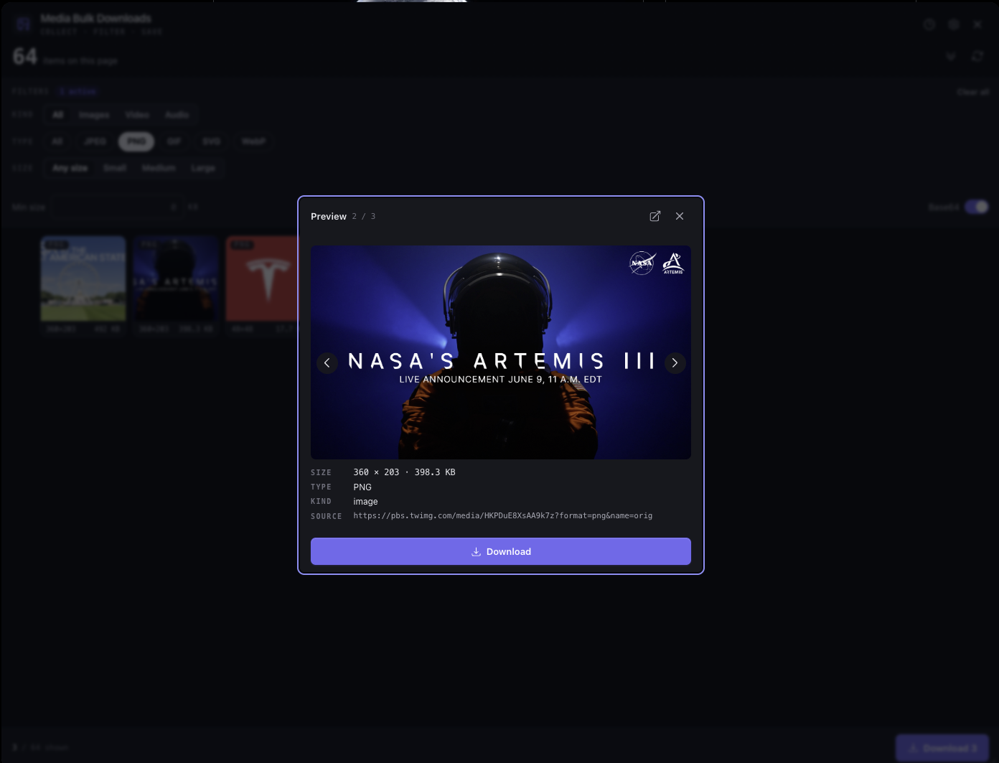

<div align="center">


# Media Bulk Downloads

**Grab every image, video, and audio file on a page — filter, preview, and download in bulk.**
Fast, network-free by default, and built for Chrome, Firefox, and Edge from one codebase.

[](https://chromewebstore.google.com/detail/media-bulk-downloads/mfbfanlkinmkpfhpmbpjcnhdfdgjognnn)
[](https://microsoftedge.microsoft.com/addons/detail/0RDCKGS01KRC)
[](./LICENSE)
[](https://developer.chrome.com/docs/extensions/develop/migrate)
[](./CONTRIBUTING.md)
[](https://github.com/mralaminahamed/media-bulk-downloads/actions/workflows/test.yml)
[](https://github.com/mralaminahamed/media-bulk-downloads/actions/workflows/extension-ci.yml)



</div>

---

## What it does

Your browser's **Save image as…** grabs one file at a time and never sees lazy-loaded
images, responsive `srcset` sources, CSS backgrounds, or gallery links. Media Bulk
Downloads scans the whole page, gathers every image, video, and audio file it can find,
upgrades thumbnails to their originals, and lets you **filter, preview, and download the
lot** — one click for one file, one click for the entire filtered set.

It reads only what the page already loaded, so nothing leaves your device.

## Features

**Finds what the browser misses**
- Lazy-loaded images (`data-src`, `data-lazy-src`, WordPress `data-orig-file` /
  `data-large-file` originals, and other `data-*` sources)
- Responsive `srcset` / `<picture>` sources and `<noscript>` fallbacks
- CSS `background-image` URLs, including `image-set()` (highest-resolution candidate)
- Media inside **open Shadow DOM** (web components) and **same-origin iframes**
- `og:image` / `twitter:image` and `<link rel=preload as=image>` hero images
- Gallery `<a href>` links (Reddit, Wallhaven, and similar)
- Direct-file `<video>` and `<audio>` sources

**Upgrades to original quality**
- **De-proxies** wrapped URLs (Next.js `_next/image` — absolute and relative —
  weserv, Cloudinary fetch)
- **CDN upgrades** thumbnails to full size (Twitter/X `name=orig`, YouTube
  `hqdefault`, Pinterest `/originals/`, Google `=s0`, and 50+ more families)
- **Deep scan** — an opt-in, bounded auto-scroll that surfaces virtualized and
  infinite-scroll media (it scrolls the page and any nested scroll panes; the page
  loads its own media). Its limits — max items, time, and scroll steps — are
  configurable in Settings, it tells you when a limit stopped it early, and it can
  optionally click **“Load more”** buttons (off by default)
- **Resolve originals** — an optional setting that fetches the exact
  highest-resolution file from supported hosts (off by default)

**Filters and downloads cleanly**
- Filter by **kind** (image / video / audio), **format** (jpg, png, gif, webp, mp4,
  webm, mp3…), and **size**
- Download one item or the entire filtered set
- Correct file extensions (never a `.jpg` on a real `.png`)
- Configurable naming scheme and a **download-path template** — `{host}`,
  `{domain}`, `{date}`, `{kind}` tokens save each site to its own folder
- **Download history** with open-file, reveal-in-folder, and re-download actions
- **Favourites** — star media to a saved list that persists across sessions,
  re-downloadable anytime

**Private by design**
- **Network-free by default** — collection reads only what the page already loaded
- No accounts, no analytics, no servers; settings and history never leave your device
- Full policy in [PRIVACY.md](./PRIVACY.md)

## Install

**From the Chrome Web Store** —
[**install Media Bulk Downloads**](https://chromewebstore.google.com/detail/media-bulk-downloads/mfbfanlkinmkpfhpmbpjcnhdfdgjognnn),
one click, no account. Other Chromium browsers (Brave, Opera, Vivaldi) can install the
Chrome build too.

**From source** — requires **Node 20.19+** and Corepack Yarn (`.nvmrc` pins 22). The
build runs on [WXT](https://wxt.dev), which targets every browser from one codebase:

```bash
git clone https://github.com/mralaminahamed/media-bulk-downloads.git
cd media-bulk-downloads
corepack enable
yarn install
yarn dev            # Chrome: builds .output/chrome-mv3 and auto-reloads on change
# yarn dev:firefox  # Firefox: builds .output/firefox-mv3 and opens a dev profile
```

`yarn dev` opens a browser with the extension loaded. To load a build by hand:
open `chrome://extensions`, enable **Developer mode**, click **Load unpacked**, and
select `.output/chrome-mv3`.

## Build & package

WXT produces an MV3 build and a store-ready zip per browser:

```bash
yarn build:all      # chrome · firefox · edge  → .output/<browser>-mv3
yarn zip:all        # store zips for all three  → .output/*.zip
```

| Store                  | Upload                                                            |
|------------------------|-------------------------------------------------------------------|
| Chrome Web Store       | `media-bulk-downloads-<version>-chrome.zip`                       |
| Microsoft Edge Add-ons | `media-bulk-downloads-<version>-edge.zip`                         |
| Firefox Add-ons (AMO)  | `media-bulk-downloads-<version>-firefox.zip` + the `-sources.zip` |

Per-browser scripts (`build:firefox`, `zip:edge`, …) exist too. Validate the Firefox
package with `yarn lint:firefox`. To load it by hand:
`about:debugging#/runtime/this-firefox` → **Load Temporary Add-on…** → pick
`.output/firefox-mv3/manifest.json`.

## Usage

1. **Click the toolbar icon** on any page — the popup opens and scans for media.
2. **Browse the grid** — hover to preview, click a tile for the full-size view.
3. **Filter** by kind, format, or file size.
4. **Download** one item (click it) or every filtered item (**Download all**).
5. **Deep scan** (optional) — trigger the auto-scroll to pull in media on
   infinite-scroll pages. Tune its limits — and enable optional **“Load more”**
   clicking — under **Settings → Deep scan**.

Prefer to stay on the page? The optional **on-page bubble** gives you the same tools in
a draggable panel without opening the toolbar popup.

## Permissions

| Permission       | Why it's needed                                                           |
|------------------|---------------------------------------------------------------------------|
| `downloads`      | Save selected media via the browser's download manager                    |
| `downloads.open` | Open a downloaded file from the in-app history                            |
| `storage`        | Keep your settings and download history locally on your device            |
| `tabs`           | Read the active tab's URL/title to label downloads and open a source page |
| `<all_urls>`     | Read media on whatever page you run the extension on                      |

## Supported sites

The engine works on **any website**. On top of the generic pipeline, it ships dedicated
upgrade rules for:

| Site                                | Upgrade                                             |
|-------------------------------------|-----------------------------------------------------|
| Wikipedia / Wikimedia / MediaWiki   | `/thumb/` path → original (incl. self-hosted wikis) |
| YouTube                             | Small thumbnails → `hqdefault` (always-present max) |
| Twitter / X                         | `name=orig` for photos; video-poster recognition    |
| Reddit                             | Gallery `<a href>` → direct `i.redd.it` original    |
| Unsplash                           | Strip resize params → native-format master          |
| Pinterest                          | `/NNNx/` → `/originals/`                            |
| Shopify stores                     | Drop `?width=` size queries                         |
| WordPress (self-hosted)            | `/wp-content/uploads/` resize + `-WxH` → original   |
| Google (Photos, Blogger)           | `=s88-…` → `=s0`                                    |
| Adobe Scene7 (Target, REI, …)      | `?wid=` → large rendition                           |
| ArtStation                         | Size bucket (`medium`, …) → `/large/`               |
| Behance                            | `/project_modules/<size>/` → `/source/` (DOM-aware) |
| Amazon / eBay / Etsy / Walmart / Newegg | Strip size tokens → full product image         |
| DeviantArt (wixmp)                 | Decode token cap → largest within-cap render        |
| imgur / Dribbble / AliExpress      | Strip thumbnail suffix → original                   |
| BBC / NYT                          | Size token → largest editorial crop                 |
| IKEA / StockSnap / Zillow          | Size query/token → largest preset                   |
| Next.js / Vercel                   | De-proxy `/_next/image?url=` (absolute + relative)  |
| Wallhaven                          | PNG/GIF detection → correct extension               |

…and 50+ more CDN families — see the live [coverage benchmark](./docs/BENCHMARK.md).

## Tech stack

- **[WXT](https://wxt.dev)** — multi-browser MV3 build (Chrome · Firefox · Edge) from one
  codebase, with dev auto-reload and per-browser zips
- **React 19** + **TypeScript** — type-safe UI
- **Tailwind CSS v4** — utility-first styling on a small design-token system
- **Vite** (via WXT) — fast bundling
- **Jest** + **Testing Library** — 35 unit/integration suites
- **web-ext** — Firefox package validation

## Project structure

```
media-bulk-downloads/
├── wxt.config.ts             # WXT config: manifest, browser targets, zip naming
├── web-ext.config.ts         # Dev browser-launch config (wxt dev)
├── src/
│   ├── entrypoints/          # WXT entrypoints → background · content ·
│   │   │                      #   ig/x MAIN-world media sniffers · popup
│   ├── extension/            # Grouped by execution context, then concern
│   │   ├── background/       # MV3 service worker: downloads, history, messaging
│   │   ├── content/          # In-page: index (listeners) · collect · deepScanRunner
│   │   ├── shared/           # Cross-context logic:
│   │   │   ├── active-tab/   #   popup↔content bridges (collect / deep-scan / resolve)
│   │   │   ├── collection/   #   collect helpers · extract · imageUrl · deepScan · filters
│   │   │   ├── resolvers/    #   per-site upgraders (instagram, twitter, unsplash, …) + sniffers
│   │   │   └── storage/      #   history · favourites · settings
│   │   ├── popup/            # React popup UI: grid, filters, preview, settings
│   │   ├── components/       # Shared UI (BrandMark)
│   │   └── bubble/           # On-page draggable panel
│   ├── styles/               # Tailwind v4 entry + design tokens
│   ├── public/icon/          # Extension icons (manifest inputs)
│   └── types/                # Shared TypeScript types
├── assets/                   # Icon master (SVG) + store screenshots
├── docs/                     # Guides, benchmark, Chrome Web Store package
├── tests/                    # Jest suites
└── .output/                  # Per-browser build output + zips (generated)
```

## Documentation

| Guide                                                       |                                                |
|-------------------------------------------------------------|------------------------------------------------|
| [Getting Started](./docs/guides/getting-started.md)         | Install, build, load unpacked, first use       |
| [Architecture](./docs/guides/architecture.md)               | Surfaces, modules, message catalog, data model |
| [Collection Pipeline](./docs/guides/collection-pipeline.md) | Discovery → de-proxy → CDN-upgrade → dedup     |
| [Resolve Originals](./docs/guides/resolve-originals.md)     | Opt-in per-host fetch for the exact original   |
| [Deep Scan](./docs/guides/deep-scan.md)                     | The opt-in auto-scroll workflow and its bounds |
| [Download](./docs/guides/download.md)                       | Filename construction and the save flow        |
| [Download paths](./docs/guides/download-paths.md)           | Per-site folder templates ({host}/{domain}/…)  |
| [Download History](./docs/guides/history.md)                | The download log and its open/reveal actions   |
| [Favourites](./docs/guides/favourites.md)                   | Star media to a saved, persistent list         |
| [Badge](./docs/guides/badge.md)                             | The per-tab media count on the toolbar icon    |
| [In-page Bubble](./docs/guides/bubble.md)                   | The Shadow-DOM launcher lifecycle              |

## Contributing

Contributions are welcome — please read the [Contributing Guide](./CONTRIBUTING.md) first.
Before opening a PR, make sure the full gate passes:

```bash
yarn type-check && yarn lint && yarn test && yarn build
```

## Security

Found a vulnerability? See [SECURITY.md](./SECURITY.md) for private disclosure.

## License

[MIT](./LICENSE) © Al Amin Ahamed
