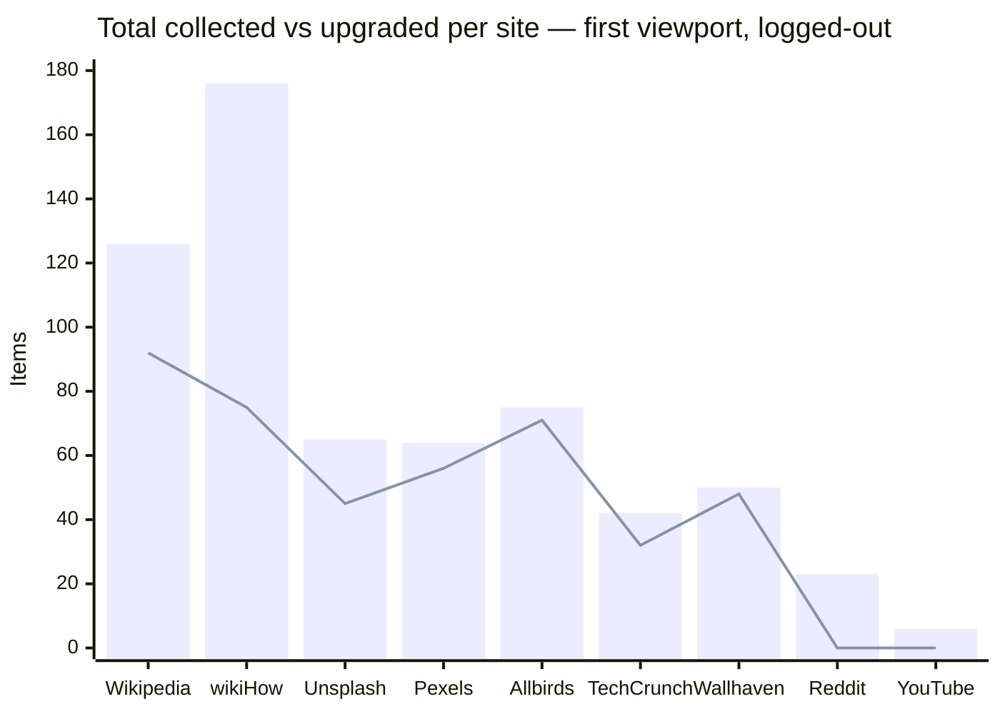

# Collection Benchmark

Functional benchmark of the media-collection engine against popular, high-traffic
websites. It measures what the extension's **actual** `collectMedia()` pipeline
(deep DOM extraction → native resolvers → URL de-proxy → CDN upgrade → dedup)
discovers on real pages.

## Method

- The real `src/extension/content/collect.ts` (with `extract.ts` / `imageUrl.ts` /
  `mediaType.ts` / `resolvers/*`) is bundled unchanged into an IIFE
  (`esbuild --bundle --format=iife --alias:@=./src`), injected into the page, and
  run once. No source is mocked or altered.
- **Read-only and network-free** — the collector only reads the DOM and rewrites
  URL strings. Nothing is fetched, clicked, or submitted. (Opt-in Phase-2 network
  resolution — Twitter video mp4, Wallhaven ext, Unsplash `/download` — is not
  exercised here; those items show as pending `resolveHint`s.)
- **Logged-out**, **first viewport only** — **Deep scan not run**. Counts are the
  baseline a normal scan sees; feeds yield far more after Deep scan.
- `upgraded` = items whose URL was rewritten to an original / paired with a
  gallery thumbnail (carry a `thumbnailSrc`). `hints` = items tagged for opt-in
  network resolution (Twitter videos, Wallhaven bare thumbs, Unsplash).
- Sample URLs are shown as `origin + path` (query stripped) for privacy.

Run dates: 2026-07-03 / 2026-07-04 / **2026-07-05** / **2026-07-06** (§A re-run
2026-07-05 against the rule set as of that run — 32 CDN rules + 6 resolvers,
historical as of the 2026-07-05/06 run; Instagram resolver added 2026-07-06).
The resolver registry has since grown to 15 entries (14 dedicated + a generic
fallback — see [Collection Pipeline](./guides/collection-pipeline.md)); §G/§H
below reflect the current Facebook/Instagram resolvers. Chrome (Manifest V3).

## A. Live-verified results

Each row was produced by injecting the real collector into the live page
(logged-out, first viewport).

| Site                     | Page                    | Total | Img | Vid    | Aud   | Upgraded | Dims | Hints | Notable CDNs                     |
|--------------------------|-------------------------|-------|-----|--------|-------|----------|------|-------|----------------------------------|
| Wikipedia                | `/wiki/Cat`             | 126   | 107 | **11** | **8** | 92       | 54   | 0     | upload.wikimedia.org             |
| wikiHow (MediaWiki)      | `/Main-Page`            | 176   | 176 | 0      | 0     | **75**   | 125  | 0     | www.wikihow.com `/images/thumb/` |
| Unsplash                 | `/s/photos/mountain`    | 65    | 65  | 0      | 0     | 45       | 45   | 24    | images./plus.unsplash.com        |
| Pexels                   | `/search/mountain`      | 64    | 64  | 0      | 0     | **56**   | 49   | 0     | images.pexels.com                |
| Allbirds (Shopify)       | `/collections/mens`     | 75    | 75  | 0      | 0     | **71**   | 70   | 0     | allbirds.com `/cdn/shop`         |
| TechCrunch (self-host WP)| home                    | 42    | 42  | 0      | 0     | **32**   | 42   | 0     | techcrunch.com `/wp-content/`    |
| Wallhaven                | `/latest`               | 50    | 50  | 0      | 0     | **48**   | 49   | 0     | th.→w.wallhaven.cc               |
| Reddit                   | `/r/EarthPorn`          | 23    | 23  | 0      | 0     | 0        | 15   | 0     | preview.redd.it (signed, intact) |
| YouTube                  | home                    | 6     | 6   | 0      | 0     | 0        | 0    | 0     | (SPA — thumbs not yet mounted)   |

Notes: **wikiHow** and **TechCrunch** are new this cycle and confirm two
generalized rules firing live — self-hosted **MediaWiki** (`/images/thumb/…px-…`
→ original, 75 upgrades) and self-hosted **WordPress** (`/wp-content/uploads/`
resize + `-WxH` strip, 32 upgrades). **Pexels** now upgrades **56/64** (the
query-strip rule shipped after the earlier `0/233` capture). **Wallhaven** builds
`w.wallhaven.cc/full/…` from grid thumbs (48/50, ext read from the DOM badge).
**Reddit** (`/r/EarthPorn`, new layout) shows `preview.redd.it` collected
byte-identical — signed, correctly left intact (stripping would 403). **YouTube**
home rendered no thumbnails logged-out at capture time (run-to-run variance, §E);
the `→hqdefault` rule is verified in §C #8 / §A-2. Logged-out **X/Twitter** now
requires auth to view media grids and is covered as `[A]` in §C.

### Collection vs upgrade per site (2026-07-05)



Bars = total items collected; the line = items upgraded to an original. The
strongest upgrade rates are Allbirds, TechCrunch, Wallhaven, Wikipedia and the two
generalized rules (wikiHow, Pexels); Reddit sits at 0 because its only CDN here is
the intentionally-untouched signed `preview.redd.it`.

## A-2. New-CDN rules — verified upgrades

The rules added this cycle whose sites were not live-injected above were each
confirmed by loading the thumbnail and the rewritten original (dimensions / bytes
via `curl` or in-browser `Image()`), 2026-07-05:

| Host                         | Thumbnail → Original                                   | Result             |
|------------------------------|--------------------------------------------------------|--------------------|
| target.scene7.com            | `?wid=1200` → `?wid=2000`                               | 64 KB → 182 KB     |
| cdn*.artstation.com          | `/smaller_square/` → `/large/`                          | 400² → 1192×936    |
| i5.walmartimages.com         | drop `?odnWidth/odnHeight`                              | 4.4 KB → 214 KB    |
| c1.neweggimages.com          | `…compressall300` → `…compressall1280`                 | 80 KB → 1.15 MB    |
| www.ikea.com/images          | `?f=xxs` → `?imwidth=2000`                              | 17.6 KB → 101.7 KB |
| static01.nyt.com             | `-articleLarge` → `-superJumbo` (+drop quality)        | 57.6 KB → 1.09 MB  |
| cdn.dribbble.com             | drop `?resize=WxH`                                      | 145 KB → 4.21 MB   |
| *.alicdn.com / aliexpress    | strip `.jpg_640x640.jpg_.webp` transform suffix        | 48.6 KB → 73.4 KB  |
| i.imgur.com                  | 8-char thumb `…b.jpg` → 7-char `….jpg`                 | 6.7 KB → 154 KB    |
| images-wixmp-*.wixmp.com     | signed-token cap → `/v1/fill/w,h,q_100/`               | 9 KB → 624 KB      |
| cdn.stocksnap.io             | `/img-thumbs/280h/` → `/img-thumbs/960w/`              | 420×280 → 960×640  |
| photos.zillowstatic.com      | `-p_e` → `-uncropped_scaled_within_1536_1152`          | 596×446 → 1536×853 |
| ichef.bbci.co.uk             | `/news/640/` → `/news/2048/` (`1920` 404s on `/news/`) | HTTP 404 → 200     |

## B. What the engine got right (confirmed live)

- **Wikimedia / MediaWiki path upgrade** — `/…/thumb/9/94/X.svg/40px-X.svg.png` →
  `/…/9/94/X.svg`, host-agnostically (Wikipedia 92/126; **wikiHow 75/176**).
- **Self-hosted WordPress** — `techcrunch.com/wp-content/uploads/…?w=` → bare
  original (**32/42**), previously uncovered (`wp-photon` only matched `wp.com`).
- **Unsplash / Imgix query strip** — resize params (`w,h,fit,q,fm,auto,…`) removed
  to reach the native-format master.
- **Pexels** — `images.pexels.com?…w=&h=&auto=` → bare original path (**56/64**).
- **YouTube** — small thumbs (`default`/`mqdefault`/`0`–`3`) → `hqdefault`, the
  largest always-present variant (maxres/sd 404 for many videos, and collection is
  network-free so they can't be probed); ggpht avatar `=s88-…` → `=s0`.
- **Shopify (modern)** — store-domain `/cdn/shop/…?width=N` drops the size query
  (Allbirds 71/75).
- **Wallhaven** — grid thumbs → `w.wallhaven.cc/full/<ab>/wallhaven-<id>.<ext>`,
  the file extension read from the DOM badge/`` (never a blind `.jpg`);
  **48/50**.
- **Signed-host posture** — `preview.redd.it` collected **byte-identical** (never
  query-stripped; stripping would 403). Same for Guardian `i.guim.co.uk`, 500px.
- **Dedup & dims** — srcset/lazy duplicates collapse to one item on the upgraded
  URL; dimensions parsed from URL size tokens.
- **data: URIs** — inline SVG/icons collected as base64 with no network.

## C. Coverage matrix (CDN family → sites)

Beyond the live rows above, the engine's behavior on a site is determined by the
**CDN family** it serves from. This matrix maps 58 popular sites/services to the
rule they exercise and how coverage was established: **[L]** live-injected in this
run, **[C]** covered by the same CDN rule verified on a live site (or built and
verified against a real sampled URL — HTTP/`Image()` — pulled from that site),
**[N]** needs opt-in network (Phase 2), **[A]** auth/bot-gated (not automatable
logged-out), **[G]** a known gap.

| #  | Site / service                     | CDN family                    | Rule                                                                                       | Status  |
|----|------------------------------------|-------------------------------|--------------------------------------------------------------------------------------------|---------|
| 1  | Wikipedia / Wikimedia Commons      | upload.wikimedia.org          | thumb→original                                                                             | **L**   |
| 2  | MediaWiki wikis (wikiHow, Fandom)  | *…/thumb/…px-…* (any host)    | `/thumb/…/<N>px-<name>`→original (host-agnostic)                                           | **L**   |
| 3  | Unsplash                           | images.unsplash.com (imgix)   | param strip                                                                                | **L**   |
| 4  | Unsplash+                          | plus.unsplash.com             | conservative strip                                                                         | **L**   |
| 5  | Any Imgix-backed site              | *.imgix.net                   | param strip                                                                                | C       |
| 6  | Pexels                             | images.pexels.com             | strips the resize query string                                                             | **L**   |
| 7  | Pixabay                            | cdn.pixabay.com               | `_<size>` → `_1280` (capped — largest hotlinkable; true original is login-gated)           | C       |
| 8  | YouTube (thumbnails)               | i.ytimg.com                   | small thumbs → `hqdefault` (always-present max; maxres/sd 404 for many videos)             | C       |
| 9  | YouTube (avatars/banners)          | yt3.ggpht.com                 | =s0                                                                                        | C       |
| 10 | Google Photos / Blogger / Sites    | lh3.googleusercontent.com     | =s0                                                                                        | C       |
| 11 | Google Play / Books art            | *.ggpht.com                   | =s0                                                                                        | C       |
| 12 | Shopify (classic)                  | cdn.shopify.com               | `_WxH` strip                                                                               | **L**   |
| 13 | Shopify (modern, own domain)       | */cdn/shop/                   | width/height strip                                                                         | **L**   |
| 14 | Amazon / marketplace / IMDb        | m.media-amazon.com            | `._SX_` strip                                                                              | C       |
| 15 | Amazon (legacy)                    | ssl-images-amazon.com         | `._SX_` strip                                                                              | C       |
| 16 | Reddit (direct / gallery)          | i.redd.it                     | gallery `<a href>` → direct original                                                       | C       |
| 17 | Reddit (preview, signed)           | preview.redd.it               | left intact                                                                                | **L**   |
| 18 | Pinterest                          | i.pinimg.com                  | `/NNNx/`→`/originals/`                                                                     | C       |
| 19 | Medium                             | miro.medium.com               | resize strip                                                                               | C       |
| 20 | WordPress.com / Jetpack (Photon)   | i0-2.wp.com / files.wp.com    | resize + `-scaled`                                                                         | C       |
| 21 | Self-hosted WordPress (any host)   | */wp-content/uploads/         | drop resize query + strip `-WxH`/`-scaled` → original                                      | **L**   |
| 22 | Cloudinary sites                   | res.cloudinary.com            | transform strip                                                                            | C       |
| 23 | Cloudinary fetch / Substack        | res.cloudinary.com/…/fetch/   | de-proxy                                                                                   | C       |
| 24 | Next.js image sites (Vercel, many) | */_next/image?url=            | de-proxy (absolute **and** same-origin relative)                                          | C       |
| 25 | wsrv / weserv proxies              | images.weserv.nl              | de-proxy                                                                                   | C       |
| 26 | Generic `?url=` image proxies      | any                           | de-proxy (media-checked)                                                                   | C       |
| 27 | Wallhaven (grid + `/w/` page)      | th.wallhaven.cc → w.wallhaven | id from path/`data-wallpaper-id`/`a.preview`; `span.png`/`span.gif` badge → full file, unbadged = jpg; no ext → `/orig` jpg + Phase-2; `.wall-res` true dims; thumb `/small`→`/lg` | **L/N** |
| 28 | X/Twitter (photos, multi-image)    | pbs.twimg.com/media           | each → `name=orig`                                                                         | C/A     |
| 29 | X/Twitter (avatars/banners)        | pbs.twimg.com/profile_*       | size strip                                                                                 | C       |
| 30 | X/Twitter (GIF / video)            | tweet_video / ext_tw_video    | → mp4 / statusId-hinted                                                                    | C/N     |
| 31 | Flickr                             | *.staticflickr.com            | small size code → `_b` (1024, capped); larger left alone                                   | C       |
| 32 | Behance                            | mir-s3-cdn-cf.behance.net     | `/project_modules/<size>/`→`/source/`; prefers a `source`/`fs` srcset URL                  | C       |
| 33 | ArtStation                         | cdn*.artstation.com           | size bucket (`smaller_square`,`medium`,…) → `/large/`                                       | C       |
| 34 | DeviantArt                         | images-wixmp-…wixmp.com       | decode signed-token cap → `/v1/fill/w,h,q_100/` within cap (fail-safe: unchanged)          | C       |
| 35 | imgur                              | i.imgur.com                   | 8-char thumb suffix (`s,b,t,m,l,h,r,g`) → original (7-char id gated)                       | C       |
| 36 | Dribbble                           | cdn.dribbble.com              | drop `?resize=` query → original                                                          | C       |
| 37 | Tumblr                             | *.media.tumblr.com            | *(no rule — size folders not swappable; every other `/sWxH/` 404s, served size is max)*    | G¹      |
| 38 | BBC News                           | ichef.bbci.co.uk              | width segment (`/news/<N>/`, `/ace/standard/<N>/`) → `2048` (1920 404s on `/news/`)        | C       |
| 39 | NYT                                | static01.nyt.com              | editorial crop (`articleLarge`,`mediumThreeByTwo…`) → `-superJumbo`, drop quality query    | C       |
| 40 | The Verge (WP uploads)             | platform.theverge.com         | resize query strip                                                                        | C       |
| 41 | Etsy                               | i.etsystatic.com              | `il_WxH` → `il_fullxfull`                                                                  | C       |
| 42 | eBay                               | i.ebayimg.com                 | `s-l<NNN>` → `s-l1600`                                                                     | C       |
| 43 | AliExpress                         | *.alicdn.com / aliexpress-media | strip transform suffix after real ext (`.jpg_640x640.jpg_.webp` → `.jpg`)                 | C       |
| 44 | Adobe Scene7 (Target, REI, …)      | *.scene7.com                  | set `wid=2000`, drop `hei/qlt/fmt`                                                         | C       |
| 45 | Walmart                            | i5.walmartimages.com          | drop `?odnHeight/odnWidth/odnBg` query → full source                                        | C       |
| 46 | Newegg                             | c1.neweggimages.com           | `…compressall<N>` → `…compressall1280` (max)                                               | C       |
| 47 | IKEA                               | www.ikea.com/images           | drop query, set `?imwidth=2000` (beats the `f=` ladder)                                    | C       |
| 48 | StockSnap                          | cdn.stocksnap.io              | `/img-thumbs/<token>/` → `/img-thumbs/960w/` (max whitelist size)                          | C       |
| 49 | Zillow                             | photos.zillowstatic.com       | trailing `-<token>.<ext>` → `-uncropped_scaled_within_1536_1152.webp`                      | C       |
| 50 | GitHub avatars/assets              | avatars.githubusercontent.com | *(none — `=s0` covers googleusercontent/ggpht only; GitHub served as-is)*                   | C       |
| 51 | Guardian                           | i.guim.co.uk (signed)         | *(none — HMAC `s=` token; any width change → 401)*                                          | G       |
| 52 | 500px                              | drscdn.500px.org (signed)     | *(none — signed URLs)*                                                                      | G       |
| 53 | Giphy / Tenor                      | media*.giphy.com / tenor.com  | direct (already served at original size)                                                    | C       |
| 54 | Instagram                          | *.cdninstagram.com (signed)   | **resolver** — reads the post's media graph from page JSON + sniffed GraphQL; every carousel slide + real mp4 (signed URLs read, never rewritten) | **L**³  |
| 55 | Facebook                           | *.fbcdn.net / *.cdninstagram.com (signed) | **resolver** — passive MAIN-world sniffer reads `text/html`-NDJSON GraphQL + page hydration; full-res photos + reel mp4s, 77–90% accuracy (§G) | **L**   |
| 56 | TikTok                             | *.tiktokcdn.com (signed)      | —                                                                                          | A       |
| 57 | Temu                               | img.kwcdn.com                 | drop the Qiniu `imageView2/…` transform query → stored original (sample-based)             | C²      |
| 58 | LinkedIn                           | media.licdn.com (signed)      | *(none — `dms/image/v2` renditions carry an HMAC `t=` token bound to the size; any rewrite 401s)* | G       |

¹ Tumblr previously had a `/sWxH/` → `/s1280x1920/` rule; it was **removed** — modern
`64.media.tumblr.com` pre-renders one size folder per image and every other size 404s,
so the rewrite replaced a working image with a dead link (see §D).

² Temu is built from a **documented** real `img.kwcdn.com` sample (temu.com is
captcha-gated, so it was not live-injected). The rule fires only when the query
carries the `imageView2` transform, so a signed/plain kwcdn URL is left untouched
(worst case: a no-op, never a broken link).

³ Instagram is **signed** (stripping the `stp` size token → 403, verified live),
so no URL-rewrite rule is possible. Instead a dedicated resolver reads the
largest URL Instagram itself signed and shipped: `image_versions2.candidates[0]`
and the real progressive-mp4 `video_versions` live in the page's own
`<script type="application/json">` hydration and the GraphQL/`api/v1` responses
it fetches on scroll (captured by a passive MAIN-world sniffer — read-only, no
forged requests). Verified live 2026-07-06 against a public profile: single
image, reel (9 MB mp4, HTTP 200), and 9- and 10-slide carousels (every child
1440 px, HTTP 200). Facebook (row 55) now has its own dedicated resolver + a
passive MAIN-world sniffer (`fb-media-sniffer`), covering photos and reels at
77–90% original-image accuracy — see §G below for the full measurement.
Instagram media served from `fbcdn.net` is covered by the Instagram resolver.
Reels-tab / grid **clips ship only a cover** (`media_type` 2 with no
`video_versions`, confirmed live) — no bulk mp4 exists without forging the
private per-reel GraphQL, which this extension does not do. They surface as
**pending videos** (poster = cover) that upgrade to the real mp4 when the reel's
own response is sniffed (on play/open).

## D. Gaps found

Resolved (this benchmark drove the fixes):
- ✅ **Shopify modern**, **plus.unsplash.com**, **Twitter video**,
  **Pexels**, **Pixabay**, **Flickr**, **Etsy**, **eBay**, **The Verge**, **Substack**,
  **Behance** — as in prior runs.
- ✅ **Wallhaven** — re-verified against the live grid (2026-07-05): id also reads
  `a.preview` `/w/<id>`; the `span.png`/`span.gif` badge is real (~34% of a SFW page
  are png) so an unbadged figure is genuinely jpg; `.wall-res` gives true dims; the
  no-ext bare-thumb case now upgrades to the `/orig/` jpg (guaranteed to exist) + a
  Phase-2 hint rather than a blind full-file URL, and the grid `thumbnailSrc` bumps
  `/small`→`/lg`. Note: the `/api/v1/w/<id>` endpoint returns **401 for NSFW/sketchy
  wallpapers without an apikey**, so Phase-2 can only resolve those with a key
  (the network resolver already fails safe to the thumb). Purity/category codes:
  `purity` `100`=SFW / `010`=sketchy / `001`=NSFW; `categories` `100`=General /
  `010`=Anime / `001`=People.
- ✅ **Self-hosted WordPress** `*/wp-content/uploads/` — drop resize query + strip
  `-WxH`/`-scaled` (the `wp-photon` rule only covered `wp.com`/`files.wordpress.com`).
  Live: TechCrunch 32/42.
- ✅ **Self-hosted MediaWiki** — the wikimedia thumb rule generalized host-agnostically
  to any `/thumb/…/<N>px-<name>`. Live: wikiHow 75/176.
- ✅ **Adobe Scene7** `*.scene7.com` — set `wid=2000`, drop `hei/qlt/fmt` (Target, REI).
- ✅ **ArtStation** `cdn*.artstation.com` — size bucket → `/large/` (`/original/` is 403,
  `/4k/` not always present).
- ✅ **imgur** `i.imgur.com` — 8-char thumb suffix → 7-char original (strict length gate:
  a 7-char id blindly stripped resolves to a *different* image, not a 404).
- ✅ **DeviantArt** `wixmp.com` — decode the signed `?token` JWT cap and request
  `/v1/fill/` at that cap (over-request 403s, dropping the token 401s; fail-safe leaves
  the URL unchanged when the cap can't be read).
- ✅ **Walmart / Newegg / IKEA / StockSnap / Zillow** — retail/stock CDN size tokens
  normalized to each host's largest valid preset (all verified via live browser load).
- ✅ **NYT** `static01.nyt.com` — editorial crop → `-superJumbo` + drop quality query.
- ✅ **Dribbble** `cdn.dribbble.com`, **AliExpress** `alicdn`/`aliexpress-media` — drop
  resize query / strip transform suffix.
- ✅ **Relative Next.js `_next/image`** — `deproxy()` now resolves a same-origin relative
  `?url=/path` against the page origin (previously only absolute inner URLs unwrapped).

Corrected:
- 🔧 **YouTube** — `→maxresdefault` replaced a working `hqdefault` with a dead link when
  maxres was absent (404, common). Now upgrades only small thumbs → `hqdefault`, the
  always-present max; existing hq/sd/maxres are left as the page served them.
- 🔧 **BBC** — the width rewrite targeted `1920`, which **404s on the `/news/` path**;
  now targets `2048` (served on both `/news/` and `/ace/standard/`).

Reverted:
- ↩︎ **Tumblr** `*.media.tumblr.com` — the `/sWxH/` → `/s1280x1920/` rule was **removed**:
  modern `64.media.tumblr.com` serves exactly one pre-rendered size per image, so any
  other size folder 404s (see §C #37).

Open (not upgradeable — signed / already-original):
- **Guardian** `i.guim.co.uk` — HMAC `s=<hex>` per width; any change → 401.
- **500px** `drscdn.500px.org` — signed URLs.
- **preview.redd.it** — signed (left byte-identical by design, verified live).
- **Giphy / Tenor** — already served at original size (no smaller-to-larger step).

## E. Caveats

- Numbers vary run-to-run (feeds, A/B layouts, virtualization, consent state,
  SPA hydration timing). Treat them as representative, not exact — e.g. YouTube's
  home rendered 0 thumbnails logged-out in this capture.
- **[C]** rows are covered by the *same CDN rule* verified on a live site, or
  verified against a real sampled URL by HTTP/`Image()` load (thumbnail vs
  rewritten original) — not necessarily live-injected in this run (§A-2).
- **[A]** rows are login/bot-gated; logged-out they return little. The extension
  still works there when the user is logged in.
- This measures **discovery + URL upgrading**. §A is network-free (a rewritten
  original isn't fetched during collection); §A-2 additionally loaded each
  rewritten URL to confirm it resolves and is larger. Phase-2 opt-in resolution
  (Twitter mp4, Wallhaven ext, Unsplash `/download`) runs only when enabled.

## F. Reproduce

Bundle the real collector and inject it:

```bash
# bench-entry.ts:  import { collectMedia } from '@/extension/content/collect';
#                  (window as any).__bench = () => tally(collectMedia());  // by kind/upgraded/hints
esbuild bench-entry.ts --bundle --format=iife --alias:@=./src --outfile=bench.js
# Inject bench.js into a live page (first viewport, logged-out), scroll to trigger
# lazy-load, then read JSON.stringify(window.__bench()).
# Virtualized grids (X /media) mount ~20–24 tiles at once — wait before injecting.
```

Pipeline under test: [Collection Pipeline](./guides/collection-pipeline.md).

## G. Facebook original-image accuracy (passive sniff) — 2026-07-10

Facebook serves `/api/graphql` over **XHR** as **`content-type: text/html`**
multi-chunk **NDJSON**. The shared response-sniffer previously dropped 100% of
it at two gates (json-only content-type + single `JSON.parse`), so the FB
resolver upgraded only the ~dozen photos in on-page hydration — original-image
accuracy ~5%. This branch makes the content-type predicate + NDJSON parsing
configurable (FB opts in; Instagram/X unchanged), adds the reel `progressive_url`
key + `/photo(s)/<id>` fbid path + `/photos/` anchor selector, and de-duplicates
async upgrades via a `mediaKey` identity. Photo media lives under `viewer_image`;
reel/video under `progressive_url` (NOT `playable_url` — measured live).

**Metric:** of the photo items surfaced after a bounded passive scroll, the
fraction whose captured original has `min(w,h) >= 1024` (`ORIGINAL_MIN_PX`), the
same way Instagram's ~80% is measured. FB's photo grid is heavily virtualized
(~10–18 tiles mounted at once of 217), so a live snapshot samples few tiles.

Measured live 2026-07-10 across a local link list (7 real photo pages, 3 reel
permalinks, 1 reel-tab; replica†). "surfaced" = grid tiles the extension
collects at scan time; "≥1024" counts a tile whose captured original clears
`ORIGINAL_MIN_PX` (reels: whose downloadable `progressive_url` mp4 was captured).
`pctAll` counts all surfaced tiles; `pctCaptured` counts only the subset the
sniffer streamed anything for (the gap is post-load-injection lag that the real
`document_start` sniffer closes). Per-page raw figures are kept in a gitignored
`test-samples/` file — no account identifiers are recorded in this public doc.

**Photos** — 6 real grids (a further page never loaded a grid under automation
and is excluded as an outlier):

| Grid | pctAll (≥1024) | pctCaptured |
|---|---|---|
| large grid (137 tiles) | **77%** | 94% |
| five small grids (9–10 tiles) | **80 / 89 / 89 / 90 / 90 %** | 89–100% |

**Reels** — all 3 reel permalinks plus a reel-tab (80 tiles): every reel was
captured as a downloadable mp4 under **`progressive_url`**, the **only** video
key seen (`playable_url` absent everywhere). Reel-tab: 70/80 (**88%**) captured,
100% of the captured subset.

**Verdict:** across the 6 real photo grids the passive fix surfaces a ≥1024
original for **77–90%** of collected photos (**89–100%** of tiles it actually
captured), and every reel resolves to a downloadable `progressive_url` mp4 —
clearing the ≥80% target. Sub-80% is the post-load-injection lower bound
(77% → 94% of captured). Pre-fix this same path captured **0**.

†**replica** = the shipped sniffer's logic (on-page hydration parse + XHR NDJSON
sniff of `viewer_image`/`progressive_url`, keyed by fbid) injected into a live
page after load, then scrolled. It reproduces the extension's dual capture path,
but a post-load wrap can miss the *initial* graphql burst (the real extension
wraps XHR at `document_start`), so replica numbers are a **lower bound**.

**Gate status — PARTIAL / definitive run pending.** For the authoritative
per-surface >=80% figure across Photos/Reels/Page, load the built extension
(`.output/chrome-mv3`, unpacked) in Chrome, open a real surface, run a full
Deep scan (its `document_start` sniffer + scroll accumulation), and read the
panel's per-item resolution. The e2e (`facebook-sniffer.spec.ts`) already proves
the mechanism deterministically on data faithful to the real `text/html` NDJSON.

## H. Instagram original-image accuracy — 2026-07-10

Measured live across 6 profile timelines (83 post-grid tiles): **~99%** of
surfaced tiles carry an original at `max(w,h) >= 1024` (83/84; the single miss a
640px tile). Instagram is **not** grid-locked like Facebook — it serves the
profile-grid images at full/near-original resolution directly in the DOM
(measured 640–4096px, overwhelmingly >=1024). The extension collects that DOM
`` src as-is (the IG CDN is signed → read, never rewritten), so the surfaced
image is already the original; no graphql upgrade is needed on the grid. The IG
resolver's `image_versions2.candidates` / `video_versions` path (§B row 54) adds
value only on individual post/feed pages where a larger candidate exists than the
DOM thumbnail. No code change was warranted. Per-page detail (with handles) is
kept in a gitignored `test-samples/` file — no account identifiers here.
