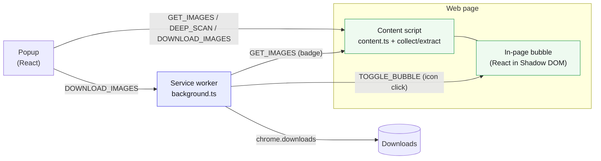

# Media Bulk Downloads — Guides

Developer and user documentation for the extension. Diagrams use
[Mermaid](https://mermaid.js.org/) and render inline on GitHub.

## Start here

| Guide                                   | What it covers                                 |
|-----------------------------------------|------------------------------------------------|
| [Getting Started](./getting-started.md) | Install, build, load unpacked, first use       |
| [Architecture](./architecture.md)       | MV3 surfaces, modules, and the message catalog |

## Workflows (sequence diagrams)

| Guide                                           | Flow                                                       |
|-------------------------------------------------|------------------------------------------------------------|
| [Collection Pipeline](./collection-pipeline.md) | How a page's media is discovered and upgraded to originals |
| [Resolve Originals](./resolve-originals.md)     | Opt-in, per-host fetch for the exact original file         |
| [Deep Scan](./deep-scan.md)                     | Opt-in auto-scroll that surfaces virtualized / lazy media  |
| [Download](./download.md)                       | How selected media is named and saved                      |
| [Download paths](./download-paths.md)           | Per-site folder templates ({host}/{domain}/{date}/{kind})  |
| [Download History](./history.md)                | The download log and its open/reveal/re-download actions   |
| [Favourites](./favourites.md)                   | The saved-media list and how it persists                   |
| [Badge](./badge.md)                             | The per-tab count on the toolbar icon                      |
| [In-page Bubble](./bubble.md)                   | The injected floating launcher and its lifecycle           |

## The three surfaces at a glance

## Design constraints (read before changing collection)

- **Passive collection is network-free by default.** Metadata is derived from
  the DOM and URL strings only — no `fetch`/HEAD/preload while scanning.
- **Two opt-in exceptions contact the network, both off unless the user turns
  them on:** popup-only, user-initiated `HEAD` size enrichment, and the
  **Resolve Originals** setting (`resolveOriginals`, off by default), which lets
  the background `fetch` one of 9 supported host APIs (Twitter/X, Wallhaven,
  Unsplash, Vimeo, Bluesky, Pinterest, Reddit, Flickr, ArtStation) for the
  exact original file. See [Resolve Originals](./resolve-originals.md).
- **Deep scan issues no requests of its own** — it scrolls and re-reads the DOM;
  the page loads its own media.
- **Conservative URL upgrading.** Only safe path-based CDN rewrites; signed hosts
  (`fbcdn.net`, `preview.redd.it`) are left byte-identical; every upgrade keeps
  the pre-upgrade URL as a `thumbnailSrc` fallback.

## See also

- [Feature one-pager](../marketing/one-pager.md) — plain-language overview
- [Collection Benchmark](../BENCHMARK.md) — live, reproducible upgrade measurements
- [Monorepo restructure](../architecture/monorepo-restructure.md) — packages/app design record
