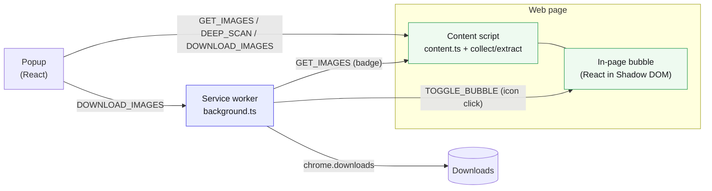

# Media Bulk Downloads — Guides

Developer and user documentation for the extension. Diagrams use
[Mermaid](https://mermaid.js.org/) and render inline on GitHub.

## Start here

| Guide                                   | What it covers                                              |
|-----------------------------------------|------------------------------------------------------------|
| [Getting Started](./getting-started.md) | Install, build, load unpacked, first use                   |
| [Architecture](./architecture.md)       | Monorepo layout, the four MV3 surfaces, and the message catalog |

## Workflows (sequence diagrams)

| Guide                                           | Flow                                                      |
|-------------------------------------------------|-----------------------------------------------------------|
| [Collection Pipeline](./collection-pipeline.md) | How page media is discovered, resolved, de-duplicated, and shown |
| [Resolve Originals](./resolve-originals.md)     | Opt-in, per-host fetch for the exact original file        |
| [Deep Scan](./deep-scan.md)                     | Opt-in auto-scroll that surfaces virtualized and lazy media |
| [Download](./download.md)                       | How selected media is named and saved through the service worker |
| [Download paths](./download-paths.md)           | Per-site folder templates ({host}, {domain}, {date}, {kind}) |
| [Download History](./history.md)                | The log of successful downloads: open, reveal, re-download |
| [Favourites](./favourites.md)                   | The starred-media list and how it persists                |
| [Badge](./badge.md)                             | The per-tab media count on the toolbar icon               |
| [In-page Bubble](./bubble.md)                   | The injected floating launcher and its lifecycle          |

## The four surfaces at a glance

## Design constraints (read before changing collection)

- **Passive collection is network-free.** The content script and badge derive
  metadata from the DOM and URL strings only — no `fetch`, `HEAD`, or preload
  while scanning.
- **Two things touch the network, neither during passive collection.**
  Image-size `HEAD` requests run only from the popup, against images the page
  already loaded, and stay on each image's own host (never the background badge
  path). **Resolve Originals** (`resolveOriginals`, off by default) is the only
  feature that contacts a host other than the page you're on: when on, the
  background resolves the exact original from one of ~20 supported hosts (Twitter/X,
  Wallhaven, Unsplash, Vimeo, Dailymotion, Bluesky, Pinterest, Reddit, Flickr,
  ArtStation, SoundCloud, Twitch, Loom, PeerTube, and more).
  See [Resolve Originals](./resolve-originals.md) for the full list.
- **Deep scan issues no requests of its own.** It scrolls and re-reads the DOM;
  the page loads its own media.
- **URL upgrades are conservative.** Only safe, path-based CDN rewrites. Signed
  URLs (`fbcdn.net`, `cdninstagram.com`) are left byte-identical, and every
  upgrade keeps the pre-upgrade URL as a `thumbnailSrc` fallback.

## See also

- [Feature one-pager](../marketing/one-pager.md) — plain-language overview
- [Collection Benchmark](../BENCHMARK.md) — live, reproducible upgrade measurements
- [Monorepo restructure](../architecture/monorepo-restructure.md) — packages/app design record
