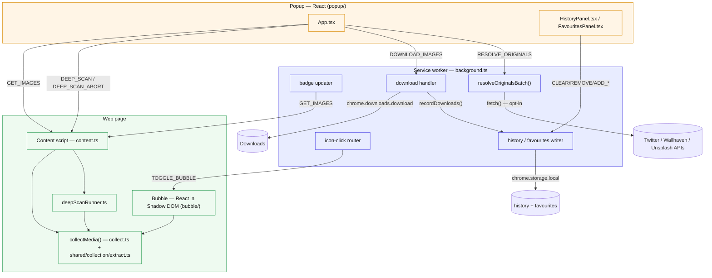

# Architecture

The extension is a cross-browser (Chrome, Firefox 109+, Edge) Manifest V3 app
with four runtime surfaces that communicate over `chrome.runtime` / `chrome.tabs`
messages.

## Surfaces



Note: `HP`, `BADGE`, `DL`, `ICON`, `HIST`, and `RES` are all reachable from the
bubble surface too — the bubble mounts the same shared `App.tsx` (see
[In-page Bubble](./bubble.md)) — the diagram omits the duplicate edges for
readability.

## Module responsibilities

| Module                                             | Responsibility                                                                                                                               |
|----------------------------------------------------|----------------------------------------------------------------------------------------------------------------------------------------------|
| `background/index.ts`                              | Message router, per-tab badge, download + history recording, resolve-originals batching, icon-click routing, popup-vs-bubble mode |
| `content/index.ts`                                 | Answers `GET_IMAGES`/`DEEP_SCAN`, mounts the bubble, relays `TOGGLE_BUBBLE`                                                                  |
| `content/collect.ts`                               | `collectMedia()` — walks the DOM (top doc + open shadow roots + same-origin iframes, plus `<meta>`/`<link preload>` head sources) into `MediaItem[]` |
| `shared/collection/extract.ts`                                | Deep DOM extraction: lazy `data-*`, best-srcset, `<noscript>`, gallery `<a href>`                                                            |
| `shared/collection/imageUrl.ts`                               | `deproxy` + `upgradeToOriginal` (CDN rules), type/dimension parsing                                                                          |
| `shared/collection/mediaType.ts`                              | Video/audio type detection + undownloadable-media skip list                                                                                  |
| `shared/collection/deepScan.ts`                               | Pure, bounded, abortable deep-scan loop                                                                                                      |
| `content/deepScanRunner.ts`                        | Binds the loop to the real DOM (page + nested-scroller scrolling, opt-in load-more clicking, MutationObserver); reads Settings caps          |
| `shared/active-tab/deep-scan-active-tab.ts`                   | Popup client that drives deep scan over messaging                                                                                            |
| `shared/active-tab/collect-active-tab.ts`                     | Popup client that fetches `GET_IMAGES` from the active tab's content script                                                                  |
| `shared/active-tab/resolve-originals-active.ts`               | Popup client that sends `RESOLVE_ORIGINALS` and unwraps the resolved-URL map                                                                 |
| `shared/collection/filters.ts`                                | `filterImagesBySettings` (badge/eligibility) + `applyToolbarFilters`                                                                         |
| `shared/storage/settings.ts`                               | `DEFAULT_SETTINGS` + `withDefaults()` — tolerant merge of stored settings over defaults                                                      |
| `shared/collection/paths.ts`                                  | Download-path token expansion (`{host}`/`{domain}`/`{date}`/`{kind}`) + path sanitizing                                                      |
| `shared/storage/history.ts`                                | `HistoryEntry[]` persistence in `chrome.storage.local` — merge/dedup/cap, serialized writes                                                  |
| `shared/storage/favourites.ts`                             | `FavouriteEntry[]` persistence in `chrome.storage.local` — same merge/dedup/cap shape                                                        |
| `shared/resolvers/index.ts`                        | Resolver `REGISTRY` (`twitterResolver, instagramResolver, unsplashResolver, wallhavenResolver, behanceResolver, genericResolver`) + `resolve()` dispatch        |
| `shared/resolvers/{twitter,instagram,unsplash,wallhaven,behance}.ts` | Per-host, synchronous, network-free URL upgrades; attach `resolveHint`/`unresolvedVideo` when a better original needs a network fetch |
| `shared/resolvers/generic.ts`                      | Fallback resolver: today's de-proxy + CDN-rule engine, image-only                                                                            |
| `shared/resolvers/network.ts`                      | The opt-in resolver: actual `fetch()` calls (Twitter syndication API, Wallhaven API, Unsplash download endpoint)                             |
| `shared/resolvers/types.ts`                        | `Resolver` / `MediaCandidate` / `ResolveContext` contracts shared by the registry                                                            |
| `popup/`                                           | Popup React app                                                                                                                              |
| `popup/components/HistoryPanel.tsx`                | Download History panel UI — list, re-download, open file, reveal in folder, remove, clear all                                                |
| `popup/components/FavouritesPanel.tsx`             | Favourites panel UI — list, download, open source, remove, clear all                                                                         |
| `extension/components/BrandMark.tsx`               | Shared brand-icon SVG — single source of truth for the popup header and bubble launcher icon                                                 |
| `bubble/`                                          | In-page bubble React app (isolated Shadow DOM)                                                                                               |

## Message catalog

| Message                | From → To                                     | Shape                                           | Response                                                                    |
|------------------------|-----------------------------------------------|-------------------------------------------------|-----------------------------------------------------------------------------|
| `GET_IMAGES`           | popup / background → content                  | string                                          | `MediaItem[]`                                                               |
| `DOWNLOAD_IMAGES`      | popup / bubble → background                   | `{ type, images, sourcePage? }`                 | `{ status, message }`                                                       |
| `DEEP_SCAN`            | popup → content                               | string                                          | `MediaItem[]` (async, channel held open)                                    |
| `DEEP_SCAN_ABORT`      | popup → content                               | string                                          | `true`                                                                      |
| `DEEP_SCAN_PROGRESS`   | content → runtime (popup listens)             | `{ type, found, scrolls, elapsedMs, reason? }`  | — (`reason: DeepScanStopReason` set on the final event)                     |
| `TOGGLE_BUBBLE`        | background (icon click) → content             | string                                          | —                                                                           |
| `RESOLVE_ORIGINALS`    | popup / bubble → background                   | `{ type, hints: { src, hint: ResolveHint }[] }` | `{ resolved: Record<string, string> }` (src → resolved URL, successes only) |
| `OPEN_DOWNLOAD_FILE`   | popup / bubble (HistoryPanel) → background    | `{ type, downloadId }`                          | — (fire-and-forget; `chrome.downloads.open`)                                |
| `SHOW_DOWNLOAD`        | popup / bubble (HistoryPanel) → background    | `{ type, downloadId }`                          | — (fire-and-forget; `chrome.downloads.show`)                                |
| `OPEN_URL`             | popup / bubble → background                   | `{ type, url }`                                 | — (opens `url` in a new tab; only `http(s)://` is honored)                  |
| `CLEAR_HISTORY`        | popup / bubble (HistoryPanel) → background    | `{ type }`                                      | —                                                                           |
| `REMOVE_HISTORY_ENTRY` | popup / bubble (HistoryPanel) → background    | `{ type, src }`                                 | —                                                                           |
| `ADD_FAVOURITE`        | popup / bubble → background                   | `{ type, entry: FavouriteEntry }`               | —                                                                           |
| `REMOVE_FAVOURITE`     | popup / bubble → background                   | `{ type, src }`                                 | —                                                                           |
| `CLEAR_FAVOURITES`     | popup / bubble (FavouritesPanel) → background | `{ type }`                                      | —                                                                           |

All history/favourite mutations and the file/URL-opening messages are routed
through the background service worker even though they originate in the
popup/bubble UI, so every `chrome.storage.local` write and every
`chrome.downloads`/`chrome.tabs` call happens in one realm (single writer, no
cross-context races). `RESOLVE_ORIGINALS` is the one message that triggers an
external network request — see [Resolve Originals](./resolve-originals.md).

Message string/type unions live in `src/types/index.d.ts` (`ChromeMessage`).

## Data model

`collectMedia()` returns `MediaItem[]` (`MediaItem = ImageInfo`):

```ts
interface ImageInfo {
  src: string;            // upgraded original URL
  alt: string;
  width: number; height: number;   // 0 when unknown (all av; some images)
  type: string;           // 'jpeg' | 'png' | ... | 'mp4' | 'mp3' | 'unknown'
  fileSize: number;       // 0 until enriched (images only, popup HEAD)
  isBase64: boolean;
  thumbnailSrc?: string;  // pre-upgrade / gallery-thumbnail fallback for the grid
  kind: 'image' | 'video' | 'audio';   // set by the collector from the element
  poster?: string;        // video poster, used as the grid thumbnail
  resolveHint?: ResolveHint;   // present when an opt-in fetch can upgrade this item
                                // to a better original (see Resolve Originals)
  unresolvedVideo?: boolean;   // Twitter real video: poster shown, but not
                                // downloadable until resolved
}
```

Two sibling types are persisted to `chrome.storage.local` rather than collected
from the page: `HistoryEntry` (one per completed download) and `FavouriteEntry`
(one per starred item). Both are defined alongside `ImageInfo` in
`src/types/index.d.ts`; see [Download History](./history.md) and
[Favourites](./favourites.md) for their shape and lifecycle.

## Privacy stance

- Passive collection never fetches media bytes; metadata comes from the DOM and
  URL strings. **Network-free by default.**
- Image size enrichment (`HEAD`) is popup-only, user-initiated, bounded
  concurrency, and skipped for video/audio.
- Deep scan only scrolls; it makes no requests itself.
- The **opt-in** `resolveOriginals` setting (off by default) is the one path
  that contacts external hosts: when enabled, the background can `fetch()` a
  small, pinned set of host APIs — Twitter's syndication endpoint, the
  Wallhaven API, and Unsplash's download endpoint — to upgrade a hinted item to
  its true original. See [Resolve Originals](./resolve-originals.md) for exactly
  what is sent and to whom.

Workflow detail: [Getting Started](./getting-started.md) ·
[Collection Pipeline](./collection-pipeline.md) ·
[Resolve Originals](./resolve-originals.md) ·
[Deep Scan](./deep-scan.md) · [Download](./download.md) ·
[Download paths](./download-paths.md) ·
[Download History](./history.md) · [Favourites](./favourites.md) ·
[Badge](./badge.md) · [Bubble](./bubble.md).
