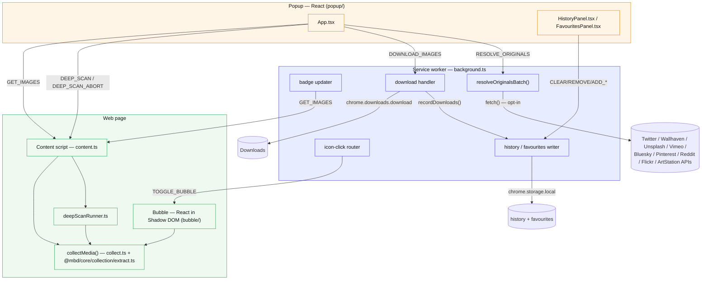

# Architecture

The extension is a cross-browser (Chrome, Firefox 109+, Edge) Manifest V3 app
with four runtime surfaces that communicate over `chrome.runtime` / `chrome.tabs`
messages.

## Workspace layout

The repository is a yarn-workspaces monorepo. Browser-agnostic logic lives in
`packages/*`; the WXT app (all entrypoints, background/UI glue) is `apps/extension`.

| Workspace | Package | Holds |
|-----------|---------|-------|
| `packages/core` | `@mbd/core` | Browser-agnostic domain logic: `collection/`, `resolvers/`, `download/` byte-logic, `net/`, and the shared `types`. Zero `chrome.*`. |
| `packages/storage` | `@mbd/storage` | Persistence over `chrome.storage` + IndexedDB (settings, history, favourites, excluded, queue, per-host memory). |
| `packages/platform` | `@mbd/platform` | Browser-capability contracts (`Downloader`, `Notifier`, `HeaderRules`, `StreamCaptureHost`) + `detectCapabilities()`. Implementations live in the app. |
| `apps/extension` | `@mbd/extension` | The WXT app: `entrypoints/`, `background/`, `content/`, `popup/`, `bubble/`, `shared/active-tab/`, and the (future) `platform/*` implementations. |

Dependency graph is acyclic: `@mbd/core` (leaf) ← `@mbd/storage`, `@mbd/platform` ← `@mbd/extension`. Module paths below use each file's workspace-relative form (`@mbd/core/…`, `@mbd/storage/…`); app-internal modules (`background/…`, `popup/…`) live under `apps/extension/src/extension/`. See [`docs/architecture/monorepo-restructure.md`](../architecture/monorepo-restructure.md) for the full design and rationale.

## Surfaces



Note: `HP`, `BADGE`, `DL`, `ICON`, `HIST`, and `RES` are all reachable from the
bubble surface too — the bubble mounts the same shared `App.tsx` (see
[In-page Bubble](./bubble.md)) — the diagram omits the duplicate edges for
readability.

## Module responsibilities

| Module                                                                                                                                                                                                                                                                      | Responsibility                                                                                                                                                                                                                                                                                                                                          |
|-----------------------------------------------------------------------------------------------------------------------------------------------------------------------------------------------------------------------------------------------------------------------------|---------------------------------------------------------------------------------------------------------------------------------------------------------------------------------------------------------------------------------------------------------------------------------------------------------------------------------------------------------|
| `background/index.ts`                                                                                                                                                                                                                                                       | Message router, per-tab badge, download + history recording, resolve-originals batching, icon-click routing, popup-vs-bubble mode                                                                                                                                                                                                                       |
| `content/index.ts`                                                                                                                                                                                                                                                          | Answers `GET_IMAGES`/`DEEP_SCAN`, mounts the bubble, relays `TOGGLE_BUBBLE`                                                                                                                                                                                                                                                                             |
| `content/collect.ts`                                                                                                                                                                                                                                                        | `collectMedia()` — walks the DOM (top doc + open shadow roots + same-origin iframes, plus `<meta>`/`<link preload>` head sources) into `MediaItem[]`                                                                                                                                                                                                    |
| `@mbd/core/collection/extract.ts`                                                                                                                                                                                                                                              | Deep DOM extraction: lazy `data-*`, best-srcset, `<noscript>`, gallery `<a href>`                                                                                                                                                                                                                                                                       |
| `@mbd/core/collection/imageUrl.ts`                                                                                                                                                                                                                                             | `deproxy` + `upgradeToOriginal` (CDN rules), type/dimension parsing                                                                                                                                                                                                                                                                                     |
| `@mbd/core/collection/mediaType.ts`                                                                                                                                                                                                                                            | Video/audio type detection + undownloadable-media skip list                                                                                                                                                                                                                                                                                             |
| `@mbd/core/collection/deepScan.ts`                                                                                                                                                                                                                                             | Pure, bounded, abortable deep-scan loop                                                                                                                                                                                                                                                                                                                 |
| `content/deepScanRunner.ts`                                                                                                                                                                                                                                                 | Binds the loop to the real DOM (page + nested-scroller scrolling, opt-in load-more clicking, MutationObserver); reads Settings caps                                                                                                                                                                                                                     |
| `shared/active-tab/deep-scan-active-tab.ts`                                                                                                                                                                                                                                 | Popup client that drives deep scan over messaging                                                                                                                                                                                                                                                                                                       |
| `shared/active-tab/collect-active-tab.ts`                                                                                                                                                                                                                                   | Popup client that fetches `GET_IMAGES` from the active tab's content script                                                                                                                                                                                                                                                                             |
| `shared/active-tab/resolve-originals-active.ts`                                                                                                                                                                                                                             | Popup client that sends `RESOLVE_ORIGINALS` and unwraps the resolved-URL map                                                                                                                                                                                                                                                                            |
| `@mbd/core/collection/filters.ts`                                                                                                                                                                                                                                              | `filterImagesBySettings` (badge/eligibility) + `applyToolbarFilters`                                                                                                                                                                                                                                                                                    |
| `@mbd/storage/settings.ts`                                                                                                                                                                                                                                                | `DEFAULT_SETTINGS` + `withDefaults()` — tolerant merge of stored settings over defaults                                                                                                                                                                                                                                                                 |
| `@mbd/core/collection/paths.ts`                                                                                                                                                                                                                                                | Download-path token expansion (`{host}`/`{domain}`/`{date}`/`{kind}`) + path sanitizing                                                                                                                                                                                                                                                                 |
| `@mbd/storage/history.ts`                                                                                                                                                                                                                                                 | `HistoryEntry[]` persistence in `chrome.storage.local` — merge/dedup/cap, serialized writes                                                                                                                                                                                                                                                             |
| `@mbd/storage/favourites.ts`                                                                                                                                                                                                                                              | `FavouriteEntry[]` persistence in `chrome.storage.local` — same merge/dedup/cap shape                                                                                                                                                                                                                                                                   |
| `@mbd/core/resolvers/index.ts`                                                                                                                                                                                                                                                 | Resolver `REGISTRY` (`twitterResolver, instagramResolver, facebookResolver, unsplashResolver, wallhavenResolver, behanceResolver, bskyResolver, pinterestResolver, redditResolver, flickrResolver, artstationResolver, magnificResolver, arcxpResolver, youtubeResolver, genericResolver` — 14 dedicated + the generic fallback) + `resolve()` dispatch |
| `@mbd/core/resolvers/sites/*.ts` (15 files: `twitter, instagram, facebook, unsplash, wallhaven, behance, bsky, pinterest, reddit, flickr, artstation, magnific, arcxp, youtube, generic`; plus `vimeo.ts`, id-extraction only — no `REGISTRY` entry, used by the network tier) | Per-host, synchronous, network-free URL upgrades; attach `resolveHint`/`unresolvedVideo` when a better original needs a network fetch                                                                                                                                                                                                                   |
| `@mbd/core/resolvers/sites/generic.ts`                                                                                                                                                                                                                                         | Fallback resolver: today's de-proxy + CDN-rule engine, image-only                                                                                                                                                                                                                                                                                       |
| `@mbd/core/resolvers/sniffers/{response,hls,ig-media,x-media}-sniff*.ts`                                                                                                                                                                                                       | Passive MAIN-world response/URL sniffers (HLS/DASH manifests, X/Instagram media JSON) + their in-content stores                                                                                                                                                                                                                                         |
| `@mbd/core/resolvers/network.ts`                                                                                                                                                                                                                                               | The opt-in resolver: actual `fetch()` calls (Twitter syndication API, Wallhaven API, Unsplash download endpoint)                                                                                                                                                                                                                                        |
| `@mbd/core/resolvers/types.ts`                                                                                                                                                                                                                                                 | `Resolver` / `MediaCandidate` / `ResolveContext` contracts shared by the registry                                                                                                                                                                                                                                                                       |
| `popup/`                                                                                                                                                                                                                                                                    | Popup React app                                                                                                                                                                                                                                                                                                                                         |
| `popup/components/panels/HistoryPanel.tsx`                                                                                                                                                                                                                                  | Download History panel UI — list, re-download, open file, reveal in folder, remove, clear all                                                                                                                                                                                                                                                           |
| `popup/components/panels/FavouritesPanel.tsx`                                                                                                                                                                                                                               | Favourites panel UI — list, download, open source, remove, clear all                                                                                                                                                                                                                                                                                    |
| `extension/components/BrandMark.tsx`                                                                                                                                                                                                                                        | Shared brand-icon SVG — single source of truth for the popup header and bubble launcher icon                                                                                                                                                                                                                                                            |
| `bubble/`                                                                                                                                                                                                                                                                   | In-page bubble React app (isolated Shadow DOM)                                                                                                                                                                                                                                                                                                          |

## Message catalog

| Message                         | From → To                                       | Shape                                                                    | Response                                                                    |
|---------------------------------|-------------------------------------------------|--------------------------------------------------------------------------|-----------------------------------------------------------------------------|
| **Collection & bubble**         |                                                 |                                                                          |                                                                             |
| `GET_IMAGES`                    | popup / background → content                    | string                                                                   | `MediaItem[]`                                                               |
| `TOGGLE_BUBBLE`                 | background (icon click) → content               | string                                                                   | —                                                                           |
| `DEEP_SCAN`                     | popup → content                                 | string                                                                   | `MediaItem[]` (async, channel held open)                                    |
| `DEEP_SCAN_ABORT`               | popup → content                                 | string                                                                   | `true`                                                                      |
| `DEEP_SCAN_PROGRESS`            | content → runtime (popup listens)               | `{ type, found, scrolls, elapsedMs, reason? }`                           | — (`reason: DeepScanStopReason` set on the final event)                     |
| **Resolve Originals & capture** |                                                 |                                                                          |                                                                             |
| `RESOLVE_ORIGINALS`             | popup / bubble → background                     | `{ type, hints: { src, hint: ResolveHint }[] }`                          | `{ resolved: Record<string, string> }` (src → resolved URL, successes only) |
| `X_MEDIA_SEEN`                  | content (MAIN-world sniffer relay) → background | `{ type, pairs: [mediaId, ResolvedMedia][] }`                            | — (background re-pins + stores each pair)                                   |
| `CAPTURE_STREAM`                | popup / bubble → background                     | `{ type, runId, item: ImageInfo, sourcePage }`                           | `{ status, message }` (async; background owns the offscreen doc + download) |
| `CAPTURE_RUN`                   | background → offscreen document                 | `{ type, runId, manifestUrl, engine: 'hls'\|'dash', quality, maxBytes }` | — (not part of the `ChromeMessage` union; internal to the capture pipeline) |
| `CAPTURE_PROGRESS`              | offscreen → all contexts (popup listens)        | `{ type, runId, done, total }`                                           | —                                                                           |
| **Downloads**                   |                                                 |                                                                          |                                                                             |
| `DOWNLOAD_IMAGES`               | popup / bubble → background                     | `{ type, images, sourcePage? }`                                          | `{ status, message }`                                                       |
| `DOWNLOAD_ZIP`                  | popup / bubble → background                     | `{ type, b64, filename }`                                                | `{ status, message }`                                                       |
| `DOWNLOAD_TEXT`                 | popup / bubble → background                     | `{ type, filename, text, mime }`                                         | — (fire-and-forget)                                                         |
| `DOWNLOAD_BYTES`                | popup / bubble → background                     | `{ type, filename, b64, mime, source? }`                                 | — (fire-and-forget; records history when `source` is present)               |
| `OPEN_DOWNLOAD_FILE`            | popup / bubble (HistoryPanel) → background      | `{ type, downloadId }`                                                   | — (fire-and-forget; `chrome.downloads.open`)                                |
| `SHOW_DOWNLOAD`                 | popup / bubble (HistoryPanel) → background      | `{ type, downloadId }`                                                   | — (fire-and-forget; `chrome.downloads.show`)                                |
| `GET_DOWNLOADED_SRCS`           | popup / bubble → background                     | `{ type }`                                                               | `string[]` (srcs still present on disk)                                     |
| `OPEN_URL`                      | popup / bubble → background                     | `{ type, url }`                                                          | — (opens `url` in a new tab; only `http(s)://` is honored)                  |
| **Queue ops**                   |                                                 |                                                                          |                                                                             |
| `QUEUE_PAUSE`                   | popup → background                              | `{ type }`                                                               | `{ status, message }`                                                       |
| `QUEUE_RESUME`                  | popup → background                              | `{ type }`                                                               | `{ status, message }`                                                       |
| `QUEUE_CANCEL`                  | popup → background                              | `{ type, id? }`                                                          | `{ status, message }` (omit `id` to cancel all still-live items)            |
| `QUEUE_RETRY`                   | popup → background                              | `{ type, id, referer? }`                                                 | `{ status, message }`                                                       |
| `QUEUE_GET`                     | popup → background                              | `{ type }`                                                               | a queue snapshot (items + status)                                           |
| **History**                     |                                                 |                                                                          |                                                                             |
| `CLEAR_HISTORY`                 | popup / bubble (HistoryPanel) → background      | `{ type }`                                                               | —                                                                           |
| `REMOVE_HISTORY_ENTRY`          | popup / bubble (HistoryPanel) → background      | `{ type, src }`                                                          | —                                                                           |
| **Favourites**                  |                                                 |                                                                          |                                                                             |
| `ADD_FAVOURITE`                 | popup / bubble → background                     | `{ type, entry: FavouriteEntry }`                                        | —                                                                           |
| `REMOVE_FAVOURITE`              | popup / bubble → background                     | `{ type, src }`                                                          | —                                                                           |
| `CLEAR_FAVOURITES`              | popup / bubble (FavouritesPanel) → background   | `{ type }`                                                               | —                                                                           |
| **Excluded**                    |                                                 |                                                                          |                                                                             |
| `ADD_EXCLUDED`                  | popup / bubble → background                     | `{ type, entry: ExcludedEntry }`                                         | —                                                                           |
| `REMOVE_EXCLUDED`               | popup / bubble → background                     | `{ type, kind, value }`                                                  | —                                                                           |
| `CLEAR_EXCLUDED`                | popup / bubble → background                     | `{ type }`                                                               | —                                                                           |
| **Settings & backup**           |                                                 |                                                                          |                                                                             |
| `SET_SETTINGS`                  | popup / bubble → background                     | `{ type, patch: Partial<SettingsData> }`                                 | — (single serialized writer)                                                |
| `RESTORE_DATA`                  | popup → background                              | `{ type, favourites, history, excluded }`                                | — (replaces all three from an imported backup)                              |

All history/favourite mutations and the file/URL-opening messages are routed
through the background service worker even though they originate in the
popup/bubble UI, so every `chrome.storage.local` write and every
`chrome.downloads`/`chrome.tabs` call happens in one realm (single writer, no
cross-context races). `RESOLVE_ORIGINALS` is the one message that triggers an
external network request — see [Resolve Originals](./resolve-originals.md).

Message string/type unions live in `packages/core/src/types.ts` (`ChromeMessage`).

## Data model

`collectMedia()` returns `MediaItem[]` (`MediaItem = ImageInfo`):

```ts
interface ImageInfo {
  src: string;            // upgraded original URL
  alt: string;
  width: number; height: number;   // 0 when unknown (all av; some images)
  type: string;           // 'jpeg' | 'png' | ... | 'mp4' | 'mp3' | 'unknown'
  fileSize: number;       // 0 until enriched (images only, popup HEAD)
  isBase64: boolean;
  thumbnailSrc?: string;  // pre-upgrade / gallery-thumbnail fallback for the grid
  kind: 'image' | 'video' | 'audio';   // set by the collector from the element
  poster?: string;        // video poster, used as the grid thumbnail
  resolveHint?: ResolveHint;   // present when an opt-in fetch can upgrade this item
                                // to a better original (see Resolve Originals)
  unresolvedVideo?: boolean;   // Twitter real video: poster shown, but not
                                // downloadable until resolved
}
```

Two sibling types are persisted to `chrome.storage.local` rather than collected
from the page: `HistoryEntry` (one per completed download) and `FavouriteEntry`
(one per starred item). Both are defined alongside `ImageInfo` in
`packages/core/src/types.ts`; see [Download History](./history.md) and
[Favourites](./favourites.md) for their shape and lifecycle.

## Privacy stance

- Passive collection never fetches media bytes; metadata comes from the DOM and
  URL strings. **Network-free by default.**
- Image size enrichment (`HEAD`) is popup-only, user-initiated, bounded
  concurrency, and skipped for video/audio.
- Deep scan only scrolls; it makes no requests itself.
- The **opt-in** `resolveOriginals` setting (off by default) is the one path
  that contacts external hosts: when enabled, the background can `fetch()` a
  small, pinned set of host APIs across the 9 supported platforms — Twitter's
  syndication endpoint, the Wallhaven API, Unsplash's download endpoint,
  Vimeo's player config, the Bluesky/atproto PDS, the Pinterest pin-widget
  endpoint, Reddit's deterministic HLS master, and Flickr's / ArtStation's
  public pages — to upgrade a hinted item to its true original. See
  [Resolve Originals](./resolve-originals.md) for exactly
  what is sent and to whom.

Workflow detail: [Getting Started](./getting-started.md) ·
[Collection Pipeline](./collection-pipeline.md) ·
[Resolve Originals](./resolve-originals.md) ·
[Deep Scan](./deep-scan.md) · [Download](./download.md) ·
[Download paths](./download-paths.md) ·
[Download History](./history.md) · [Favourites](./favourites.md) ·
[Badge](./badge.md) · [Bubble](./bubble.md).
