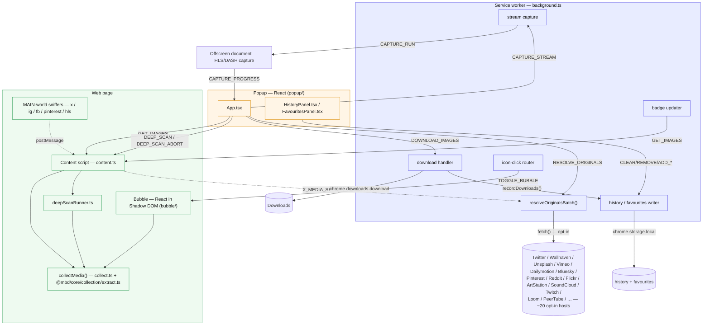
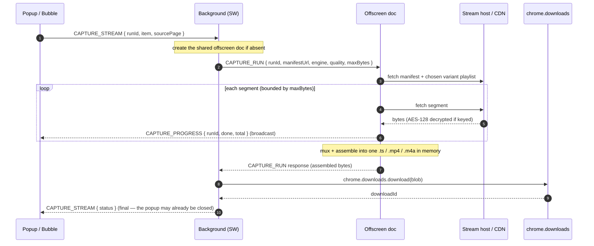

# Architecture

The extension is a cross-browser (Chrome, Firefox 140+, Edge, Safari) Manifest V3 app.
Its surfaces talk over `chrome.runtime` / `chrome.tabs` messages: a background
service worker, an isolated content script per tab, the popup, and the in-page
bubble. Three kinds of helper surface back them — five MAIN-world media sniffers
(x/ig/fb/pinterest response sniffers plus a shared HLS/DASH URL sniffer) and an
offscreen document that assembles captured streams.

## Workspace layout

The repository is a yarn-workspaces monorepo. Browser-agnostic logic lives in
`packages/*`; the WXT app (all entrypoints, background/UI glue) is `apps/extension`.

| Workspace | Package | Holds |
|-----------|---------|-------|
| `packages/core` | `@mbd/core` | Browser-agnostic domain logic: `collection/`, `resolvers/`, `download/` byte-logic, `net/`, and the shared `types`. Zero `chrome.*`. |
| `packages/storage` | `@mbd/storage` | Persistence over `chrome.storage` + IndexedDB (settings, history, favourites, excluded, queue, per-host memory). |
| `packages/platform` | `@mbd/platform` | Browser-capability contracts (`Downloader`, `Notifier`, `HeaderRules`, `StreamCaptureHost`) + `detectCapabilities()`. Implementations live in the app. |
| `apps/extension` | `@mbd/extension` | The WXT app: `entrypoints/`, `background/`, `content/`, `popup/`, `bubble/`, `offscreen/`, `components/`, `shared/`, and the (future) `platform/*` implementations. |

The dependency graph is acyclic: `@mbd/core` (leaf) ← `@mbd/storage`,
`@mbd/platform` ← `@mbd/extension`. Module paths below use each file's
workspace-relative form (`@mbd/core/…`, `@mbd/storage/…`); app-internal modules
(`background/…`, `popup/…`) live under `apps/extension/src/extension/`. See
[`docs/architecture/monorepo-restructure.md`](../architecture/monorepo-restructure.md)
for the full design and rationale.

## Surfaces



The bubble mounts the same shared `App.tsx` as the popup (see
[In-page Bubble](./bubble.md)), so every popup edge above applies to the bubble
too. The diagram omits those duplicates.

## Module responsibilities

| Module | Responsibility |
|--------|----------------|
| `background/index.ts` | Message router, per-tab badge, download + history recording, resolve-originals batching, icon-click routing, popup-vs-bubble mode |
| `content/index.ts` | Answers `GET_IMAGES` / `GET_PAGE_TYPE`, runs the deep-scan lifecycle (`DEEP_SCAN` / `DEEP_SCAN_ABORT`), relays the MAIN-world sniffer envelopes (x/ig/fb/pinterest/hls) to the background and resolver, mounts the bubble |
| `content/collect.ts` | `collectMedia()` — walks the DOM (top doc + open shadow roots + same-origin iframes, plus `<meta>` / `<link preload>` head sources) into `MediaItem[]` |
| `@mbd/core/collection/extract.ts` | Deep DOM extraction: lazy `data-*`, best-srcset, `<noscript>`, gallery `<a href>` |
| `@mbd/core/collection/imageUrl.ts` | `deproxy` + `upgradeToOriginal` (CDN rules), type/dimension parsing |
| `@mbd/core/collection/mediaType.ts` | Video/audio type detection + undownloadable-media skip list |
| `@mbd/core/collection/deepScan.ts` | Pure, bounded, abortable deep-scan loop |
| `content/deepScanRunner.ts` | Binds the loop to the real DOM (page + nested-scroller scrolling, opt-in load-more clicking, MutationObserver); reads Settings caps |
| `shared/active-tab/deep-scan-active-tab.ts` | Popup client that drives deep scan over messaging |
| `shared/active-tab/collect-active-tab.ts` | Popup client that fetches `GET_IMAGES` from the active tab's content script |
| `shared/active-tab/resolve-originals-active.ts` | Popup client that sends `RESOLVE_ORIGINALS` and unwraps the resolved-media map |
| `@mbd/core/collection/filters.ts` | `filterImagesBySettings` (badge/eligibility) + `applyToolbarFilters` |
| `@mbd/storage/settings.ts` | `DEFAULT_SETTINGS` + `withDefaults()` — tolerant merge of stored settings over defaults |
| `@mbd/core/collection/paths.ts` | Download-path token expansion (`{host}` / `{domain}` / `{date}` / `{kind}`) + path sanitizing |
| `@mbd/storage/history.ts` | `HistoryEntry[]` persistence in `chrome.storage.local` — merge/dedup/cap, serialized writes |
| `@mbd/storage/favourites.ts` | `FavouriteEntry[]` persistence in `chrome.storage.local` — same merge/dedup/cap shape |
| `@mbd/core/resolvers/index.ts` | Resolver `REGISTRY` (`twitterResolver, instagramResolver, facebookResolver, threadsResolver, unsplashResolver, wallhavenResolver, behanceResolver, bskyResolver, pinterestResolver, redditResolver, flickrResolver, artstationResolver, pixivResolver, magnificResolver, arcxpResolver, youtubeResolver, mastodonResolver, booruResolver, zerochanResolver, wallpaperscraftResolver, sankakuResolver, postimagesResolver, fourchanResolver, foolfuukaResolver, pikabuResolver, wallpaperHostsResolver, xiaohongshuResolver, spiegelResolver, onedioResolver, animePicturesResolver, genericResolver` — 30 dedicated + the generic fallback) + host-indexed `resolve()` dispatch |
| `@mbd/core/resolvers/sites/*.ts` (64 files: the 30 `REGISTRY` resolvers above, plus id-extraction modules like `vimeo.ts` / `dailymotion.ts` and the page-reader / network-tier modules — TikTok, Imgur, Pornhub, SoundCloud, Twitch, and more — that feed the opt-in network tier without a `REGISTRY` entry) | Per-host, synchronous, network-free URL upgrades; attach `resolveHint` / `unresolvedVideo` / `unresolvedImage` when a better original needs a network fetch |
| `@mbd/core/resolvers/sites/generic.ts` | Fallback resolver: de-proxy + CDN-rule engine, image-only |
| `@mbd/core/resolvers/sniffers/*` (`response-sniffer`, `hls-sniff`, `x-media-sniff`, `ig-media-sniff`, `fb-media-sniff`, `pinterest-media-sniff`, `pinterest-hosts`) | Shared fetch/XHR-wrapping sniffer core + per-platform extractors (HLS/DASH manifests; X/Instagram/Facebook/Pinterest media JSON) and their in-content stores |
| `@mbd/core/resolvers/network.ts` | `resolveOriginal()` — the opt-in network tier: one pinned-host request per hinted platform (Twitter syndication, Wallhaven, Unsplash, Vimeo/Dailymotion player config, Bluesky PDS, Pinterest widget, Flickr/ArtStation pages); Reddit and Bluesky video build the URL with no fetch. https-pinned, SSRF-guarded |
| `@mbd/core/resolvers/types.ts` | `Resolver` / `MediaCandidate` / `ResolveContext` contracts shared by the registry |
| `popup/` | Popup React app |
| `popup/components/panels/HistoryPanel.tsx` | Download History panel UI — list, re-download, open file, reveal in folder, remove, clear all |
| `popup/components/panels/FavouritesPanel.tsx` | Favourites panel UI — list, download, open source, remove, clear all |
| `components/BrandMark.tsx` | Shared brand-icon SVG — single source of truth for the popup header and bubble launcher icon |
| `bubble/` | In-page bubble React app (isolated Shadow DOM) |

## Message catalog

| Message | From → To | Shape | Response |
|---------|-----------|-------|----------|
| **Collection & bubble** | | | |
| `GET_IMAGES` | popup / background → content | string | `MediaItem[]` |
| `TOGGLE_BUBBLE` | background (icon click) → content | string | — (the mounted Bubble component toggles open/closed) |
| `DEEP_SCAN` | popup → content | string | `MediaItem[]` (async, channel held open) |
| `DEEP_SCAN_ABORT` | popup → content | string | `true` |
| `DEEP_SCAN_PROGRESS` | content → runtime (popup listens) | `{ type, found, scrolls, elapsedMs, reason? }` | — (`reason: DeepScanStopReason` set on the final event) |
| **Resolve Originals & capture** | | | |
| `RESOLVE_ORIGINALS` | popup / bubble → background | `{ type, hints: { src, hint: ResolveHint }[] }` | `{ resolved: Record<string, ResolvedMedia> }` (src → `{ url, hls? }`; `hls: true` marks a manifest to capture, not a direct file; successes only) |
| `X_MEDIA_SEEN` | content (MAIN-world sniffer relay) → background | `{ type, pairs: [mediaId, ResolvedMedia][] }` | — (background re-pins + stores each pair) |
| `CAPTURE_STREAM` | popup / bubble → background | `{ type, runId, item: ImageInfo, sourcePage }` | `{ status }` (async; one composed status line; background owns the offscreen doc + download) |
| `CAPTURE_RUN` | background → offscreen document | `{ type, runId, manifestUrl, engine: 'hls'\|'dash', quality, maxBytes }` | — (not part of the `ChromeMessage` union; internal to the capture pipeline) |
| `CAPTURE_PROGRESS` | offscreen → all contexts (popup listens) | `{ type, runId, done, total }` | — |
| `LIST_VARIANTS` | popup → background | `{ type, manifestUrl, engine: 'hls'\|'dash' }` | `{ ok: true, variants: StreamVariant[] } \| { ok: false, code }` — parses the master manifest for the per-stream quality picker (#314) |
| **Downloads** | | | |
| `DOWNLOAD_IMAGES` | popup / bubble → background | `{ type, images, sourcePage?, explicit? }` | `{ status, message }` |
| `DOWNLOAD_ZIP` | popup / bubble → background | `{ type, b64, filename }` | `{ status, message }` |
| `DOWNLOAD_TEXT` | popup / bubble → background | `{ type, filename, text, mime }` | — (fire-and-forget) |
| `DOWNLOAD_BYTES` | popup / bubble → background | `{ type, filename, b64, mime, source? }` | — (fire-and-forget; records history when `source` is present) |
| `OPEN_DOWNLOAD_FILE` | popup / bubble (HistoryPanel) → background | `{ type, downloadId }` | — (fire-and-forget; `chrome.downloads.open`) |
| `SHOW_DOWNLOAD` | popup / bubble (HistoryPanel) → background | `{ type, downloadId }` | — (fire-and-forget; `chrome.downloads.show`) |
| `GET_DOWNLOADED_SRCS` | popup / bubble → background | `{ type }` | `string[]` (srcs still present on disk) |
| `OPEN_URL` | popup / bubble → background | `{ type, url }` | — (opens `url` in a new tab; only `http(s)://` is honored) |
| **Queue ops** | | | |
| `QUEUE_PAUSE` | popup → background | `{ type }` | `{ status, message }` |
| `QUEUE_RESUME` | popup → background | `{ type }` | `{ status, message }` |
| `QUEUE_CANCEL` | popup → background | `{ type, id? }` | `{ status, message }` (omit `id` to cancel all still-live items) |
| `QUEUE_RETRY` | popup → background | `{ type, id, referer? }` | `{ status, message }` (`id: 'all-failed'` retries every failed item) |
| `QUEUE_GET` | popup → background | `{ type }` | a queue snapshot (items + status) |
| `QUEUE_CLEAR` | popup → background | `{ type }` | `{ status, message }` (clears finished done/failed items) |
| `QUEUE_OPEN` | popup → background | `{ type, id }` | `{ status, message }` (`chrome.downloads.open` on a done item) |
| **History** | | | |
| `CLEAR_HISTORY` | popup / bubble (HistoryPanel) → background | `{ type }` | — |
| `REMOVE_HISTORY_ENTRY` | popup / bubble (HistoryPanel) → background | `{ type, src }` | — |
| **Favourites** | | | |
| `ADD_FAVOURITE` | popup / bubble → background | `{ type, entry: FavouriteEntry }` | — |
| `REMOVE_FAVOURITE` | popup / bubble → background | `{ type, src }` | — |
| `CLEAR_FAVOURITES` | popup / bubble (FavouritesPanel) → background | `{ type }` | — |
| **Excluded** | | | |
| `ADD_EXCLUDED` | popup / bubble → background | `{ type, entry: ExcludedEntry }` | — |
| `REMOVE_EXCLUDED` | popup / bubble → background | `{ type, kind, value }` | — |
| `CLEAR_EXCLUDED` | popup / bubble → background | `{ type }` | — |
| **Settings & backup** | | | |
| `SET_SETTINGS` | popup / bubble → background | `{ type, patch: Partial<SettingsData> }` | — (single serialized writer) |
| `GET_SETTINGS` | content → background | `{ type }` | current `SettingsData` (Safari content scripts don't reliably see the popup's `chrome.storage.sync` writes, so the bubble asks directly) |
| `SETTINGS_CHANGED` | background → content (a tab) | `{ type, settings: SettingsData }` | — (pushed after every `SET_SETTINGS` write so the on-page bubble mounts/unmounts live; replaces the `storage.onChanged` listener that doesn't fire for sync changes on Safari) |
| `SET_PER_HOST_SETTINGS` | popup / bubble → background | `{ type, host, patch: Partial<SettingsData> \| null }` | — (`patch: null` clears the host's override and its scan memory) |
| `SAVE_SCAN_MEMORY` | content → background | `{ type, host, sample: { settleMs, scrolls } }` | — (persists the host's learned deep-scan settle time + scroll depth) |
| `RESTORE_DATA` | popup → background | `{ type, favourites, history, excluded }` | — (replaces all three from an imported backup) |

Every history, favourite, and blocklist mutation, plus the file- and
URL-opening messages, is routed through the background service worker even
though it originates in the popup or bubble UI. That keeps every
`chrome.storage.local` write and every `chrome.downloads` / `chrome.tabs` call
in one realm — a single writer, no cross-context races. `RESOLVE_ORIGINALS` is
the only message that reaches an external host (see
[Resolve Originals](./resolve-originals.md)).

The message string and type unions live in `packages/core/src/types.ts`
(`ChromeMessage`).

### Stream capture flow

The one flow that spans three realms — popup, background, and the offscreen
document — and runs to completion independent of the popup:



`CAPTURE_RUN` and `CAPTURE_PROGRESS` are internal to this pipeline; only
`CAPTURE_STREAM` is part of the popup-facing `ChromeMessage` union.

## Data model

`collectMedia()` returns `MediaItem[]` (`MediaItem = ImageInfo`):

```ts
interface ImageInfo {
  src: string;            // upgraded original URL
  alt: string;
  width: number; height: number;   // 0 when unknown (all a/v; some images)
  type: string;           // 'jpeg' | 'png' | ... | 'mp4' | 'mp3' | 'unknown' — canonical, for filtering
  ext?: string;           // true download extension when the resolver knows it (else derived from type)
  fileSize: number;       // bytes; 0 until enriched (images only, popup HEAD)
  isBase64: boolean;
  thumbnailSrc?: string;  // pre-upgrade / gallery-thumbnail fallback for the grid
  kind: 'image' | 'video' | 'audio';   // set by the collector from the element
  poster?: string;        // video poster, used as the grid thumbnail
  resolveHint?: ResolveHint;   // present when an opt-in fetch can upgrade this item
  unresolvedVideo?: boolean;   // real video: poster shown, not downloadable until resolved
  unresolvedImage?: boolean;   // pending Twitter image: not downloadable until the syndication resolve swaps in the real URL
  hlsManifest?: string;        // HLS/DASH manifest: capture (fetch + assemble segments), never a direct download
  mediaKey?: string;           // stable cross-rendition identity, so a re-resolved deep-scan tile replaces its thumbnail row instead of duplicating it
}
```

Two sibling types are persisted to `chrome.storage.local` rather than collected
from the page: `HistoryEntry` (one per completed download) and `FavouriteEntry`
(one per starred item). Both are defined alongside `ImageInfo` in
`packages/core/src/types.ts`; see [Download History](./history.md) and
[Favourites](./favourites.md) for their shape and lifecycle.

## Privacy stance

- Passive collection never fetches media bytes; metadata comes from the DOM and
  URL strings. **Network-free by default.**
- Image size enrichment (`HEAD`) is popup-only, user-initiated, bounded
  concurrency, and skipped for video/audio.
- Deep scan only scrolls; it makes no requests itself.
- The MAIN-world sniffers forge no requests. They passively read responses the
  page already fetched (HLS/DASH manifests; X/Instagram/Facebook/Pinterest media
  JSON) and hand the URLs to the collector.
- The **opt-in** `resolveOriginals` setting (off by default) is the only path
  that contacts an external host. When enabled, the background resolves a hinted
  item to its true original across ~20 platforms: it fetches a small, pinned set
  of host APIs — Twitter's syndication endpoint, the Wallhaven API, Unsplash's
  download endpoint, Vimeo's and Dailymotion's player config, the Bluesky/atproto
  PDS, the Pinterest pin-widget endpoint, Flickr's / ArtStation's public pages,
  and the SoundCloud / Twitch / Loom / PeerTube / Rutube / Rumble / Streamable /
  RedGifs / Sankaku / 9GAG endpoints — and builds the Reddit and Bluesky-video HLS
  masters deterministically, with no fetch. See
  [Resolve Originals](./resolve-originals.md) for exactly what
  is sent and to whom.

Workflow detail: [Getting Started](./getting-started.md) ·
[Collection Pipeline](./collection-pipeline.md) ·
[Resolve Originals](./resolve-originals.md) ·
[Deep Scan](./deep-scan.md) · [Download](./download.md) ·
[Download paths](./download-paths.md) ·
[Download History](./history.md) · [Favourites](./favourites.md) ·
[Badge](./badge.md) · [Bubble](./bubble.md).

---

**[← All guides](./README.md)**
