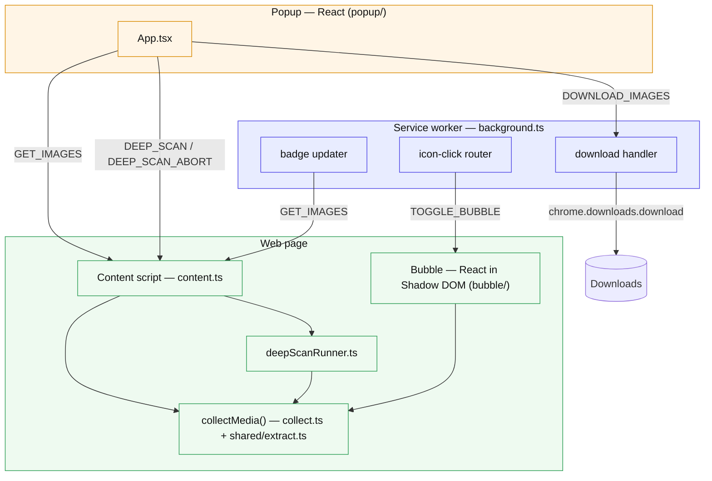

# Architecture

The extension is a Chrome Manifest V3 app with four runtime surfaces that
communicate over `chrome.runtime` / `chrome.tabs` messages.

## Surfaces



## Module responsibilities

| Module | Responsibility |
|--------|----------------|
| `background.ts` | Per-tab badge, download requests, icon-click routing, popup-vs-bubble mode |
| `content.ts` | Answers `GET_IMAGES`/`DEEP_SCAN`, mounts the bubble, relays `TOGGLE_BUBBLE` |
| `collect.ts` | `collectMedia()` — walks the DOM into `MediaItem[]` |
| `shared/extract.ts` | Deep DOM extraction: lazy `data-*`, best-srcset, `<noscript>`, gallery `<a href>` |
| `shared/imageUrl.ts` | `deproxy` + `upgradeToOriginal` (CDN rules), type/dimension parsing |
| `shared/mediaType.ts` | Video/audio type detection + undownloadable-media skip list |
| `shared/deepScan.ts` | Pure, bounded, abortable deep-scan loop |
| `content/deepScanRunner.ts` | Binds the loop to the real DOM (scroll, MutationObserver) |
| `shared/deep-scan-active-tab.ts` | Popup client that drives deep scan over messaging |
| `shared/filters.ts` | `filterImagesBySettings` (badge/eligibility) + `applyToolbarFilters` |
| `popup/` | Popup React app |
| `bubble/` | In-page bubble React app (isolated Shadow DOM) |

## Message catalog

| Message | From → To | Shape | Response |
|---------|-----------|-------|----------|
| `GET_IMAGES` | popup / background → content | string | `MediaItem[]` |
| `DOWNLOAD_IMAGES` | popup → background | `{ type, images }` | `{ status, message }` |
| `DEEP_SCAN` | popup → content | string | `MediaItem[]` (async, channel held open) |
| `DEEP_SCAN_ABORT` | popup → content | string | `true` |
| `DEEP_SCAN_PROGRESS` | content → runtime (popup listens) | `{ type, found, scrolls, elapsedMs }` | — |
| `TOGGLE_BUBBLE` | background (icon click) → content | string | — |

Message string/type unions live in `src/types/index.d.ts` (`ChromeMessage`).

## Data model

`collectMedia()` returns `MediaItem[]` (`MediaItem = ImageInfo`):

```ts
interface ImageInfo {
  src: string;            // upgraded original URL
  alt: string;
  width: number; height: number;   // 0 when unknown (all av; some images)
  type: string;           // 'jpeg' | 'png' | ... | 'mp4' | 'mp3' | 'unknown'
  fileSize: number;       // 0 until enriched (images only, popup HEAD)
  isBase64: boolean;
  thumbnailSrc?: string;  // pre-upgrade / gallery-thumbnail fallback for the grid
  kind: 'image' | 'video' | 'audio';   // set by the collector from the element
  poster?: string;        // video poster, used as the grid thumbnail
}
```

## Privacy stance

- Passive collection never fetches media bytes; metadata comes from the DOM and
  URL strings.
- The only network call is image size enrichment (`HEAD`) — popup-only,
  user-initiated, bounded concurrency, and **skipped for video/audio**.
- Deep scan only scrolls; it makes no requests itself.

Workflow detail: [Collection Pipeline](./collection-pipeline.md) ·
[Deep Scan](./deep-scan.md) · [Download](./download.md) · [Badge](./badge.md) ·
[Bubble](./bubble.md).
