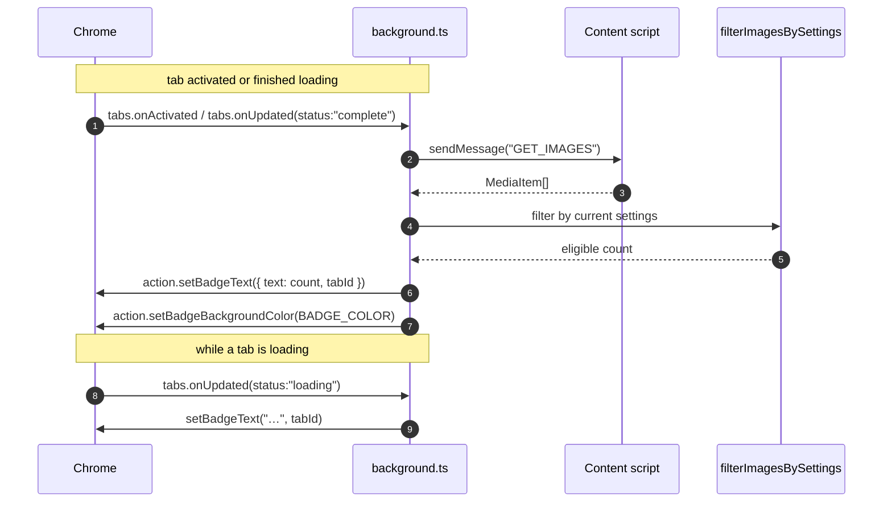
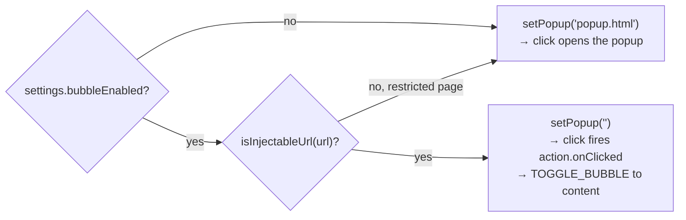

# Badge

The toolbar icon shows the count of **eligible** media on the active tab, kept in
sync by the service worker.

## Flow

## Behavior

- **Loading** tabs show `…` until the page settles, then the real count.
- The count uses the same `filterImagesBySettings` (minimum size + base64
  exclusion) that gates the visible list and downloads, so **badge = what the
  panel shows = what downloads**.
- If the content script can't run (e.g. `chrome://`, the Web Store, AMO),
  the `GET_IMAGES` message fails silently and the badge stays clear.

## Popup vs. bubble mode

The worker also decides what clicking the icon does, via `action.setPopup`, in
`updateTabActionMode`. Two gates must both pass for the bubble to take over —
the setting, **and** `isInjectableUrl(url)`:

`isInjectableUrl` (`apps/extension/src/extension/background/badge.ts`) passes only `http(s):` and
`file:` URLs, and explicitly rejects three store hosts even though they're
`https:`: `chromewebstore.google.com`, `chrome.google.com/webstore`, and
`addons.mozilla.org`. So even with the bubble enabled, those pages (and any
`chrome://`, `about:`, etc. page) fall back to the popup — it's the only
surface that works everywhere.

See [In-page Bubble](./bubble.md) for what `TOGGLE_BUBBLE` does.
