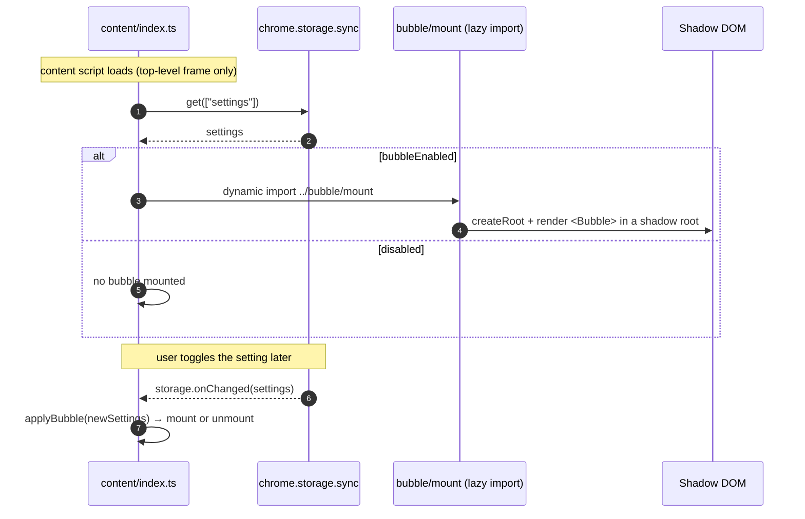
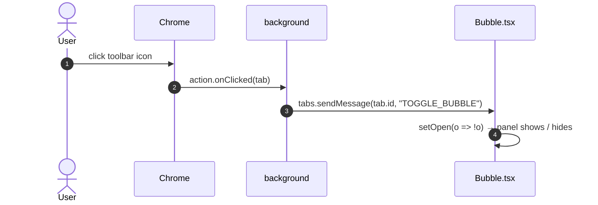

# In-page Bubble

The bubble is an optional floating launcher injected into the page. It renders the
same popup UI (`popup/App.tsx`) inside an isolated **Shadow DOM**, so the page's
styles and the extension's styles can't collide. The toolbar popup stays as a
fallback and works everywhere, including pages where content scripts can't run.

## Lifecycle (enable / disable)

The content script mounts and unmounts the bubble. It reads `settings.bubbleEnabled`
on load, then watches `chrome.storage.sync` for later changes.

Mount builds one host element, `
`, and appends it to
`<html>` with `all: initial` and the max z-index. It attaches an open shadow root,
injects the compiled app CSS into that root, and renders `<Bubble>` through a React
root. Unmount calls `root.unmount()` and removes the host element. `mountBubble` in
the content script guards against mounting twice.

The bubble UI is code-split behind a dynamic `import()`, so pages with the bubble
disabled never load it.

## Open / close (icon click)

Mounting the bubble does not open its panel. The panel starts closed and opens on
demand.

When the bubble is enabled on an injectable page, the background clears that tab's
toolbar popup: `updateTabActionMode` in `background/badge.ts` sets
`chrome.action.setPopup` to `''`. A toolbar click then fires `action.onClicked`
instead of opening a popup. `isInjectableUrl` gates this — it's true for `http`,
`https`, and `file` URLs, and false for the Chrome Web Store, AMO, and browser
pages. On a non-injectable tab the popup stays as the fallback.

Clicking the launcher button toggles the panel too. Bubble.tsx treats a press with
little pointer travel as a click and flips `open`; more travel is a drag.

## Placement & sizing

Four settings hold the bubble's layout:

| Setting                        | Meaning                                                                          |
|--------------------------------|----------------------------------------------------------------------------------|
| `bubblePosition`               | Launcher corner + offset (`{ corner, x, y }`)                                    |
| `bubblePanelPlacement`         | `anchored` (beside the button), `center`, a viewport corner, or `free` (dragged) |
| `bubblePanelPoint`             | Top-left coordinates for the `free` placement                                    |
| `bubbleWidth` / `bubbleHeight` | Panel size (corner-grip resizable)                                              |

Two surfaces edit these fields. The popup Settings panel edits them through its
dropdowns and number fields. Bubble.tsx also writes them as the user manipulates
the bubble: dragging the launcher writes `bubblePosition`, dragging the panel
header sets `bubblePanelPlacement` to `free` and writes `bubblePanelPoint`, and
dragging the resize grip writes `bubbleWidth`/`bubbleHeight`.

Neither surface writes `chrome.storage.sync` directly. Both send
`{ type: 'SET_SETTINGS', patch }` to the background, which applies the patch through
one serialized writer. That ordering keeps a bubble drag and a popup Settings save
from clobbering each other.

## Why Shadow DOM

- The page's CSS can't reach in and restyle the panel. The panel's Tailwind and
  design tokens can't leak out and restyle the page.
- Design tokens are declared on `:host` as well as `:root`, so the theme applies
  inside the shadow root, dark mode (`prefers-color-scheme`) included.

The panel renders the same `App` component as the popup. The bubble passes in-page
implementations of `collect`, `deepScan`, and `abortDeepScan`, plus
`surface="bubble"`, so collection, filtering, deep scan, and download behave as
they do in the popup. See [Architecture](./architecture.md) and
[Deep Scan](./deep-scan.md).

---

**[← All guides](./README.md)**
