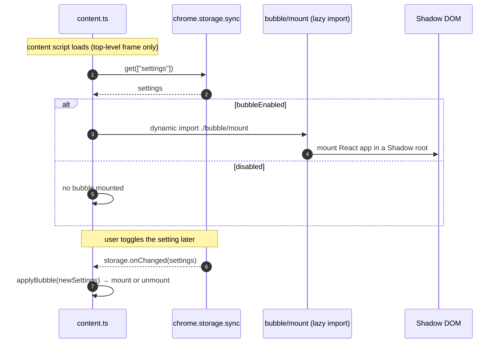
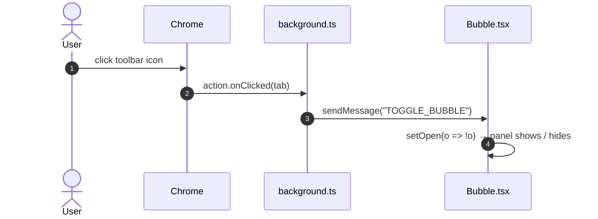

# In-page Bubble

The bubble is an optional floating launcher injected into the page. It opens the
full app in-place inside an isolated **Shadow DOM**, so the extension's styles and
the page's styles don't collide. The popup remains a full fallback (it always
works, including on pages where content scripts can't run).

## Lifecycle (enable / disable)

The heavy bubble UI is code-split behind a dynamic `import()`, so pages without
the bubble enabled stay lightweight.

## Open / close (icon click)

When bubble mode is on, `background.ts` sets the action popup to empty, so
clicking the toolbar icon fires `action.onClicked` instead of opening a popup:

The user can also open/close the panel from the bubble's own launcher button.

## Placement & sizing

Persisted in settings (`chrome.storage.sync`):

| Setting                        | Meaning                                                                          |
|--------------------------------|----------------------------------------------------------------------------------|
| `bubblePosition`               | Launcher corner + offset                                                         |
| `bubblePanelPlacement`         | `anchored` (beside the button), `center`, a viewport corner, or `free` (dragged) |
| `bubblePanelPoint`             | Top-left coordinates for the `free` placement                                    |
| `bubbleWidth` / `bubbleHeight` | Panel size (corner-grip resizable)                                               |

Settings isn't the only writer: `Bubble.tsx`'s own in-page handlers persist these
directly to `chrome.storage.sync` as the user interacts with the bubble —
dragging the launcher writes `bubblePosition`, dragging the panel header sets
`bubblePanelPlacement` to `free` and writes `bubblePanelPoint`, and dragging the
resize grip writes `bubbleWidth`/`bubbleHeight`. Settings is just the other
place these same fields can be edited (via the dropdowns/number fields).

## Why Shadow DOM

- Page CSS can't leak in and restyle the panel; the panel's Tailwind/tokens can't
  leak out and restyle the page.
- Design tokens are declared on `:host` as well as `:root`, so the same theme
  (including dark mode via `prefers-color-scheme`) applies inside the shadow root.

Inside the panel, collection, filtering, deep scan, and download behave exactly as
in the popup — the bubble passes in-page implementations of `collect` and
`deepScan` to the shared `App`. See [Architecture](./architecture.md) and
[Deep Scan](./deep-scan.md).

---

**[← All guides](./README.md)**
