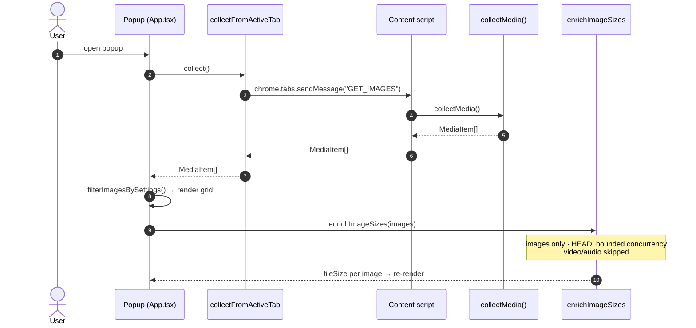
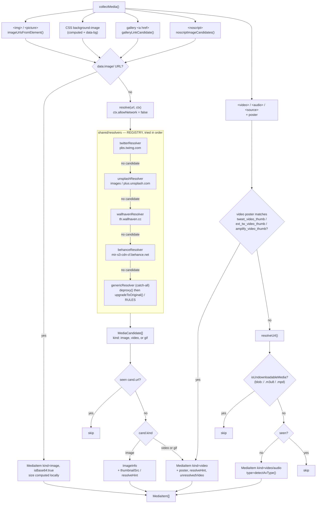

# Collection Pipeline

How a page's media is discovered, resolved to originals through a per-host
resolver registry, de-duplicated, and shown.

## End-to-end (popup scan)

## Inside `collectMedia()`

The collector runs several DOM passes, then routes every raw, non-base64 URL
through `resolve()` — the resolver **registry** (`shared/resolvers/index.ts`) —
before dedup. `<video>`/`<audio>` elements mostly bypass the registry (direct
file sources only), except for a Twitter-specific poster check that can turn a
`<video>` into an image-shaped candidate of `kind: 'video' | 'gif'`.

Only the **generic** resolver runs the pre-registry `deproxy()` →
`upgradeToOriginal()` → `RULES` chain; it's the catch-all (`match: () => true`),
so it always fires — either as the real handler for an unrecognized host, or as
the fallback when a dedicated resolver upstream matched the host but returned no
candidate for that particular path.

### Extraction sources (`shared/extract.ts`)

| Source             | Attributes / pattern                                                                                        |
|--------------------|-------------------------------------------------------------------------------------------------------------|
| Lazy `src`         | `data-src`, `data-original`, `data-lazy-src`, `data-lazy`, `data-hi-res-src`, `data-full-src`, `data-image` |
| Srcset             | `srcset`, `data-srcset`, `data-lazy-srcset` — **highest-width candidate** kept as primary, others as extras |
| Background         | `data-bg`, `data-background`, `data-background-image` + computed `background-image`                         |
| `<noscript>`       | Parsed with `DOMParser`; the real image often lives here for no-JS users                                    |
| Gallery `<a href>` | Anchor whose href `looksLikeMediaUrl` → href is the original, inner `` is the `thumbnailSrc`           |

## Resolver registry (`shared/resolvers/`)

`resolve(rawUrl, ctx)` scheme-guards to http(s), then tries each `Resolver` in
`REGISTRY` order — `twitterResolver → unsplashResolver → wallhavenResolver →
behanceResolver → genericResolver` — and returns the first non-empty
`MediaCandidate[]`.

| Resolver            | Matches                                          | Behavior                                                                                                                                                                                                                                                                                                                                                                                                                                                                                                                                                                                         |
|---------------------|--------------------------------------------------|--------------------------------------------------------------------------------------------------------------------------------------------------------------------------------------------------------------------------------------------------------------------------------------------------------------------------------------------------------------------------------------------------------------------------------------------------------------------------------------------------------------------------------------------------------------------------------------------------|
| `twitterResolver`   | `pbs.twimg.com`                                  | `/media/<id>` → `name=orig` + real format (`webp`→`jpg`); `/profile_images/` and `/profile_banners/` → strip the size suffix; `/card_img/` → `name=orig`. GIF thumbs (`/tweet_video_thumb/<id>`) → `video.twimg.com/tweet_video/<id>.mp4`, `kind:'gif'`. Real-video posters (`/ext_tw_video_thumb/`, `/amplify_video_thumb/`) → `kind:'video'`, `unresolvedVideo:true`, plus `resolveHint:{platform:'twitter', id: statusId}` — the status id comes from a nearby `/status/<id>` link, falling back to the id in the page's own URL (e.g. a single-tweet detail page) when no such link is found |
| `unsplashResolver`  | `images.unsplash.com`, `plus.unsplash.com`       | Strips resize query params (`w`, `h`, `fit`, `resize`, `q`, `quality`, `dpr`, `crop`, `ar`, `cs`, `fm`, `auto`, `bg`, `blend*`, `ixlib` — a smaller subset on `plus.`); attaches `resolveHint:{platform:'unsplash', id}` when the element sits inside an `<a href="/photos/<id>">`                                                                                                                                                                                                                                                                                                               |
| `wallhavenResolver` | `th.wallhaven.cc`                                | Reads the wallpaper id from the thumb path or a `figure[data-wallpaper-id]`; if the real extension is readable from the DOM (a full `` on the page, or a png/gif badge on the figure), rewrites straight to `w.wallhaven.cc/full/<ab>/wallhaven-<id>.<ext>`; otherwise keeps the thumb URL and attaches `resolveHint:{platform:'wallhaven', id}`. On the grid it also reads the figure's `span.wall-res` to record the wallpaper's **true** full resolution (not the small thumbnail's)                                                                                                     |
| `behanceResolver`   | `mir-s3-cdn-cf.behance.net`                      | Rewrites `/project_modules/<size>/` (`disp`/`max_1200`/`1400`/`fs`) → `/project_modules/source/`, and strips the search-grid's base64 crop token (`<hash>.<crop>.<ext>` → `<hash>.<ext>`); if the element (or its `srcset`/`data-src`, or a sibling `<source>`) already exposes a `source`/`fs` URL on the same host, that DOM value wins over the rewrite. Returns `[]` (falls through to `genericResolver`) only when the upgrade would leave the URL unchanged (e.g. element already at `source`) — the `fs→source` rewrite otherwise applies                                                 |
| `genericResolver`   | everything else (catch-all, `match: () => true`) | Today's `deproxy()` → `upgradeToOriginal()` → `RULES` chain — see below                                                                                                                                                                                                                                                                                                                                                                                                                                                                                                                          |

Twitter, Unsplash, Wallhaven, and Behance each get a **dedicated** resolver;
every other host — including the 40+ CDN families in the coverage benchmark —
falls through to the generic resolver.

## Generic resolver: URL intelligence (`shared/imageUrl.ts`)

Reached for any host no dedicated resolver above claims, **plus** the rare
fallthrough case: `twitterResolver.resolve()` returns `[]` for a
`pbs.twimg.com` path it doesn't recognize, and the loop continues to
`genericResolver`, whose `RULES` still carry a legacy `pbs.twimg.com` rewrite as
a safety net for that case. (`unsplashResolver` and `wallhavenResolver`-with-a-known-id
never return `[]` for their matched hosts, so the `RULES` entry below that also
matches `images.unsplash.com`/`plus.unsplash.com` is effectively unreachable for
those two hosts today — it's still live for the `*.imgix.net` hosts it shares a
rule with, which no dedicated resolver claims.)

Order: `deproxy()` first, then the first matching CDN rule.

### De-proxy (unwrap once)

| Proxy            | Example                                            | Result                                    |
|------------------|----------------------------------------------------|-------------------------------------------|
| Next.js          | `/_next/image?url=<enc>&w=640`                     | decoded inner URL                         |
| weserv           | `images.weserv.nl/?url=cdn.com%2Fb.png`            | `https://cdn.com/b.png`                   |
| Cloudinary fetch | `/image/fetch/w_200/https://cdn.com/d.jpg`         | `https://cdn.com/d.jpg`                   |
| Generic          | `?url=` / `?u=` / `?src=` / `?image=` / `?imgurl=` | inner URL **only if** `looksLikeMediaUrl` |

`looksLikeMediaUrl` accepts a media file extension, a known media CDN host, or a
`format=`/`fm=` param **whose value is a real media format** (so `?format=csv`
is rejected).

Substack's `substackcdn.com/image/fetch/$s_!sig!,w_160,…/https%3A%2F%2F…` fits
the Cloudinary-fetch shape above unchanged — no Substack-specific branch was
needed, just a regression test.

### Safe path-based CDN upgrades

| Host                                                                             | Rewrite                                                                                                 |
|----------------------------------------------------------------------------------|---------------------------------------------------------------------------------------------------------|
| `pbs.twimg.com` (Twitter/X) — **fallback only**, see above                       | `name=<size>` → `name=orig`                                                                             |
| `*.googleusercontent.com` / `*.ggpht.com`                                        | trailing `=s200` / `=w200-h200` → `=s0`                                                                 |
| `i.pinimg.com`                                                                   | `/236x/` … `/736x/` → `/originals/`                                                                     |
| `i.ytimg.com` / `img.youtube.com`                                                | `/vi/<id>/<name>.jpg` → `maxresdefault.jpg`                                                             |
| `*.media-amazon.com` / `ssl-images-amazon.com`                                   | strip `._SX300_SY300_.` encoding segment                                                                |
| `miro.medium.com`                                                                | drop chained `resize/fit/format` transform segments                                                     |
| `images`/`plus.unsplash.com` — **unreachable**, see above · `*.imgix.net` — live | strip resize query params                                                                               |
| WordPress/Jetpack, Shopify, Cloudinary, Wikimedia                                | (existing rules — see source)                                                                           |
| `images.pexels.com`                                                              | strips the resize query string                                                                          |
| `cdn.pixabay.com`                                                                | `_<size>` → `_1280` (capped — largest hotlinkable; true original is login-gated)                        |
| `*.staticflickr.com`                                                             | small size code (`s`/`q`/`t`/`m`/`n`/`w`/`z`/`c`) → `_b` (1024, capped); already-large sizes left alone |
| `*.media.tumblr.com`                                                             | `/sWxH/` → `/s1280x1920/`                                                                               |
| `ichef.bbci.co.uk`                                                               | width segment (`/news/<N>/`, `/ace/standard/<N>/`) → `1920`                                             |
| `i.etsystatic.com`                                                               | `il_WxH` → `il_fullxfull`                                                                               |
| `i.ebayimg.com`                                                                  | `s-l<NNN>` → `s-l1600`                                                                                  |
| `platform.theverge.com` (WP uploads)                                             | strip the resize query                                                                                  |

Wallhaven and Behance have **no** entry here — their upgrades live entirely in
`wallhavenResolver` / `behanceResolver` above; a URL either resolver's `match`
claims but can't upgrade (a Wallhaven thumb with no readable id, or a Behance
URL already at `source`/`fs`) falls through and is collected unmodified by the
generic resolver, since neither host has a `RULES` entry here.

**Signed hosts** (`*.fbcdn.net`, `preview.redd.it`) get **no rule and no query
strip** — their signature lives in the query, so stripping it would 403. They are
still collected, just not "upgraded."

Every upgrade returns `{ original, thumbnail: <input> }`, so the pre-upgrade URL
is kept as `thumbnailSrc` and the grid preview renders even if the upgraded
original later fails to download.

## `resolveHint` and `unresolvedVideo`

Some candidates can't be fully resolved without a network request — a Twitter
real-video poster, an Unsplash photo whose exact master needs its own download
endpoint, a Wallhaven thumb with no extension evidence in the DOM. Rather than
fetch during collection — collection runs with `ctx.allowNetwork: false` and
never issues a request of its own — the resolver attaches:

- **`resolveHint: { platform, id }`** — enough (a Twitter status id, Wallhaven
  wallpaper id, or Unsplash photo id) to look the real original up later, over
  the network, if the user opts in.
- **`unresolvedVideo: true`** — this item's only known `src` is a still-frame
  poster, not a downloadable video file.

Collection itself never contacts these hosts. An `unresolvedVideo` item is
still **shown** in the popup grid — poster image, ▶ badge, and (when it also
carries a `resolveHint`) a "Get video" action — but it's excluded from the
downloadable set until it resolves to a real file; a pending video with no
`resolveHint` at all (no `/status/` link nearby and no status id in the page
URL either) is shown with no action to take on it.

Getting from "hinted/pending" to "downloadable" happens over the network, and
now two ways: automatically, if `resolveOriginals` is on, or on demand — one
item at a time — via that "Get video" button, regardless of the setting. See
[Resolve Originals](./resolve-originals.md) for both paths, the exact
endpoints called, how the popup swaps the resolved URL into the displayed
item, and how a resolve that comes back empty (e.g. a tombstoned,
age-restricted tweet) is surfaced rather than silently dropped.

## Dedup

Both pipelines share one `seenSources` Set, keyed on the **resolved candidate
URL** (`cand.url`) — whichever resolver in the registry produced it. Two
different thumbnails/proxies that resolve to the same URL collapse to a single
`MediaItem`.

---

Related: [Resolve Originals](./resolve-originals.md) (the opt-in network step
for `resolveHint`/`unresolvedVideo` items) · [Deep Scan](./deep-scan.md) (each
scan round re-runs this pipeline) · [Download](./download.md).
