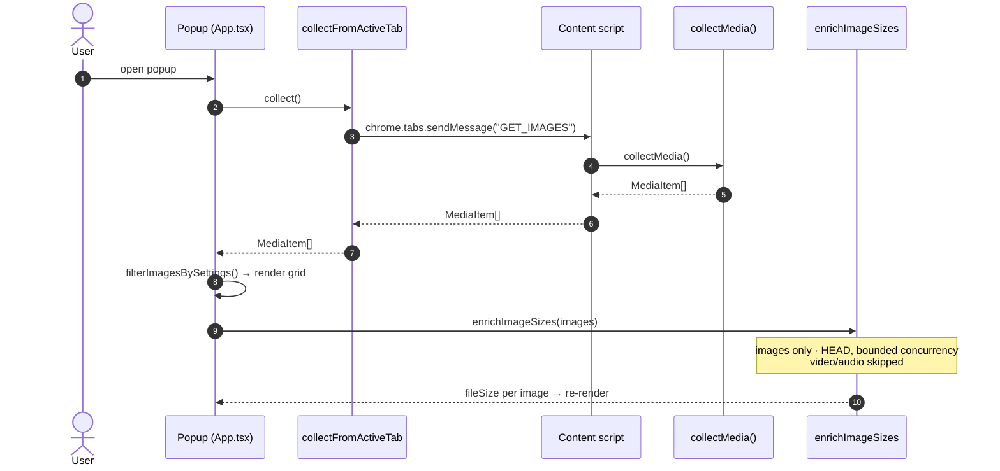
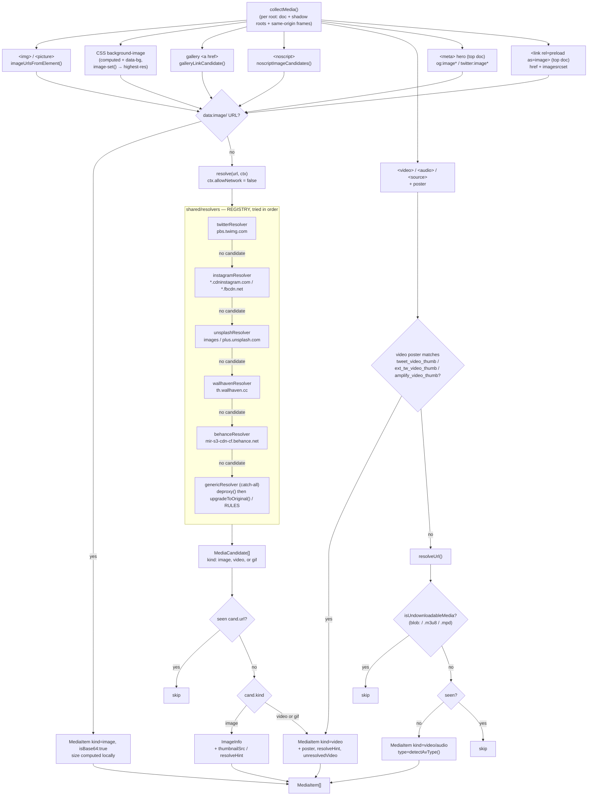

# Collection Pipeline

How a page's media is discovered, resolved to originals through a per-host
resolver registry, de-duplicated, and shown.

## End-to-end (popup scan)

## Inside `collectMedia()`

The collector runs several DOM passes over **multiple roots** — the top document
plus every open shadow root and every reachable same-origin `<iframe>` document
discovered during the walk (cross-origin frames are skipped) — then two
top-document-only head passes (`<meta>` hero images and `<link rel=preload>`).
Every raw, non-base64 URL is routed through `resolve()` — the resolver
**registry** (`shared/resolvers/index.ts`) — before dedup.
`<video>`/`<audio>` elements mostly bypass the registry (direct file sources
only), except for a Twitter-specific poster check that can turn a `<video>` into
an image-shaped candidate of `kind: 'video' | 'gif'`. On a single Instagram
post/reel page a `collectMedia` tail-pass also pulls the whole post from its page
JSON (`instagramPageMedia`), covering media the DOM hides — virtualized carousel
slides and `blob:`-backed reel videos.

Element passes (IMG/BG/GAL/NS/AV) run **per root** — the top document plus every
open shadow root and same-origin `<iframe>` document. The META and PRELOAD passes
run on the top document only.

Only the **generic** resolver runs the pre-registry `deproxy()` →
`upgradeToOriginal()` → `RULES` chain; it's the catch-all (`match: () => true`),
so it always fires — either as the real handler for an unrecognized host, or as
the fallback when a dedicated resolver upstream matched the host but returned no
candidate for that particular path.

### Extraction sources (`shared/extract.ts`)

| Source             | Attributes / pattern                                                                                        |
|--------------------|-------------------------------------------------------------------------------------------------------------|
| Lazy `src`         | In preference order: `data-orig-file`, `data-large-file` (WordPress/Jetpack **true original** — surfaced first so it wins without a CDN rule), then `data-src`, `data-original`, `data-original-src`, `data-actualsrc`, `data-lazy-src`, `data-lazy`, `data-lazyload`, `data-hi-res-src`, `data-src-large`, `data-full-src`, `data-image`, `data-echo`, `data-flickity-lazyload` |
| Srcset             | `srcset`, `data-srcset`, `data-lazy-srcset` — **highest-width srcset candidate** kept ahead of its narrower siblings; a lazy-`src` attr above, when present, still takes primary (index 0, paired with DOM dimensions) |
| Background         | `data-bg`, `data-background`, `data-background-image` + computed `background-image` (incl. `image-set()`/`-webkit-image-set()` — only the highest-resolution candidate of each layer is kept) |
| `<noscript>`       | Parsed with `DOMParser`; the real image often lives here for no-JS users                                    |
| Gallery `<a href>` | Anchor whose href `looksLikeMediaUrl` → href is the original, inner `` is the `thumbnailSrc`           |

### Root & head sources (`shared/collect.ts`)

Beyond the per-element attrs above, `collectMedia()` widens where it looks:

| Source                        | What it does                                                                                                   |
|-------------------------------|----------------------------------------------------------------------------------------------------------------|
| Open shadow roots             | Any element's `el.shadowRoot` is added as an extra root; all element passes re-run inside it                    |
| Same-origin `<iframe>`        | Reachable `iframe.contentDocument`s are added as extra roots; cross-origin frames are skipped                   |
| `<meta>` hero (top doc only)  | `og:image`, `og:image:url`, `og:image:secure_url`, `twitter:image`, `twitter:image:src`                        |
| `<link rel=preload>` (top doc)| `rel=preload as=image` → `href` + `imagesrcset` (highest-width)                                                 |

A perf guard skips the computed-`background-image` pass for elements with no
layout box (`offsetWidth === 0 && offsetHeight === 0`, e.g. `display:none`).

## Resolver registry (`shared/resolvers/`)

`resolve(rawUrl, ctx)` scheme-guards to http(s), then tries each `Resolver` in
`REGISTRY` order — `twitterResolver → instagramResolver → unsplashResolver →
wallhavenResolver → behanceResolver → genericResolver` — and returns the first non-empty
`MediaCandidate[]`.

| Resolver            | Matches                                          | Behavior                                                                                                                                                                                                                                                                                                                                                                                                                                                                                                                                                                                         |
|---------------------|--------------------------------------------------|--------------------------------------------------------------------------------------------------------------------------------------------------------------------------------------------------------------------------------------------------------------------------------------------------------------------------------------------------------------------------------------------------------------------------------------------------------------------------------------------------------------------------------------------------------------------------------------------------|
| `twitterResolver`   | `pbs.twimg.com`                                  | `/media/<id>` → `name=orig` + real format (`webp`→`jpg`); `/profile_images/` and `/profile_banners/` → strip the size suffix; `/card_img/` → `name=orig`. GIF thumbs (`/tweet_video_thumb/<id>`) → `video.twimg.com/tweet_video/<id>.mp4`, `kind:'gif'`. Real-video posters (`/ext_tw_video_thumb/`, `/amplify_video_thumb/`) → `kind:'video'`, `unresolvedVideo:true`, plus `resolveHint:{platform:'twitter', id: statusId}` — the status id comes from a `/status/<id>` link the element sits inside (the media-grid cell), else the enclosing tweet `<article>`'s **own** permalink (the `<time>`-wrapped or `/photo`/`/video` link — chosen over any quoted/embedded tweet's link in the same article), falling back to the id in the page's own URL (e.g. a single-tweet detail page) when none is found |
| `instagramResolver` | `*.cdninstagram.com`, `*.fbcdn.net`              | Reels/videos whose feed carries only a cover (`media_type` 2 with `image_versions2` but no `video_versions` — the reels-tab and profile grid) surface as **pending videos** (poster = cover) with `resolveHint {platform:'instagram', id: shortcode}`. Each resolves to its real mp4 either when that reel's own response is seen by the sniffer (it plays/opens) or on demand via "Get video" — the background then GETs the reel's own page with the user's session cookies and reads the mp4 from its embedded JSON (`igMediaFromHtml`), read-only; returns "couldn't fetch" if Instagram gated the page. Instagram's CDNs are **signed** (the `stp` size token is covered by the `oh` HMAC — stripping it 403s, verified live), so no URL rewrite is possible. Instead the resolver finds the post shortcode from the enclosing `/p\|reel\|tv/<code>` link (else `ctx.pageUrl`) and returns **every slide** of that post from the media graph Instagram ships in the page's own `<script type="application/json">` hydration and the GraphQL/`api/v1` responses it fetches on scroll: images at their largest `image_versions2.candidates`, videos as their real progressive-mp4 `video_versions` (the on-page `<video>` is a `blob:` MSE stream and undownloadable). The scroll responses are read by a passive MAIN-world sniffer (`ig-media-sniffer`) that wraps the page's `fetch`/`XHR` — read-only, forges nothing — and fed into the resolver via a host-pinning relay. Non-post images (avatars, tagged-user `/username/` links, UI chrome) return `[]` and fall through to the generic resolver |
| `unsplashResolver`  | `images.unsplash.com`, `plus.unsplash.com`       | Strips resize query params (`w`, `h`, `fit`, `resize`, `q`, `quality`, `dpr`, `crop`, `ar`, `cs`, `fm`, `auto`, `bg`, `blend*`, `ixlib` — a smaller subset on `plus.`); attaches `resolveHint:{platform:'unsplash', id}` when the element sits inside an `<a href="/photos/<id>">`                                                                                                                                                                                                                                                                                                               |
| `wallhavenResolver` | `th.wallhaven.cc`                                | Reads the wallpaper id from the thumb path (`/{small\|lg\|orig}/<ab>/<id>.jpg`), a `figure[data-wallpaper-id]`, or the figure's `a.preview` `/w/<id>` link (id shape-validated). If the real extension is readable from the DOM (a full `` on the page, or a `span.png`/`span.gif` badge on the figure — confirmed live, ~34% of a page are png), rewrites straight to `w.wallhaven.cc/full/<ab>/wallhaven-<id>.<ext>`; an unbadged figure is genuinely jpg (Wallhaven only badges non-jpg). With no DOM ext evidence at all it hands back the largest guaranteed-existing jpg — the `/orig/` thumb — plus `resolveHint:{platform:'wallhaven', id}` (never a blind full-file URL that could 404 for a png). The grid preview `thumbnailSrc` is bumped `/small`→`/lg` for sharpness (never downgraded), and it reads the figure's `span.wall-res` for the wallpaper's **true** full resolution (not the thumbnail's)                                                       |
| `behanceResolver`   | `mir-s3-cdn-cf.behance.net`                      | Rewrites `/project_modules/<size>/` (`disp`/`max_1200`/`1400`/`fs`) → `/project_modules/source/`, and strips the search-grid's base64 crop token (`<hash>.<crop>.<ext>` → `<hash>.<ext>`); if the element (or its `srcset`/`data-src`, or a sibling `<source>`) already exposes a `source`/`fs` URL on the same host, that DOM value wins over the rewrite. Returns `[]` (falls through to `genericResolver`) only when the upgrade would leave the URL unchanged (e.g. element already at `source`) — the `fs→source` rewrite otherwise applies                                                 |
| `genericResolver`   | everything else (catch-all, `match: () => true`) | Today's `deproxy()` → `upgradeToOriginal()` → `RULES` chain — see below                                                                                                                                                                                                                                                                                                                                                                                                                                                                                                                          |

Twitter, Instagram, Unsplash, Wallhaven, and Behance each get a **dedicated** resolver;
every other host — including the 40+ CDN families in the coverage benchmark —
falls through to the generic resolver.

## Generic resolver: URL intelligence (`shared/imageUrl.ts`)

Reached for any host no dedicated resolver above claims, **plus** the rare
fallthrough case: `twitterResolver.resolve()` returns `[]` for a
`pbs.twimg.com` path it doesn't recognize, and the loop continues to
`genericResolver`, whose `RULES` still carry a legacy `pbs.twimg.com` rewrite as
a safety net for that case. (`unsplashResolver` and `wallhavenResolver`-with-a-known-id
never return `[]` for their matched hosts, so the `RULES` entry below that also
matches `images.unsplash.com`/`plus.unsplash.com` is effectively unreachable for
those two hosts today — it's still live for the `*.imgix.net` hosts it shares a
rule with, which no dedicated resolver claims.)

Order: `deproxy()` first, then the first matching CDN rule.

### De-proxy (unwrap once)

| Proxy            | Example                                            | Result                                    |
|------------------|----------------------------------------------------|-------------------------------------------|
| Next.js          | `/_next/image?url=<enc>&w=640`                     | decoded inner URL                         |
| weserv           | `images.weserv.nl/?url=cdn.com%2Fb.png`            | `https://cdn.com/b.png`                   |
| Cloudinary fetch | `/image/fetch/w_200/https://cdn.com/d.jpg`         | `https://cdn.com/d.jpg`                   |
| Generic          | `?url=` / `?u=` / `?src=` / `?image=` / `?imgurl=` | inner URL **only if** `looksLikeMediaUrl` |

`looksLikeMediaUrl` accepts a media file extension, a known media CDN host, or a
`format=`/`fm=` param **whose value is a real media format** (so `?format=csv`
is rejected).

Substack's `substackcdn.com/image/fetch/$s_!sig!,w_160,…/https%3A%2F%2F…` fits
the Cloudinary-fetch shape above unchanged — no Substack-specific branch was
needed, just a regression test.

### Safe path-based CDN upgrades

| Host                                                                             | Rewrite                                                                                                 |
|----------------------------------------------------------------------------------|---------------------------------------------------------------------------------------------------------|
| `pbs.twimg.com` (Twitter/X) — **fallback only**, see above                       | `name=<size>` → `name=orig`                                                                             |
| `*.googleusercontent.com` / `*.ggpht.com`                                        | trailing `=s200` / `=w200-h200` → `=s0`                                                                 |
| `i.pinimg.com`                                                                   | `/236x/` … `/736x/` → `/originals/`                                                                     |
| `i.ytimg.com` / `img.youtube.com`                                                | small thumbs (`default`/`mqdefault`/`0`–`3`) → `hqdefault.jpg` (always-present max; maxres/sd 404 for many videos) |
| `*.media-amazon.com` / `ssl-images-amazon.com`                                   | strip `._SX300_SY300_.` encoding segment                                                                |
| `miro.medium.com`                                                                | drop chained `resize/fit/format` transform segments                                                     |
| `images`/`plus.unsplash.com` — **unreachable**, see above · `*.imgix.net` — live | strip resize query params                                                                               |
| WordPress/Jetpack, Shopify, Cloudinary, Wikimedia                                | (existing rules — see source)                                                                           |
| `images.pexels.com`                                                              | strips the resize query string                                                                          |
| `cdn.pixabay.com`                                                                | `_<size>` → `_1280` (capped — largest hotlinkable; true original is login-gated)                        |
| `*.staticflickr.com`                                                             | small size code (`s`/`q`/`t`/`m`/`n`/`w`/`z`/`c`) → `_b` (1024, capped); already-large sizes left alone |
| `ichef.bbci.co.uk`                                                               | width segment (`/news/<N>/`, `/ace/standard/<N>/`) → `2048` (1920 404s on the `/news/` path)            |
| `i.etsystatic.com`                                                               | `il_WxH` → `il_fullxfull`                                                                               |
| `i.ebayimg.com`                                                                  | `s-l<NNN>` → `s-l1600`                                                                                  |
| `platform.theverge.com` (WP uploads)                                             | strip the resize query                                                                                  |
| self-hosted WordPress (any host, `/wp-content/uploads/`)                          | drop resize query + strip `-WxH` / `-scaled` → original                                                 |
| `*.scene7.com` (Adobe Scene7 — Target, REI, …)                                   | set `wid=2000`, drop `hei`/`qlt`/`fmt`/`resMode`/`op_usm`/`fit`                                         |
| `cdn*.artstation.com`                                                             | size bucket (`smaller_square`/`medium`/…) → `/large/`                                                   |
| `static01.nyt.com`                                                               | editorial crop (`articleLarge`, `mediumThreeByTwo…`) → `-superJumbo`, clear query                       |
| `i.imgur.com`                                                                    | 8-char thumb suffix (`s`/`b`/`t`/`m`/`l`/`h`/`r`/`g`) → 7-char original id                              |
| `*.alicdn.com` / `*.aliexpress-media.com`                                        | strip transform suffix after the real ext (`.jpg_640x640.jpg_.webp` → `.jpg`)                           |
| `cdn.dribbble.com`                                                               | drop the `?resize=` query → original                                                                    |
| `*.walmartimages.com`                                                            | drop `odnHeight`/`odnWidth`/`odnBg` query → full source                                                 |
| `*.wixmp.com` (DeviantArt), `/v1/(fit\|fill)/`                                    | decode signed-token cap → `/v1/fill/w,h,q_100/` within cap (fail-safe: unchanged)                       |
| `photos.zillowstatic.com`                                                        | trailing `-<token>.<ext>` → `-uncropped_scaled_within_1536_1152.webp`                                   |
| `cdn.stocksnap.io` (`/img-thumbs/`)                                              | `/img-thumbs/<token>/` → `/img-thumbs/960w/` (max whitelisted size)                                     |
| `www.ikea.com` (`/images/`)                                                      | clear query, set `?imwidth=2000` (beats the `f=` ladder)                                                |
| `c1.neweggimages.com`                                                            | `…compressall<N>` → `…compressall1280` (max)                                                            |
| `img.kwcdn.com` (Temu, query has `imageView2`)                                   | drop the Qiniu `imageView2/…w/q/format` transform query → stored original                                |

Wallhaven and Behance have **no** entry here — their upgrades live entirely in
`wallhavenResolver` / `behanceResolver` above; a URL either resolver's `match`
claims but can't upgrade (a Wallhaven thumb with no readable id, or a Behance
URL already at `source`/`fs`) falls through and is collected unmodified by the
generic resolver, since neither host has a `RULES` entry here.

**Signed hosts** (`*.fbcdn.net`, `preview.redd.it`, `*.cdninstagram.com`,
`*.tiktokcdn.com`, `media.licdn.com`) get **no rule and no query strip** — their
signature (an HMAC token bound to the URL, incl. the size on LinkedIn's
`dms/image/v2` renditions) lives in the URL, so rewriting it would 401/403. They
are still collected, just not "upgraded." Instagram/Facebook CDN URLs
(`*.cdninstagram.com`, `*.fbcdn.net`) are the exception that proves the rule: the
`instagramResolver` never rewrites them either — it instead **reads** the largest
already-signed URL Instagram shipped in its own page JSON, so the full-res
original is surfaced without touching the signature.

Every upgrade returns `{ original, thumbnail: <input> }`, so the pre-upgrade URL
is kept as `thumbnailSrc` and the grid preview renders even if the upgraded
original later fails to download.

## `resolveHint` and `unresolvedVideo`

Some candidates can't be fully resolved without a network request — a Twitter
real-video poster, an Unsplash photo whose exact master needs its own download
endpoint, a Wallhaven thumb with no extension evidence in the DOM. Rather than
fetch during collection — collection runs with `ctx.allowNetwork: false` and
never issues a request of its own — the resolver attaches:

- **`resolveHint: { platform, id }`** — enough (a Twitter status id, Wallhaven
  wallpaper id, or Unsplash photo id) to look the real original up later, over
  the network, if the user opts in.
- **`unresolvedVideo: true`** — this item's only known `src` is a still-frame
  poster, not a downloadable video file.

Collection itself never contacts these hosts. An `unresolvedVideo` item is
still **shown** in the popup grid — poster image, ▶ badge, and (when it also
carries a `resolveHint`) a "Get video" action — but it's excluded from the
downloadable set until it resolves to a real file; a pending video with no
`resolveHint` at all (no `/status/` link nearby and no status id in the page
URL either) is shown with no action to take on it.

Getting from "hinted/pending" to "downloadable" happens over the network, and
now two ways: automatically, if `resolveOriginals` is on, or on demand — one
item at a time — via that "Get video" button, regardless of the setting. See
[Resolve Originals](./resolve-originals.md) for both paths, the exact
endpoints called, how the popup swaps the resolved URL into the displayed
item, and how a resolve that comes back empty (e.g. a tombstoned,
age-restricted tweet) is surfaced rather than silently dropped.

## Dedup

Both pipelines share one `seenSources` Set, keyed on the **resolved candidate
URL** (`cand.url`) — whichever resolver in the registry produced it. Two
different thumbnails/proxies that resolve to the same URL collapse to a single
`MediaItem`.

---

Related: [Resolve Originals](./resolve-originals.md) (the opt-in network step
for `resolveHint`/`unresolvedVideo` items) · [Deep Scan](./deep-scan.md) (each
scan round re-runs this pipeline) · [Download](./download.md).
