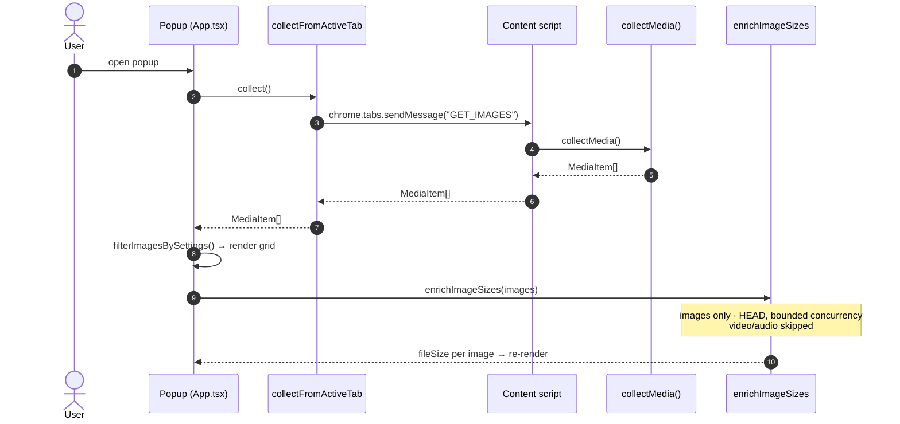
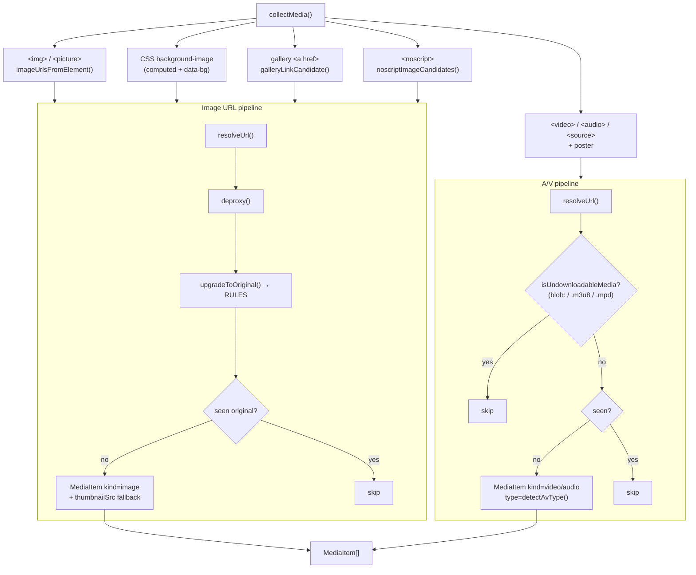

# Collection Pipeline

How a page's media is discovered, upgraded to originals, de-duplicated, and shown.

## End-to-end (popup scan)

## Inside `collectMedia()`

The collector runs several DOM passes, then routes every raw URL through one
shared upgrade + dedup path.

### Extraction sources (`shared/extract.ts`)

| Source | Attributes / pattern |
|--------|----------------------|
| Lazy `src` | `data-src`, `data-original`, `data-lazy-src`, `data-lazy`, `data-hi-res-src`, `data-full-src`, `data-image` |
| Srcset | `srcset`, `data-srcset`, `data-lazy-srcset` — **highest-width candidate** kept as primary, others as extras |
| Background | `data-bg`, `data-background`, `data-background-image` + computed `background-image` |
| `<noscript>` | Parsed with `DOMParser`; the real image often lives here for no-JS users |
| Gallery `<a href>` | Anchor whose href `looksLikeMediaUrl` → href is the original, inner `` is the `thumbnailSrc` |

## URL intelligence (`shared/imageUrl.ts`)

Order: `deproxy()` first, then the first matching CDN rule.

### De-proxy (unwrap once)

| Proxy | Example | Result |
|-------|---------|--------|
| Next.js | `/_next/image?url=<enc>&w=640` | decoded inner URL |
| weserv | `images.weserv.nl/?url=cdn.com%2Fb.png` | `https://cdn.com/b.png` |
| Cloudinary fetch | `/image/fetch/w_200/https://cdn.com/d.jpg` | `https://cdn.com/d.jpg` |
| Generic | `?url=` / `?u=` / `?src=` / `?image=` / `?imgurl=` | inner URL **only if** `looksLikeMediaUrl` |

`looksLikeMediaUrl` accepts a media file extension, a known media CDN host, or a
`format=`/`fm=` param **whose value is a real media format** (so `?format=csv`
is rejected).

### Safe path-based CDN upgrades

| Host | Rewrite |
|------|---------|
| `pbs.twimg.com` (Twitter/X) | `name=<size>` → `name=orig` |
| `*.googleusercontent.com` / `*.ggpht.com` | trailing `=s200` / `=w200-h200` → `=s0` |
| `i.pinimg.com` | `/236x/` … `/736x/` → `/originals/` |
| `i.ytimg.com` / `img.youtube.com` | `/vi/<id>/<name>.jpg` → `maxresdefault.jpg` |
| `*.media-amazon.com` / `ssl-images-amazon.com` | strip `._SX300_SY300_.` encoding segment |
| `miro.medium.com` | drop chained `resize/fit/format` transform segments |
| WordPress/Jetpack, Shopify, Unsplash/Imgix, Cloudinary, Wikimedia | (existing rules — see source) |

**Signed hosts** (`*.fbcdn.net`, `preview.redd.it`) get **no rule and no query
strip** — their signature lives in the query, so stripping it would 403. They are
still collected, just not "upgraded."

Every upgrade returns `{ original, thumbnail: <input> }`, so the pre-upgrade URL
is kept as `thumbnailSrc` and the grid preview renders even if the upgraded
original later fails to download.

## Dedup

Both pipelines share one `seenSources` Set, keyed on the **upgraded original**.
Two different thumbnails/proxies that resolve to the same original collapse to a
single `MediaItem`.
