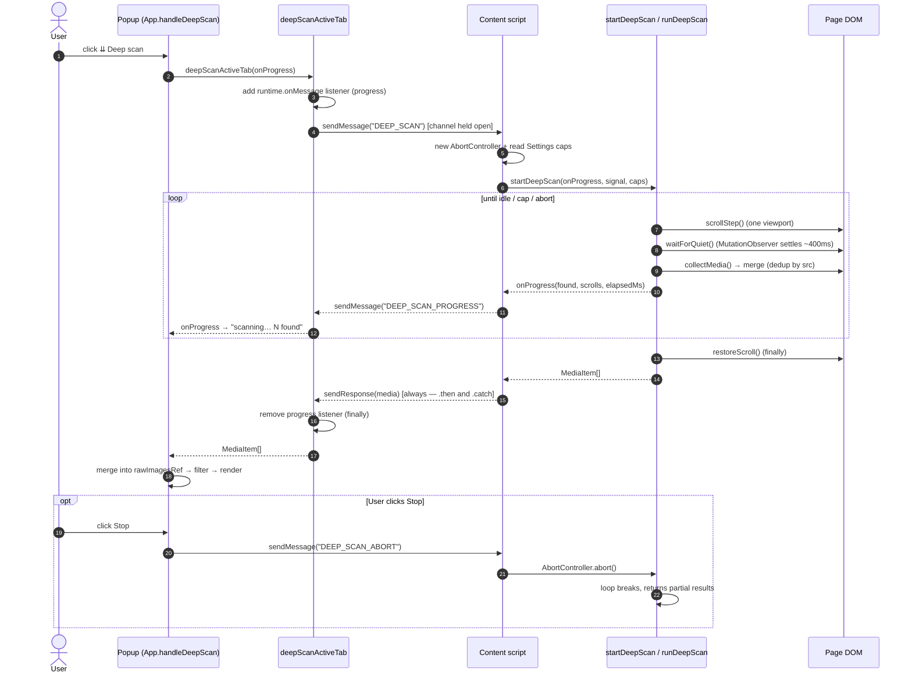
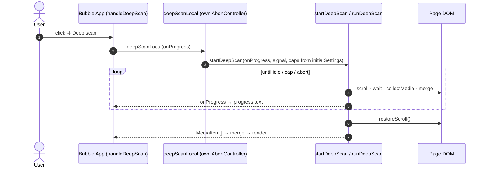
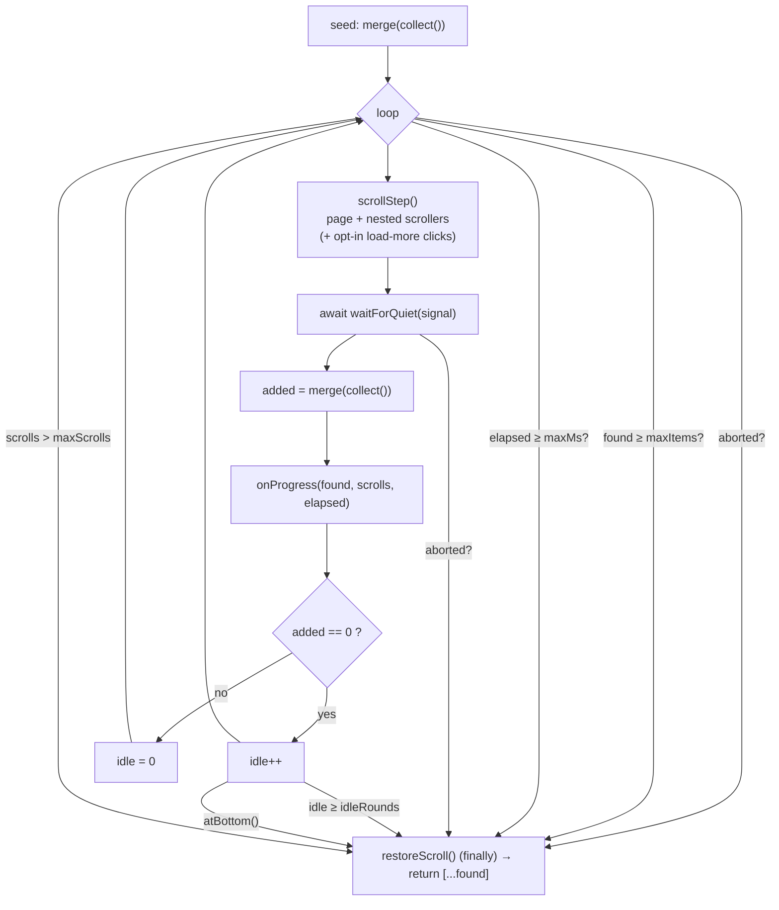

# Deep Scan

Deep scan surfaces media that isn't in the DOM until the page scrolls —
virtualized feeds (Twitter/X timelines), infinite scroll, and lazy carousels.
It is **opt-in**, **bounded**, and **network-free on our side**: it only scrolls
and re-reads the DOM; the page loads its own media.

## Popup path (over messaging)

## Bubble path (in-page, no messaging)

The bubble runs inside the page, so it drives the loop directly.

## The loop (`shared/collection/deepScan.ts` — pure)

### Bounds (defaults in `DEEP_SCAN_DEFAULTS`; the first three are user-configurable)

`maxItems` / `maxMs` / `maxScrolls` are **defaults only** — the popup path reads
the user's **Settings → Deep scan** values and passes them into `startDeepScan`,
overriding these. Only `idleRounds` is a genuinely fixed, non-configurable cap.

| Cap          | Default | Configurable in Settings? | Meaning                                             |
|--------------|---------|---------------------------|-----------------------------------------------------|
| `maxItems`   | 1000    | yes (50–5000)             | Stop once this many unique items are found          |
| `maxMs`      | 20000   | yes (5–120 s, ×1000)      | Wall-clock ceiling (~20s)                           |
| `maxScrolls` | 40      | yes (5–200)               | Hard scroll-step ceiling                            |
| `idleRounds` | 3       | no (fixed)                | Stop after N consecutive steps that add nothing new |

### Stop reasons

The final progress event carries a `reason` (`DeepScanStopReason`) so the popup
can say *why* a scan ended early:

| Reason         | Trigger                                                  |
|----------------|----------------------------------------------------------|
| `complete`     | Idle rounds hit or page bottom reached — nothing left    |
| `max-items`    | `maxItems` cap reached                                   |
| `max-time`     | `maxMs` wall-clock cap reached                           |
| `max-scrolls`  | `maxScrolls` step cap reached                            |
| `aborted`      | User pressed Stop (`AbortController`)                    |

### Scroll surfaces & load-more

- **Nested scrollers** (always on): each step also advances any nested
  `overflow-y: auto|scroll` pane taller than 200px, not just the page — so media
  inside inner scroll containers surfaces too.
- **Load-more clicking** (opt-in, **off by default** — Settings → Deep scan →
  *Click "Load more" buttons*): when enabled, each step may click up to 3
  matching `<button>` / `role=button` controls per round (text like "load more",
  "show more"). Real buttons only — never `<a href>` links, to avoid navigating
  away.

## Guarantees

- **Scroll is always restored** (`restoreScroll()` runs in `finally`), even on
  abort or a thrown error.
- **No listener/observer leaks**: `waitForQuiet` disconnects its `MutationObserver`
  and clears both timers on every exit path; the popup client removes its progress
  listener in `finally`.
- **The message channel always closes**: the `DEEP_SCAN` handler calls
  `sendResponse` on both success and failure, so the popup never hangs.
- **No data loss on merge**: results merge into the raw collected set
  (`rawImagesRef`), so images previously hidden by a size/base64 filter aren't
  discarded and reappear if the filter is relaxed.
- **Resolution still applies**: each scan round calls the same `collectMedia()`
  as the initial scan, so newly-found items can carry `resolveHint`/
  `unresolvedVideo` just like any other item; after the merge, `applyResolution`
  runs again and resolves them too when `resolveOriginals` is on — see
  [Resolve Originals](./resolve-originals.md).

Pipeline that each scan round feeds into: [Collection Pipeline](./collection-pipeline.md) ·
[Resolve Originals](./resolve-originals.md).
