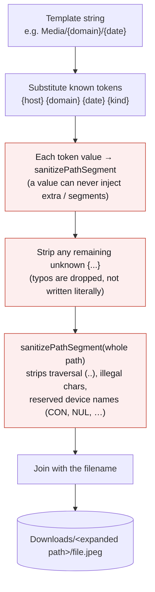

# Download paths (folder templates)

The **Save to subfolder** setting is a small path *template*. Type plain folder
names, token placeholders, or a mix — the extension expands the tokens per
download and saves the file there. This is how you get **one folder per site**,
per-day folders, or per-media-kind folders without any per-site configuration.

## The one constraint

Everything you configure lives **inside the browser's Downloads folder**. The
download API (`chrome.downloads.download({ filename })`) only accepts a path
relative to that folder and rejects absolute paths and `..`. So:

```
~/Downloads / <your template expands here> / file.jpeg
└ fixed root ┘ └──────── you control this ───────┘
  (browser)          (the template)
```

To move the root itself, change the browser's download location in its own
settings — the extension can't set it.

## Tokens

| Token      | Expands to                                   | Example                     |
|------------|----------------------------------------------|-----------------------------|
| `{host}`   | the source page's full hostname              | `www.twitter.com`           |
| `{domain}` | the registrable domain (drops `www.` + subs) | `twitter.com`               |
| `{date}`   | the download date, `YYYY-MM-DD` (local)      | `2026-07-04`                |
| `{kind}`   | the media kind                               | `image` / `video` / `audio` |

## Examples

| Template          | Saved as (file from `www.twitter.com`)          |
|-------------------|-------------------------------------------------|
| *(empty)*         | `Downloads/image_1.jpeg`                        |
| `Media`           | `Downloads/Media/image_1.jpeg`                  |
| `{domain}`        | `Downloads/twitter.com/image_1.jpeg`            |
| `Media/{domain}`  | `Downloads/Media/twitter.com/image_1.jpeg`      |
| `{domain}/{date}` | `Downloads/twitter.com/2026-07-04/image_1.jpeg` |
| `{kind}/{domain}` | `Downloads/image/twitter.com/image_1.jpeg`      |

The Settings panel shows a live preview against a sample site as you type.

## How a template expands



The two sanitizing steps (guarded in red) are what make the constraint above a
guarantee, not a convention: however the template is written, the expanded path
can never point outside `Downloads/`.

## Rules & edge cases

- **`{host}` vs `{domain}`** — `www.twitter.com`, `m.twitter.com`, and
  `twitter.com` are three different hosts (three `{host}` folders) but one
  `{domain}`. Use `{domain}` to group a site's subdomains together. The domain
  reduction is a heuristic with a small built-in set of two-part suffixes
  (`co.uk`, `com.au`, …); it is not a full public-suffix list.
- **Unknown site** — when a download has no source page (a file opened directly),
  `{host}` / `{domain}` are empty and their folder segment simply collapses away.
  `Media/{domain}` becomes `Downloads/Media/…`, never an empty or `unknown` folder.
- **Unknown tokens** — a `{typo}` that isn't a real token is dropped, not written
  literally.
- **Safety** — the whole expanded path is run through `sanitizePathSegment`
  (`src/extension/shared/collection/paths.ts`): traversal (`..`), leading slashes, illegal
  filename characters, and Windows reserved device names are all neutralized, so a
  template can never write outside `Downloads/`. A token *value* is always a single
  segment — a value containing `/` cannot inject extra folders.
- **Name collisions** — unchanged: `conflictAction: 'uniquify'` still appends
  ` (1)` on a clash. Per-site folders make clashes rarer.

## Implementation

- `expandPathTemplate(template, tokens)` — token substitution + sanitizing
  (`src/extension/shared/collection/paths.ts`).
- `hostFromUrl`, `registrableDomain`, `todayISO` — token-value helpers (same file).
- `buildDownloadFilename(image, index, settings, sourcePageUrl?)` — resolves the
  tokens against the source page and prepends the folder
  (`src/extension/shared/collection/download-name.ts`); the source URL is
  threaded from `downloadAndRecord`.

## Back-compatibility

A template with no tokens behaves exactly as the old static subfolder did — an
existing `downloadPath` like `Media` keeps saving to `Downloads/Media/`. No
migration.
