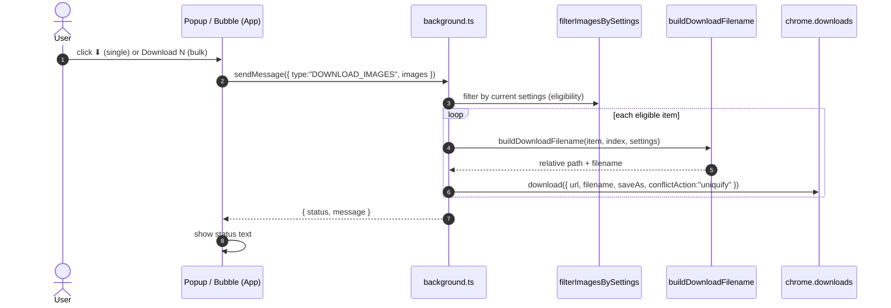
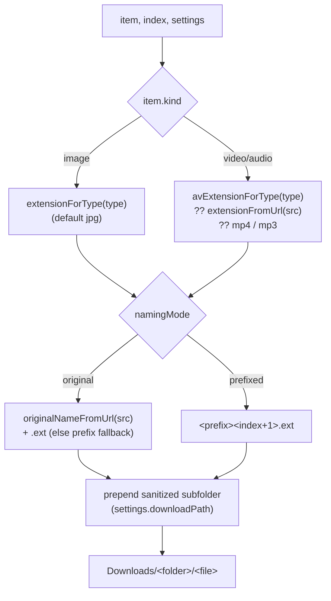

# Download

Downloads run through the service worker, which owns `chrome.downloads`.

## Flow

## Filename construction (`buildDownloadFilename`)

### Options (Settings)

| Setting | Effect |
|---------|--------|
| `namingMode: 'original'` | Keep the source file's name; falls back to the prefix form when the URL has no usable name (data/blob URIs, path with no basename) |
| `namingMode: 'prefixed'` | `fileNamePrefix` + sequential index |
| `downloadPath` | Sanitized relative subfolder inside `Downloads/` (MV3 has no native folder picker) |
| `saveAs: true` | Chrome's native "Save As" dialog per file |
| `conflictAction: 'uniquify'` | Chrome auto-dedups clashing names (always on) |

### Extension by kind

- **Image:** `extensionForType(type)` — `jpeg→jpg`, `png/gif/webp/svg/avif/bmp/ico`
  pass through, default `jpg`.
- **Video/Audio:** `avExtensionForType(type)` (mp4/webm/mov/…/mp3/wav/flac/…),
  then the URL's real extension, then `mp4`/`mp3` as a last resort.

## Notes

- Eligibility is re-checked in the worker via `filterImagesBySettings`, so the
  same rule that drives the badge and the visible list also gates downloads.
- Cross-origin URLs the server blocks fail via `chrome.downloads`; the error
  message is surfaced in the panel's status line.
- Streaming (`.m3u8`/`.mpd`) and `blob:` media never reach here — they're dropped
  at collection (see [Collection Pipeline](./collection-pipeline.md)).
