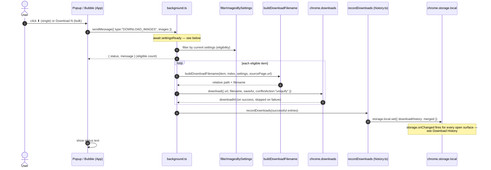
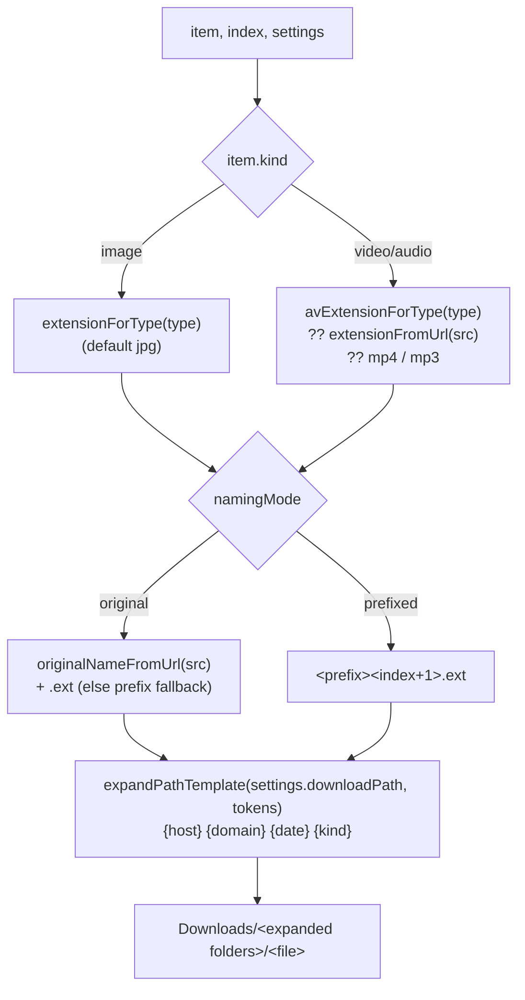

# Download

Downloads run through the service worker, which owns `chrome.downloads`.

## Flow

`downloadAndRecord` is the function that drives the loop above: it fires every
eligible download, then hands the successes (each already carrying its
`chrome.downloads` `downloadId`) to `recordDownloads`, which writes them into
`chrome.storage.local['downloadHistory']`. Failed downloads (a Chrome
`lastError`, or no `downloadId`) are silently skipped — nothing is recorded for
them. See [Download History](./history.md) for what happens after the write.

## Filename construction (`buildDownloadFilename`)

### Options (Settings)

| Setting                      | Effect                                                                                                                                                                               |
|------------------------------|--------------------------------------------------------------------------------------------------------------------------------------------------------------------------------------|
| `namingMode: 'original'`     | Keep the source file's name; falls back to the prefix form when the URL has no usable name (data/blob URIs, path with no basename)                                                   |
| `namingMode: 'prefixed'`     | `fileNamePrefix` + sequential index                                                                                                                                                  |
| `downloadPath`               | Relative subfolder **template** inside `Downloads/`, with `{host}` `{domain}` `{date}` `{kind}` tokens — see [Download paths](./download-paths.md) (MV3 has no native folder picker) |
| `saveAs: true`               | Chrome's native "Save As" dialog per file                                                                                                                                            |
| `conflictAction: 'uniquify'` | Chrome auto-dedups clashing names (always on)                                                                                                                                        |

### Extension by kind

- **Image:** `extensionForType(type)` — `jpeg→jpg`, `png/gif/webp/svg/avif/bmp/ico`
  pass through, default `jpg`.
- **Video/Audio:** `avExtensionForType(type)` (mp4/webm/mov/…/mp3/wav/flac/…),
  then the URL's real extension, then `mp4`/`mp3` as a last resort.

## The `settingsReady` gate

The service worker is ephemeral (MV3): the `DOWNLOAD_IMAGES` message itself can
wake it up, and that wake-up races the async `chrome.storage.sync` read of
settings. If filtering/naming ran against `DEFAULT_SETTINGS` in that window, a
download could land in the wrong subfolder, use the wrong prefix, or skip the
user's real size/base64 filters. The handler instead `await`s a `settingsReady`
promise — resolved the first time settings finish loading (or change) — before
it filters or builds a single filename, so a download that wakes the worker
always runs against the user's actual settings.

## Notes

- Eligibility is re-checked in the worker via `filterImagesBySettings`, so the
  same rule that drives the badge and the visible list also gates downloads.
- Cross-origin URLs the server blocks fail via `chrome.downloads`; the error
  message is surfaced in the panel's status line.
- Streaming (`.m3u8`/`.mpd`) and `blob:` media never reach here — they're dropped
  at collection (see [Collection Pipeline](./collection-pipeline.md)).
- **Re-download reuses this flow.** [Download History](./history.md) and
  [Favourites](./favourites.md) both re-download by sending this exact
  `DOWNLOAD_IMAGES` message — a synthesized `ImageInfo` plus the entry's stored
  `sourcePage` — so the same eligibility check, naming, and
  [download-path](./download-paths.md) tokens apply as any other download.
