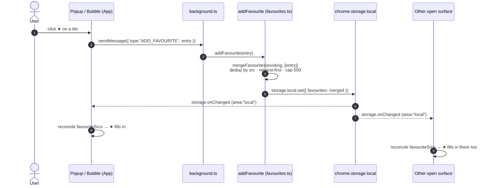

# Favourites

Star any collected item to a personal **Favourites** list that survives across
pages and sessions — a bookmark for media.

## Using it

- **Star** an item from its grid tile (hover → ★) or from the preview modal. A
  filled-star badge marks already-saved items, even after a rescan or restart.
- Open the **Favourites** panel from the ★ button in the header.
- Each row offers **Download**, **Open source**, and **Remove**; the header has
  **Clear all**.
- **Download** re-downloads through the normal [Download](./download.md) flow:
  it sends `DOWNLOAD_IMAGES` with an `ImageInfo` synthesized from the stored
  `FavouriteEntry` (`src`, `kind`, `type`, `thumbnailSrc`) plus the entry's
  saved `sourcePageUrl`/`sourcePageTitle` as `sourcePage` — which is why your
  download-path tokens (`{host}`/`{domain}`/`{date}`/`{kind}`) still apply, the
  same as any first-time download.

## How it works

- Stored in `chrome.storage.local` under the `favourites` key, deduped by media
  URL, newest-first, capped at 500.
- Mutations route through the background service worker (a single writer) via
  three messages — `ADD_FAVOURITE`, `REMOVE_FAVOURITE`, `CLEAR_FAVOURITES` —
  and every open surface (popup + on-page bubble) stays in sync via
  `chrome.storage.onChanged`.
- Favourites are independent of [Download History](./history.md) — an item can
  be both.

## Star click → single writer → multi-surface sync

`REMOVE_FAVOURITE` and `CLEAR_FAVOURITES` follow the identical single-writer →
`storage.onChanged` path — only the mutation inside `favourites.ts` differs.

Implementation: `src/extension/shared/favourites.ts`,
`src/extension/popup/components/FavouritesPanel.tsx`, and the star controls in
`src/extension/popup/components/ImageList.tsx`.

See also: [Download](./download.md) · [Download History](./history.md) ·
[Architecture](./architecture.md).
