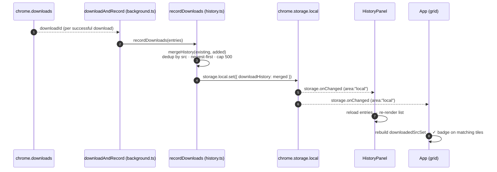

# Download History

Every **successful** download is recorded to a **Download History** list that
survives across pages, tabs, and browser restarts — so you can find, re-open,
or re-download something you saved earlier without hunting through the OS
downloads folder.

## Using it

- Open the **Download History** panel from the ⏱ button in the header.
- Each row offers:

| Action             | Needs `downloadId`? | Effect                                                                                           |
|--------------------|---------------------|--------------------------------------------------------------------------------------------------|
| **Open source**    | no                  | Opens the original media URL in a new tab (`OPEN_URL`)                                           |
| **Open file**      | yes                 | Opens the downloaded file in the OS default app (`OPEN_DOWNLOAD_FILE` → `chrome.downloads.open`) |
| **Show in folder** | yes                 | Reveals the file in the OS file manager (`SHOW_DOWNLOAD` → `chrome.downloads.show`)              |
| **Re-download**    | no                  | Re-runs the normal [Download](./download.md) flow (`DOWNLOAD_IMAGES`)                            |
| **Remove**         | no                  | Deletes this one entry (`REMOVE_HISTORY_ENTRY`)                                                  |
| **Clear all**      | no                  | Empties the whole history (`CLEAR_HISTORY`), header button                                       |

  "Open file" and "Show in folder" only render when the entry carries a
  `downloadId` — present on every download recorded going forward, but absent
  on entries carried over from before this was tracked.
- A collected tile already in history shows a ✓ badge in the grid (from
  `downloadedSrcSet`) — distinct from the toolbar count in [Badge](./badge.md).

## How it works

- Stored in `chrome.storage.local` under the `downloadHistory` key
  (`HISTORY_KEY`), deduped by media `src` (newest wins), sorted newest-first,
  and capped at 500 entries (`mergeHistory`, `HISTORY_CAP`).
- Every mutation — the automatic write on a successful download, and user
  edits (remove / clear) — is routed through the background service worker (a
  single writer) and serialized through one `writeChain`, so concurrent
  read-modify-write ops can never clobber each other.
- Every open surface (popup + on-page bubble) reconciles via
  `chrome.storage.onChanged` — nobody polls.
- History is independent of [Favourites](./favourites.md): an item can be in
  both, either, or neither.

## Recording a download → live sync

Row actions (Remove, Clear all) write through the same `recordDownloads` /
`removeEntry` / `clearHistory` path and end at the same `storage.onChanged`
fan-out — there's no separate code path for user edits vs. automatic
recording.

## Implementation

`src/extension/shared/history.ts` (`HISTORY_KEY`, `HISTORY_CAP`,
`mergeHistory`, `recordDownloads`, `removeEntry`, `clearHistory`,
`downloadedSrcSet`), `src/extension/background.ts` (`downloadAndRecord`, and
the `CLEAR_HISTORY` / `REMOVE_HISTORY_ENTRY` / `OPEN_DOWNLOAD_FILE` /
`SHOW_DOWNLOAD` message handlers), and
`src/extension/popup/components/HistoryPanel.tsx`.

See also: [Download](./download.md) · [Favourites](./favourites.md) ·
[Architecture](./architecture.md).
