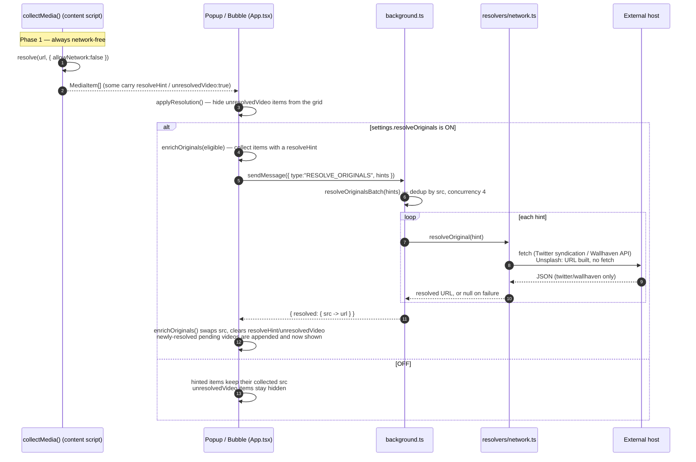

# Resolve Originals

**Resolve exact originals** is an **opt-in** setting (`resolveOriginals`,
default **off**) that fetches the exact highest-resolution file from a handful
of supported hosts — a Twitter video's real mp4, a Wallhaven wallpaper's true
full-size file, an Unsplash photo's native master. It's the only feature in the
extension that contacts a host other than the page you're on.

## Two phases

Resolution always happens in two separate phases — a network-free one that
always runs, and a network one that runs only when you turn the setting on.

| Phase                      | When                             | Network?                           | Where                                              |
|----------------------------|----------------------------------|------------------------------------|----------------------------------------------------|
| **Passive URL resolution** | Every collection / deep scan     | None — `allowNetwork:false`        | `resolve()` registry, in-page (`collect.ts`)       |
| **Opt-in network resolve** | Only if `resolveOriginals` is on | Yes — a handful of `fetch()` calls | Background service worker (`resolvers/network.ts`) |

Phase one is [Collection Pipeline](./collection-pipeline.md)'s `resolve()`
registry: `twitterResolver → unsplashResolver → wallhavenResolver →
genericResolver`. For most URLs it fully resolves the original with no network
call at all — Twitter `name=orig`, Unsplash query-param stripping, Wallhaven
full-file paths built from the DOM's own extension evidence. It only reaches
for phase two when it *can't* finish the job locally, by attaching a
`resolveHint` (or marking a video `unresolvedVideo`) instead of guessing or
fetching.

## What it contacts

Phase two is `resolveOriginal(hint, deps)` in
`src/extension/shared/resolvers/network.ts`, called from the background
service worker only (never from a content script or the popup directly):

| Platform    | Endpoint                                                                       | What it fetches                                                                                                                                                                                                             |
|-------------|--------------------------------------------------------------------------------|-----------------------------------------------------------------------------------------------------------------------------------------------------------------------------------------------------------------------------|
| `twitter`   | `https://cdn.syndication.twimg.com/tweet-result?id=<id>&token=<token>&lang=en` | The tweet's syndication JSON; picks the highest-bitrate `video/mp4` variant from `mediaDetails[].video_info.variants`. The token is derived with the same (public, key-free) algorithm as react-tweet's syndication client. |
| `wallhaven` | `https://wallhaven.cc/api/v1/w/<id>`                                           | The wallpaper's public API record; reads `data.path` (the full-size file URL).                                                                                                                                              |
| `unsplash`  | *(no fetch)*                                                                   | Builds `https://unsplash.com/photos/<id>/download` directly — Unsplash's own download-redirect URL. The request only actually happens later, if the item is downloaded, via `chrome.downloads`.                             |

Every URL taken out of a JSON response is passed through `pinnedUrl()` before
it's trusted: it must be `https:` and its hostname must equal (or be a
subdomain of) the expected host (`twimg.com` / `wallhaven.cc`). Anything else —
a malformed URL, an unexpected redirect target — resolves to `null` instead of
being handed back as a downloadable URL. `resolveOriginal()` never throws; a
failed lookup for one item just means that item stays as collected.

## End-to-end flow

- The gate lives in `applyResolution()` (`popup/App.tsx`): it filters
  `unresolvedVideo` items out of what's displayed, then calls `enrichOriginals`
  only `if (s.resolveOriginals)`. This runs on every path that can populate the
  grid — the initial scan, a manual rescan, a deep-scan merge, and a settings
  change — so **toggling the setting on later retroactively resolves
  already-collected items** without a fresh scan.
- `enrichOriginals()` never mutates an item in place: a resolved hit becomes a
  new object with `src` swapped to the resolved URL and `resolveHint`/
  `unresolvedVideo` cleared. If that `src` was already displayed, it's replaced
  in place (Wallhaven/Unsplash upgrades); if it wasn't (a `unresolvedVideo`
  pending video), the resolved item is appended, so it appears for the first
  time exactly when it becomes downloadable. An item that never resolves is
  simply never shown — nothing flickers in and back out.
- A generation counter (`resolveGenRef`) discards a resolution that finishes
  after a newer scan/rescan has already started, so a slow request can't
  clobber fresher results.

## Privacy

- **Off by default.** Every other feature — collection, deep scan, size
  enrichment — either reads only what the page already loaded or (image-size
  `HEAD` requests) stays on the same host; this is the one setting that talks
  to Twitter/Wallhaven/Unsplash servers on your behalf.
- What's sent is minimal: the id already visible in the page's own URL (a
  tweet status id, a Wallhaven wallpaper id) or nothing at all (Unsplash just
  builds a URL). No cookies or auth are attached — the fetch runs from the
  background service worker, not the page.
- Toggling **Resolve exact originals (network requests)** in Settings is the
  single switch; see [Getting Started](./getting-started.md#settings).

## Adding a new resolver

1. Implement the `Resolver` interface (`src/extension/shared/resolvers/types.ts`):
   a `match(u, ctx)` guard and a synchronous, network-free `resolve(u, ctx)`
   that returns `MediaCandidate[]` (`[]` means "not mine / give up, try the
   next one").
2. Add it to `REGISTRY` in `src/extension/shared/resolvers/index.ts`, **before**
   `genericResolver` — order matters, since the first resolver to return a
   non-empty array wins.
3. If the exact original needs a network fetch, add the platform to
   `ResolvePlatform` (`src/types/index.d.ts`), attach a `resolveHint` from
   `resolve()`, and add a case to `resolveOriginal()`
   (`src/extension/shared/resolvers/network.ts`) — run any URL pulled from a
   response through `pinnedUrl()` before returning it.
4. A resolver that only needs DOM evidence (no network case at all) can skip
   step 3 entirely — see `wallhavenResolver` when it has extension evidence.

---

Related: [Collection Pipeline](./collection-pipeline.md) (the `resolve()`
registry and passive resolution) · [Deep Scan](./deep-scan.md) (merged results
carry the same hints) · [Architecture](./architecture.md) · [Download](./download.md).
