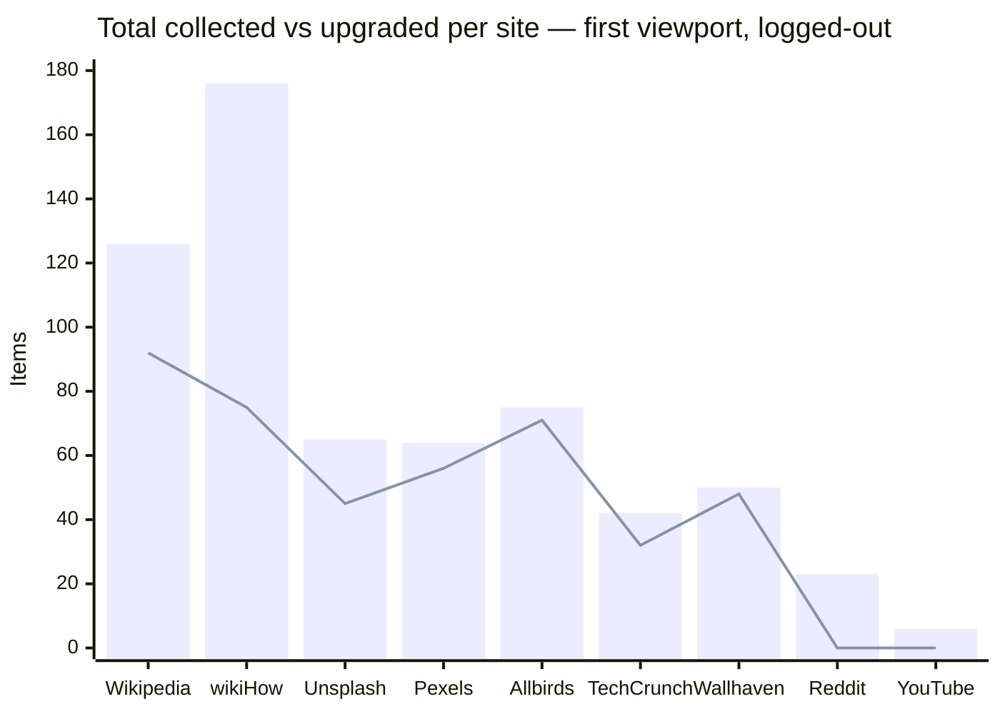

> Part of the [Collection Benchmark](/media-bulk-downloads/benchmark/overview/).

## A. Live-verified results

Each row was produced by injecting the real collector into the live page (logged-out, first viewport).

| Site                      | Page                 | Total | Img | Vid    | Aud   | Upgraded | Dims | Hints | Notable CDNs                     |
|---------------------------|----------------------|-------|-----|--------|-------|----------|------|-------|----------------------------------|
| Wikipedia                 | `/wiki/Cat`          | 126   | 107 | **11** | **8** | 92       | 54   | 0     | upload.wikimedia.org             |
| wikiHow (MediaWiki)       | `/Main-Page`         | 176   | 176 | 0      | 0     | **75**   | 125  | 0     | www.wikihow.com `/images/thumb/` |
| Unsplash                  | `/s/photos/mountain` | 65    | 65  | 0      | 0     | 45       | 45   | 24    | images./plus.unsplash.com        |
| Pexels                    | `/search/mountain`   | 64    | 64  | 0      | 0     | **56**   | 49   | 0     | images.pexels.com                |
| Allbirds (Shopify)        | `/collections/mens`  | 75    | 75  | 0      | 0     | **71**   | 70   | 0     | allbirds.com `/cdn/shop`         |
| TechCrunch (self-host WP) | home                 | 42    | 42  | 0      | 0     | **32**   | 42   | 0     | techcrunch.com `/wp-content/`    |
| Wallhaven                 | `/latest`            | 50    | 50  | 0      | 0     | **48**   | 49   | 0     | th.→w.wallhaven.cc               |
| Reddit                    | `/r/EarthPorn`       | 23    | 23  | 0      | 0     | 0        | 15   | 0     | preview.redd.it (signed, intact) |
| YouTube                   | home                 | 6     | 6   | 0      | 0     | 0        | 0    | 0     | (SPA — thumbs not yet mounted)   |

Notes: **wikiHow** and **TechCrunch** are new this cycle and confirm two generalized rules firing live — self-hosted **MediaWiki** (`/images/thumb/…px-…`
→ original, 75 upgrades) and self-hosted **WordPress** (`/wp-content/uploads/`
resize + `-WxH` strip, 32 upgrades). **Pexels** now upgrades **56/64** (the query-strip rule shipped after the earlier `0/233` capture). **Wallhaven** builds
`w.wallhaven.cc/full/…` from grid thumbs (48/50, ext read from the DOM badge). **Reddit** (`/r/EarthPorn`, new layout) shows `preview.redd.it` collected byte-identical — signed, correctly left intact
(stripping would 403). **YouTube**
home rendered no thumbnails logged-out at capture time (run-to-run variance, §E); the `→hqdefault` rule is verified in §C #8 / §A-2. Logged-out **X/Twitter** now requires auth to view media grids and
is covered as `[A]` in §C.

### Collection vs upgrade per site (2026-07-05)

Bars = total items collected; the line = items upgraded to an original. The strongest upgrade rates are Allbirds, TechCrunch, Wallhaven, Wikipedia and the two generalized rules (wikiHow, Pexels);
Reddit sits at 0 because its only CDN here is the intentionally-untouched signed `preview.redd.it`.

## A-2. New-CDN rules — verified upgrades

The rules added this cycle whose sites were not live-injected above were each confirmed by loading the thumbnail and the rewritten original (dimensions / bytes via `curl` or in-browser `Image()`),
2026-07-05:

| Host                      | Thumbnail → Original                                   | Result             |
|---------------------------|--------------------------------------------------------|--------------------|
| target.scene7.com         | `?wid=1200` → `?wid=2000`                              | 64 KB → 182 KB     |
| cdn*.artstation.com       | `/smaller_square/` → `/large/`                         | 400² → 1192×936    |
| i5.walmartimages.com      | drop `?odnWidth/odnHeight`                             | 4.4 KB → 214 KB    |
| c1.neweggimages.com       | `…compressall300` → `…compressall1280`                 | 80 KB → 1.15 MB    |
| www.ikea.com/images       | `?f=xxs` → `?imwidth=2000`                             | 17.6 KB → 101.7 KB |
| static01.nyt.com          | `-articleLarge` → `-superJumbo` (+drop quality)        | 57.6 KB → 1.09 MB  |
| cdn.dribbble.com          | drop `?resize=WxH`                                     | 145 KB → 4.21 MB   |
| *.alicdn.com / aliexpress | strip `.jpg_640x640.jpg_.webp` transform suffix        | 48.6 KB → 73.4 KB  |
| i.imgur.com               | 8-char thumb `…b.jpg` → 7-char `….jpg`                 | 6.7 KB → 154 KB    |
| images-wixmp-*.wixmp.com  | signed-token cap → `/v1/fill/w,h,q_100/`               | 9 KB → 624 KB      |
| cdn.stocksnap.io          | `/img-thumbs/280h/` → `/img-thumbs/960w/`              | 420×280 → 960×640  |
| photos.zillowstatic.com   | `-p_e` → `-uncropped_scaled_within_1536_1152`          | 596×446 → 1536×853 |
| ichef.bbci.co.uk          | `/news/640/` → `/news/2048/` (`1920` 404s on `/news/`) | HTTP 404 → 200     |

## B. What the engine got right (confirmed live)

- **Wikimedia / MediaWiki path upgrade** — `/…/thumb/9/94/X.svg/40px-X.svg.png` →
  `/…/9/94/X.svg`, host-agnostically (Wikipedia 92/126; **wikiHow 75/176**).
- **Self-hosted WordPress** — `techcrunch.com/wp-content/uploads/…?w=` → bare original (**32/42**), previously uncovered (`wp-photon` only matched `wp.com`).
- **Unsplash / Imgix query strip** — resize params (`w,h,fit,q,fm,auto,…`) removed to reach the native-format master.
- **Pexels** — `images.pexels.com?…w=&h=&auto=` → bare original path (**56/64**).
- **YouTube** — small thumbs (`default`/`mqdefault`/`0`–`3`) → `hqdefault`, the largest always-present variant (maxres/sd 404 for many videos, and collection is network-free so they can't be probed);
  ggpht avatar `=s88-…` → `=s0`.
- **Shopify (modern)** — store-domain `/cdn/shop/…?width=N` drops the size query (Allbirds 71/75).
- **Wallhaven** — grid thumbs → `w.wallhaven.cc/full/<ab>/wallhaven-<id>.<ext>`, the file extension read from the DOM badge/`` (never a blind `.jpg`); **48/50**.
- **Signed-host posture** — `preview.redd.it` collected **byte-identical** (never query-stripped; stripping would 403). Same for Guardian `i.guim.co.uk`, 500px.
- **Dedup & dims** — srcset/lazy duplicates collapse to one item on the upgraded URL; dimensions parsed from URL size tokens.
- **data: URIs** — inline SVG/icons collected as base64 with no network.
