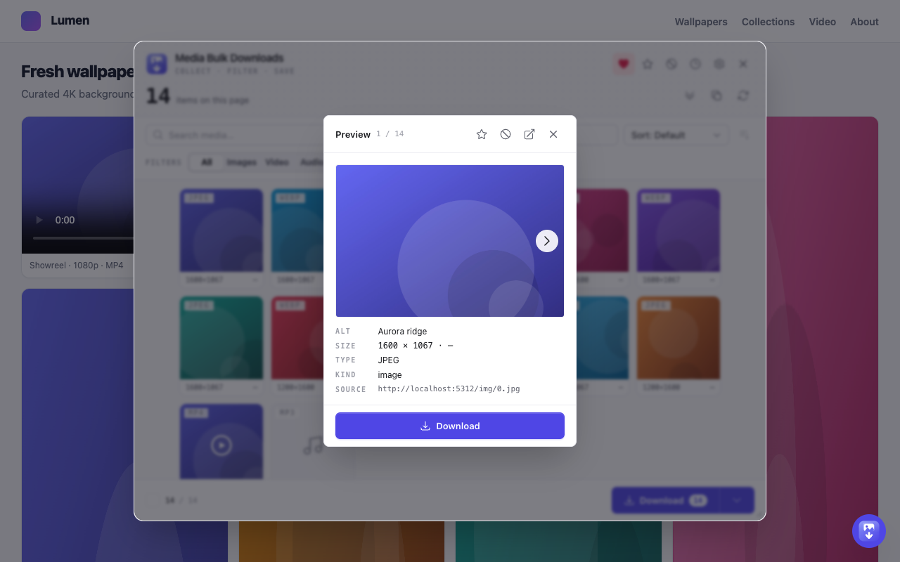

## Prerequisites

- Node 20.19 or newer. `.nvmrc` pins 22.
- Yarn 4 through Corepack. The repo pins `yarn@4.17.1` via `packageManager`.
- A Chromium browser (Chrome or Edge) and/or Firefox 140+.

```bash
corepack enable
yarn install
```

Every script runs through Corepack Yarn. Do not use npm. WXT builds all four build targets (Chrome, Firefox, Edge, Safari) from one codebase; Opera and other Chromium browsers run the Chrome build.

## Develop

```bash
yarn dev            # Chrome
yarn dev:firefox    # Firefox
```

`yarn dev` builds `apps/extension/.output/chrome-mv3`, opens a browser with the extension loaded, and reloads on change. To load a build by hand:

1. Open `chrome://extensions`.
2. Turn on **Developer mode** (top-right).
3. Click **Load unpacked** and pick `apps/extension/.output/chrome-mv3`.

## Build & package

```bash
yarn build          # wxt build → apps/extension/.output/chrome-mv3
yarn build:all      # chrome + firefox + edge
yarn zip:all        # store-ready zips in apps/extension/.output/
```

Zips are named `media-bulk-downloads-<version>-<browser>.zip`. See the per-store upload matrix in the [README](https://github.com/mralaminahamed/media-bulk-downloads/blob/main/README.md#build--package).

## Quality gates

```bash
yarn type-check   # tsc -b core/storage/platform, then the test project, then the app's wxt prepare + tsc --noEmit
yarn lint         # eslint . (flat config)
yarn test         # vitest run --coverage across packages, then the extension's vitest suite
yarn build        # production build
```

## First use

The toolbar icon does one of two things, depending on your settings:

- **Popup (default):** clicking the icon opens the popup panel.
- **Bubble:** with **Show floating bubble on pages** turned on, clicking the icon toggles an in-page floating panel instead. See [In-page Bubble](/media-bulk-downloads/guides/bubble/).

Once the panel is open:

1. It **scans the active tab** and lists every image, video, and audio file it found. The toolbar badge shows the count per tab.
2. **Filter** by type (All / Images / Video / Audio), by format, or by size.
3. **Deep scan** scrolls the page to surface lazy-loaded and virtualized media on infinite feeds and galleries. See [Deep Scan](/media-bulk-downloads/guides/deep-scan/).
4. **Download** one item (hover its tile) or everything shown (footer button).
5. **Download History** and **Favourites** open from the popup header. See
   [Download History](/media-bulk-downloads/guides/history/) and [Favourites](/media-bulk-downloads/guides/favourites/).

Click any tile to preview it full-size with its dimensions, type, and source:



## Settings

Stored in `chrome.storage.sync`. The Settings sheet has four tabs.

**Downloads**

- **Save to subfolder** inside `Downloads/`. Empty by default. Supports the tokens `{host}`, `{domain}`, `{date}`, `{kind}`.
- **File naming:** Prefixed (default) or Original. The prefix defaults to
  `image_`, numbered per file (`image_1.jpg`).
- **Convert images on download:** Keep original (default), PNG, or JPEG. When converting, **Metadata** is Preserve (copy EXIF/XMP, default) or Strip.
- **Ask where to save each file** (off).
- Advanced: **Simultaneous downloads** (1–10, default 5) and **Notify when downloads finish** (off).

**Media**

- **Minimum image size** in px (0–10000, default 0).
- **Exclude Base64 images** (off) and **Exclude emoji** (off).
- **Resolve exact originals (network requests)** (off). When on, the background fetches a hinted item's exact original from one of ~20 supported hosts (Twitter/X, Wallhaven, Unsplash, Vimeo,
  Dailymotion, Bluesky, Pinterest, Reddit, Flickr, ArtStation, SoundCloud, Twitch, Loom, PeerTube, and more). See
  [Resolve Originals](/media-bulk-downloads/how-it-works/resolve-originals/) for the full list.
- **Capture video streams (HLS & DASH)** (off). Surfaces `.m3u8` and `.mpd`
  streams as capture items.
- **Smart page defaults** (on), **Remember scan behaviour per site** (on), **Skip images already downloaded** (on).
- Advanced deep-scan caps: max items (50–5000, default 1000), max time in seconds (5–120, default 20), max scroll steps (5–200, default 40), and **Click "Load more" buttons** (off).
  See [Deep Scan](/media-bulk-downloads/guides/deep-scan/).

**Display**

- **Thumbnail size** in px (64–240, default 120).
- **Show image count on toolbar icon** (on).
- **Show floating bubble on pages** (off), plus its corner and panel position.
- Advanced: popup width (320–800, default 460), popup height (400–600, default 600), preview size (240–900, default 360), and bubble width/height.

**Data**

- Export or import a full backup (settings, favourites, history, blocked sources) as JSON.

## Where things live

The repo is a yarn-workspaces monorepo: browser-agnostic logic in `packages/*`, the WXT app in `apps/extension`. See [Architecture → Workspace layout](/media-bulk-downloads/how-it-works/architecture/#workspace-layout).

```
package.json                    # workspaces root: [packages/*, apps/*] + orchestration scripts
tsconfig.base.json              # shared compiler options for the packages

packages/                       # each package: src/ + tests/ (its own Vitest project)
  core/            @mbd/core    # browser-agnostic domain logic (zero chrome.*)
    src/
      collection/               #   extract · imageUrl · mediaType · deepScan · filters ·
                                 #     paths · download-name (buildDownloadFilename)
      resolvers/                #   collection-time REGISTRY + opt-in network resolve:
        index.ts                 #     REGISTRY + resolve() dispatch
        network.ts               #     opt-in fetch() dispatch (~20 platforms)
        sites/                   #     per-host resolvers (+ vimeo.ts id-extraction only)
        sniffers/                #     response/hls/ig/x/fb/pinterest MAIN-world sniffers
      download/                 #   zip · base64 · convert/ · stream/ (HLS/DASH byte-logic)
      net/                      #   fetch retry
      types.ts                  #   shared TypeScript types (ChromeMessage, ImageInfo, …)
    tests/                      #   Vitest specs + fixtures/ (jsdom project)
  storage/         @mbd/storage # persistence over chrome.storage + IndexedDB:
                                 #   settings · history · favourites · excluded · queue ·
                                 #   per-host memory · backup · sync  (+ tests/)
  platform/        @mbd/platform# capability contracts (Downloader/Notifier/HeaderRules/
                                 #   StreamCaptureHost) + detectCapabilities()  (+ tests/)

apps/
  extension/       @mbd/extension
    wxt.config.ts               # WXT build config (manifest fn, targets, zip)
    src/
      entrypoints/              # background · content · ig/x/fb/pinterest/hls MAIN-world
                                 #   sniffers · offscreen (HLS/DASH capture) · popup
      public/icon/              # extension icons
      types/                    # ambient CSS-module declarations
      extension/
        background/             # MV3 service worker (badge, commands, context-menu,
                                 #   message-router, state, download/ queue+capture)
        content/               # collect.ts (DOM → MediaItem[]) · deepScanRunner · bubble mount
        components/BrandMark.tsx
        shared/active-tab/     # popup↔content bridges: collect / deep-scan /
                                 #   resolve-originals / capture-stream
        popup/                 # React popup: App.tsx, components/panels/, hooks/
        bubble/                # in-page bubble (Shadow DOM host + React root)
      styles/index.css          # Tailwind v4 + design tokens
    tests/unit/                 # Vitest specs
    tests/e2e/                  # Playwright e2e (real extension in Chromium)

docs/website/                    # documentation site (Astro Starlight)
docs/architecture/              # monorepo-restructure design record
```

Next: [Architecture](/media-bulk-downloads/how-it-works/architecture/).

---

