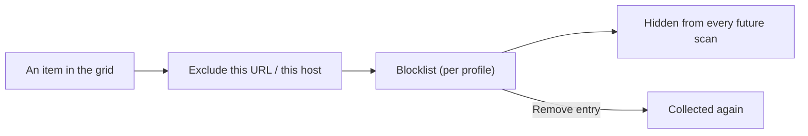

Some things show up in a scan that you never want: a site's logo and icons, ad
creatives, tracking pixels, an avatar that repeats on every page. Blocked sources
is a per-profile blocklist that hides those for good, so they stop cluttering every
future scan instead of being filtered out by hand each time.

## Blocking something

You block by URL or by whole host:

- **This URL** hides that one exact file.
- **This host** hides everything from that domain, which is the quick way to drop
  a whole ad or CDN domain in one step.

Add a block from an item's own menu in the grid, or select several items and
choose **Exclude** from the download menu to block them all at once. See
[Select & bulk actions](/media-bulk-downloads/guides/select-and-bulk-actions/).

Once blocked, a source is removed from the current grid and left out of every
later scan, on any page. Blocking is the durable version of a filter: a filter
hides things for this view, a block keeps them out permanently.

## Managing the blocklist

Open the **Excluded sources** panel from the no-entry icon in the popup header. It
lists everything you have blocked, newest first, each tagged **URL** or **Host**:

- **Remove** one entry with its trash button to start collecting that source again.
- **Clear all** empties the whole blocklist at once.

## Where it is stored

The blocklist lives on your device in the browser's local storage, per profile. It
is not synced across devices. It is included in a
[backup](/media-bulk-downloads/guides/backup-restore/), so exporting and importing
carries your blocklist along, and **Clear all local data** in Settings removes it
together with history and favourites.

## Related

- [Select & bulk actions](/media-bulk-downloads/guides/select-and-bulk-actions/) to block several sources at once.
- [Filter, search & sort](/media-bulk-downloads/guides/filter-search-sort/) for hiding items in one view without blocking them.
- [Backup & restore](/media-bulk-downloads/guides/backup-restore/) to move your blocklist between devices.

---
