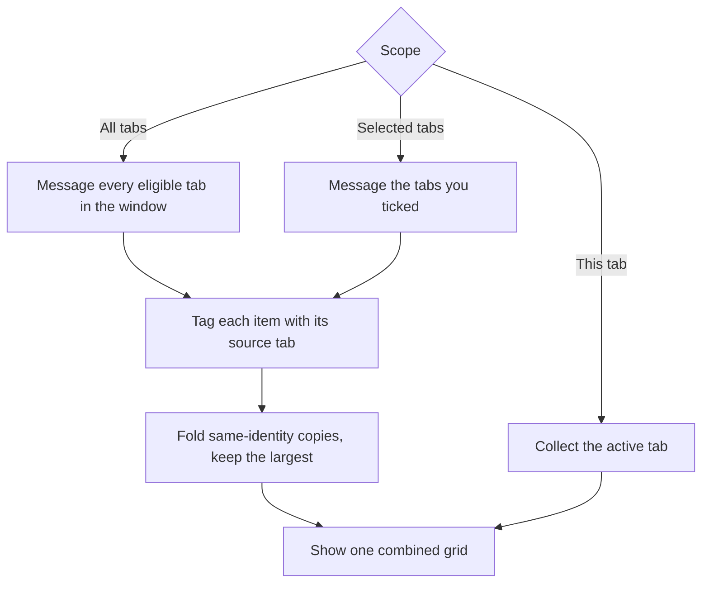

By default the popup collects media from the tab you are on. You can widen that to
every open tab in the window, or to a set of tabs you pick, and see everything in
one grid. This is a popup feature: the on-page bubble always works on its own
page.

## The scope selector

Above the grid, the popup shows a scope dropdown with three choices:

| Scope | Collects from |
|-------|---------------|
| This tab | The active tab only (the default) |
| All tabs | Every eligible tab in the current window |
| Selected tabs | The tabs you tick in the picker |

A tab is eligible when it is a loaded http(s) page. Restricted pages (browser
settings pages, the web store, local files, discarded tabs) are skipped, because
they have no content script to read.

Choosing **Selected tabs** opens a picker that lists the window's eligible tabs
with a checkbox each, plus an **All** / **Clear** toggle. Tick the ones you want
and confirm. Once a selection is active, an **Edit** button appears next to the
dropdown so you can change the set without starting over.

## How a multi-tab collect works

Each tab is asked for its media in parallel (a few at a time) with a per-tab time
budget, so one slow or unresponsive tab never stalls the batch. A tab that does
not answer in time is counted as skipped rather than failing the whole collect.
When the scan finishes, the count line shows how many tabs were scanned and how
many were skipped.

The same picture can appear in more than one tab, sometimes at different sizes (a
thumbnail in one tab, the full-size original in another). The combined set is
de-duplicated by canonical identity, keeping the largest copy of each, so the grid
is not full of the same image. Distinct near-duplicates at different URLs are left
alone here; the on-demand
[near-duplicate pass](/media-bulk-downloads/guides/near-duplicates/) collapses
those.

## Per-file source tab

Every item collected across tabs carries the tab it came from. Hover an item in
the grid and the tooltip names its source (`From host` or `From host, then the
page title`). Items from the active-tab scope show no such tooltip, because there
is only one source. Each item keeps its source page through download, so folder
tokens like `{host}` and `{domain}` still sort files by the site they came from.
See [Download paths](/media-bulk-downloads/guides/download-paths/).

## Example: pull media from several open tabs

1. Open the tabs you want to collect from in one window.
2. Open the popup and set the scope dropdown to **All tabs**, or choose
   **Selected tabs** and tick the ones you want.
3. Wait for the scan. The count line reports the items found and how many tabs
   were scanned or skipped.
4. Filter or select as usual, then download the set. Hover any item to see which
   tab it came from.

## Related

- [Download](/media-bulk-downloads/guides/download/) for how the combined set is saved.
- [Deep Scan](/media-bulk-downloads/guides/deep-scan/) to pull lazy-loaded media from each tab first.
- [FAQ & troubleshooting](/media-bulk-downloads/help/faq/) for collecting from more than one tab.

---
