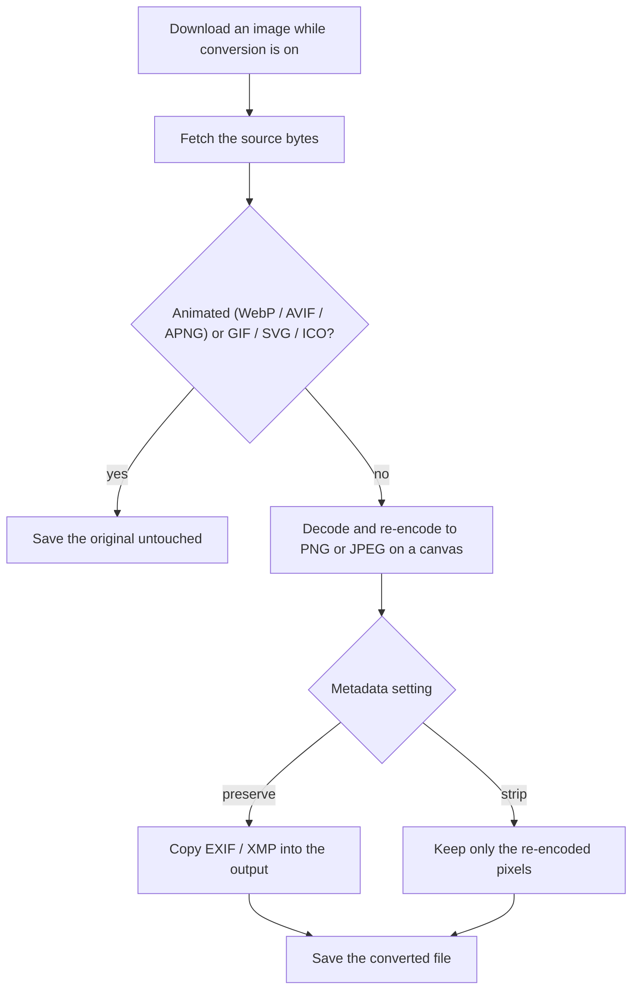

The extension can re-encode raster images to a standard format as they download,
so a page full of WebP or AVIF images lands as PNG or JPEG. Conversion is off by
default. Turn it on under **Settings → Downloads → Convert images on download
to**.

| Choice | Result |
|--------|--------|
| Keep original format | No conversion (the default). Files save as-is. |
| PNG | Re-encode to `.png` (lossless, keeps transparency). |
| JPEG | Re-encode to `.jpg` (smaller, no transparency). |

Conversion happens in the popup or bubble: the image is fetched to a blob, drawn
to a canvas, and read back in the target format, then the converted bytes are
handed to the browser to save. JPEG has no transparency, so a white background is
painted before the image is drawn.

## What gets converted

Only raster images are re-encoded: PNG, JPEG, WebP, AVIF, and BMP. Everything
else is saved untouched:

- **Videos and audio** are never re-encoded.
- **SVG** is vector, and **ICO** is left alone.
- **GIF** is skipped, because re-encoding would drop the animation.
- **Animated WebP, AVIF, and APNG** are detected from their file header at
  download time. A canvas re-encode keeps only the first frame, so an animated
  image falls back to a plain download of the original instead of being silently
  flattened.
- An image already in the target format is left as-is.

If a conversion can't be completed for any reason, the extension downloads the
original rather than nothing.

## Metadata: preserve or strip

A canvas re-encode normally throws away all embedded metadata. When conversion is
on, a second setting appears, **Settings → Downloads → Metadata when
converting**:

| Choice | Effect |
|--------|--------|
| Preserve (copy EXIF/XMP) | Copies embedded EXIF/XMP into the converted file (the default). |
| Strip (remove all metadata) | Keeps only the pixels, dropping EXIF/XMP. |

**Preserve** carries across fields like copyright, author, and capture info.
**Strip** is useful for clearing metadata such as GPS location before you share a
file. If metadata is set to preserve but can't be re-injected into the output
(for example, it is too large for a JPEG's metadata block), the extension
downloads the original untouched rather than a copy that lost its metadata.

## How a converted download flows

## Example: save WebP images as JPEG without location data

1. Open **Settings → Downloads**.
2. Set **Convert images on download to** to **JPEG**.
3. Set **Metadata when converting** to **Strip (remove all metadata)**.
4. Save the settings, then download images as usual. Each raster image lands as a
   `.jpg` with its metadata removed. Videos, GIFs, and SVGs still save in their
   original format.

## Related

- [Download](/media-bulk-downloads/guides/download/) for how converted files are named and de-duplicated.
- [Download paths](/media-bulk-downloads/guides/download-paths/) for sorting downloads into folders.
- [FAQ & troubleshooting](/media-bulk-downloads/help/faq/) for where files go and why names differ.

---
