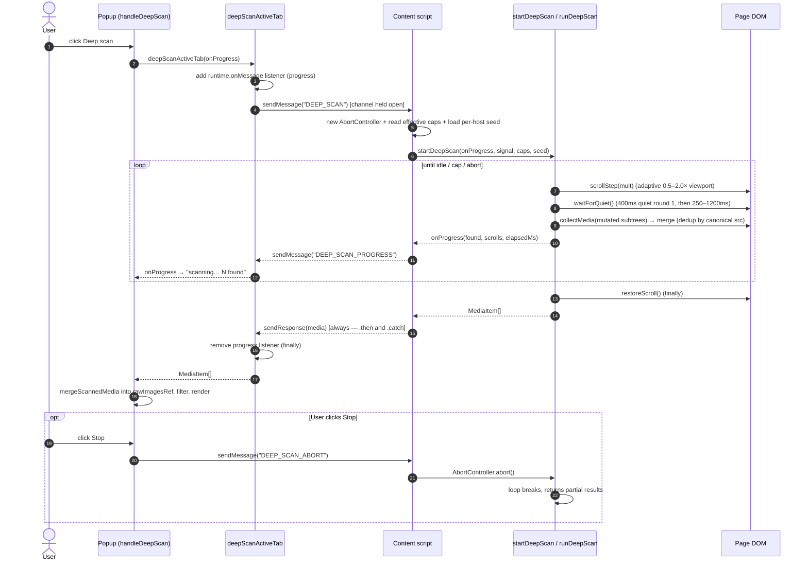
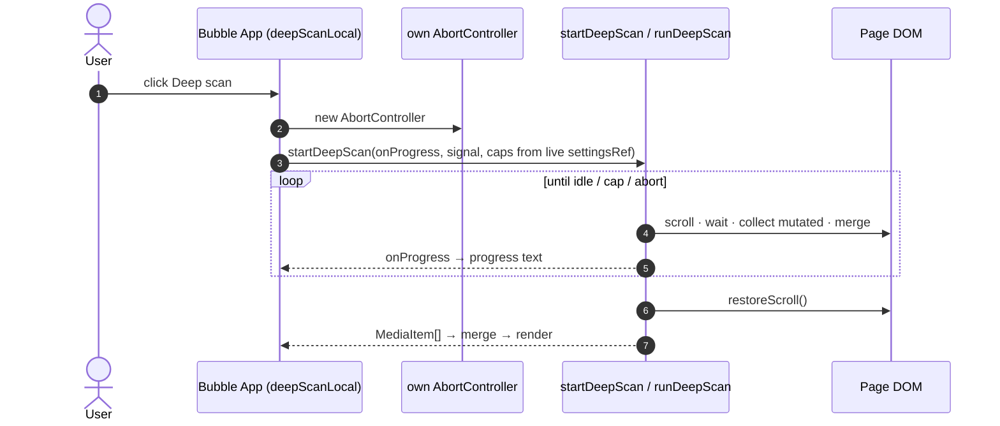
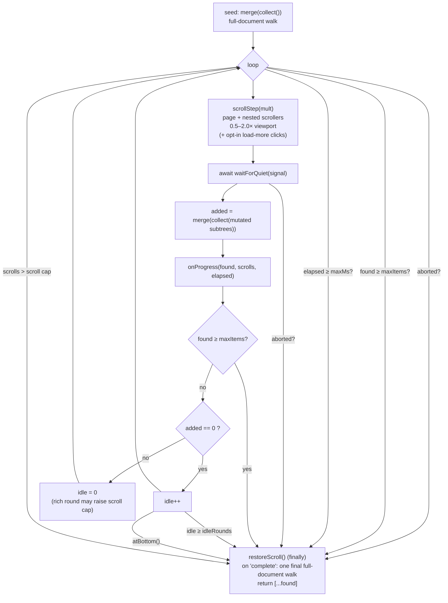

Deep scan surfaces media that isn't in the DOM until the page scrolls:
virtualized feeds (Twitter/X timelines), infinite scroll, and lazy carousels. It is **opt-in** and **bounded**. The extension makes no network requests of its own during a scan. It scrolls the page,
waits for the DOM to settle, and re-reads it. The page loads its own media.

## Popup path (over messaging)

## Bubble path (in-page, no messaging)

The bubble runs inside the page, so it drives the loop directly.

The bubble reads caps from `settingsRef.current`, which a `storage.onChanged`
listener keeps live. Editing the caps in Settings updates a running-again scan, not just the next mount.

## The loop (`@mbd/core/collection/deepScan.ts` — pure)

Only the seed and the closing sweep walk the whole document. Every round in between rescans just the subtrees that mutated during `waitForQuiet` (or the whole document when that set is unreliable,
such as on abort). The final walk runs only when the scan finished naturally, so the completed result matches a full scan and catches media behind shadow roots or same-origin iframes that the
per-round rescans can't see.

### Bounds (defaults in `DEEP_SCAN_DEFAULTS`; the first three are user-configurable)

`maxItems` / `maxMs` / `maxScrolls` are **defaults only**. The popup and bubble both read the user's **Settings → Media → Advanced** values and pass them into
`startDeepScan`, overriding these. Only `idleRounds` is fixed and not configurable.

| Cap          | Default | Configurable in Settings? | Meaning                                                        |
|--------------|---------|---------------------------|----------------------------------------------------------------|
| `maxItems`   | 1000    | yes (50–5000)             | Hard stop once this many unique items are found                |
| `maxMs`      | 20000   | yes (5–120 s, ×1000)      | Hard wall-clock stop (default ~20 s)                           |
| `maxScrolls` | 40      | yes (5–200)               | Base scroll-step cap; can stretch to 2× while rounds stay rich |
| `idleRounds` | 3       | no (fixed)                | Stop after N consecutive steps that add nothing new            |

`maxScrolls` is a base cap, not a hard ceiling. If a round adds at least 5 new items just as the cap is reached, the cap grows by 10, up to `2 × maxScrolls`.
`maxItems` and `maxMs` are the real hard stops and are checked at the top of the loop before the scroll cap is consulted.

### Stop reasons

The final progress event carries a `reason` (`DeepScanStopReason`) so the popup can say *why* a scan ended.

| Reason        | Trigger                                                                          |
|---------------|----------------------------------------------------------------------------------|
| `complete`    | Idle rounds hit or page bottom reached — nothing left to load                    |
| `max-items`   | `maxItems` cap reached                                                           |
| `max-time`    | `maxMs` wall-clock cap reached                                                   |
| `max-scrolls` | The (possibly stretched) scroll cap reached                                      |
| `aborted`     | User pressed Stop (`AbortController`)                                            |
| `error`       | A `collect()` / `scrollStep()` threw mid-scan; the partial set is still returned |

### Adaptive pacing

The step size and the settle wait both adapt during the scan, so the loop covers ground fast when a page is sparse and slows down when it is dense.

- **Scroll step.** Each step moves a multiple of the viewport, chosen from the previous round's new-item count. A dense round (≥ 15 new) steps 0.6×; a zero round steps 1.75×; anything in between steps
  1.0×. The multiplier is clamped to 0.5–2.0×. The first step is always 1.0×.
- **Quiet window.** After each scroll the loop waits for the DOM to stop mutating. Round 1 of a cold scan waits 400 ms of quiet with a 2000 ms hard cap. After that the window tracks an EMA (weight
  0.5) of the measured settle time: quiet = `1.5 × EMA` clamped to 250–1200 ms, hard cap = `3 × EMA` clamped to 1500–4000 ms. Attribute changes count as mutations too, since most lazy loaders swap
  `data-src → src` on the same node.

### Scroll surfaces & load-more

- **Nested scrollers** (always on): each step also advances any inner
  `overflow-y: auto|scroll` pane that has more than 200 px of un-scrolled content and isn't already at its bottom, not just the page. Some galleries lazy-load inside their own scroll pane, so the page
  scroller alone never advances them.
- **Load-more clicking** (opt-in, **off by default** — Settings → Media → Advanced → *Click "Load more" buttons*): when enabled, each step may click up to 3 matching `<button>` / `role="button"`
  controls per round. The text or
  `aria-label` must read as an expander ("load/show/view/see/read more", "load additional", "more results/items/photos/images/posts"). "Learn more" is deliberately excluded. Real buttons only, never
  `<a href>` links, which would navigate away and tear down the scan.

## Per-host scan memory (repeat visits)

**Setting:** "Remember scan behaviour per site" (`rememberScanBehaviour`), **on by default**. Local only, never synced. "Reset this site" clears it, and resetting a host's per-host settings clears it
too.

The store lives in `chrome.storage.local` under `perHostScanMemory`: a record keyed by registrable domain. Each entry is three numbers — `settleMs`,
`scrolls`, `updatedAt`. No URLs, no page content. The store is LRU-capped at 200 hosts; `settleMs` is clamped to ≤ 10000 and `scrolls` to ≤ 500.

**Cold vs warm start.** The first scan of a host has no memory and behaves exactly like a scan with the setting off. On a repeat scan, `startDeepScan`
loads that host's memory and seeds the loop:

- `settleMs` seeds the settle EMA, so round 1 skips the 400 ms cold default and uses the tuned quiet window from the first step.
- `scrolls` raises the starting scroll cap toward `2 × maxScrolls` (clamped to
  `[maxScrolls, 2 × maxScrolls]`). This is raise-only: a remembered-deep site pre-extends its cap, but the user's `maxScrolls` is never lowered.

**Write-back** happens once at the end, via the loop's `onLearned` callback:

- Nothing is written on an `aborted` or `error` run.
- The fresh settle EMA is always blended into the stored value (cross-visit EMA, weight 0.5).
- Scroll depth is blended in only when the run ended on `complete` or
  `max-scrolls` — a genuine depth signal. A `max-time` / `max-items` stop under-counts depth, so the previous remembered value is kept instead of lowered.
- The write is routed through the background (`SAVE_SCAN_MEMORY`) so saves and
  "Reset this site" share one serialized writer across tabs. It is fire-and-forget: if the background worker is asleep, the write is dropped and the value is re-learned on the next scan.

## Guarantees

- **Scroll is always restored** (`restoreScroll()` runs in `finally`), even on abort or a thrown error.
- **No listener/observer leaks**: `waitForQuiet` disconnects its
  `MutationObserver`, clears both timers, and removes its abort listener on every exit path; the popup client removes its progress listener in `finally`.
- **The message channel always closes**: the `DEEP_SCAN` handler calls
  `sendResponse` on both success and failure, so the popup never hangs.
- **Partial results survive a throw**: a mid-scan error marks the run `error`
  and returns everything gathered so far, rather than an empty list.
- **No data loss on merge**: results merge into the raw collected set (`rawImagesRef`) via `mergeScannedMedia`, so images previously hidden by a size/base64 filter aren't discarded and reappear if the
  filter is relaxed.
- **Resolution still applies**: each scan round calls the same `collectMedia()`
  as the initial scan, so newly-found items can carry `resolveHint` /
  `unresolvedVideo` like any other item. After the merge, `applyResolution` runs again and resolves them when `resolveOriginals` is on — see
  [Resolve Originals](/media-bulk-downloads/how-it-works/resolve-originals/).

Pipeline that each scan round feeds into: [Collection Pipeline](/media-bulk-downloads/how-it-works/collection-pipeline/) ·
[Resolve Originals](/media-bulk-downloads/how-it-works/resolve-originals/).

---

