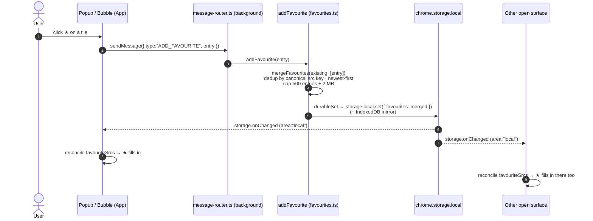

Star any collected item to save it to a **Favourites** list. The list persists across pages and browser sessions.

## Using it

- **Star** an item from its grid tile (hover or focus the tile, then click ★) or from the preview modal's header. A filled-star badge marks saved items on the grid, and it stays after a rescan or
  restart.
- Items that haven't resolved to a real file yet (a pending Twitter photo or video) don't show the star — there's no stable URL to save.
- Open the **Favourites** panel from the ★ button in the popup header.
- Each row has **Download**, **Open source**, and **Remove**; the header has **Clear all**. All four route through the background service worker.
- **Download** re-runs the normal [Download](./download.md) flow. It sends
  `DOWNLOAD_IMAGES` with an `ImageInfo` rebuilt from the stored `FavouriteEntry`
  (`src`, `kind`, `type`, and `thumbnailSrc` if present) plus the saved
  `sourcePageUrl`/`sourcePageTitle` as `sourcePage`. It sets `explicit: true`, so the blocklist never drops the item you picked. Your download-path tokens (`{host}`, `{domain}`, `{date}`, `{kind}`)
  apply as on a first download.
- **Open source** opens the saved source page (`sourcePageUrl`, falling back to the media `src`) in a new tab via `OPEN_URL`.
- **Remove** deletes one entry; **Clear all** empties the list.

## How it works

- Stored under the `favourites` key in `chrome.storage.local` — the reactive copy that fires `storage.onChanged`. Each write is also mirrored to IndexedDB as a best-effort durable backup.
- Deduped by **canonical src key**, not the raw URL. Two URLs for the same image (rotating CDN edge host, signed query token, resize transform) count as one favourite. This is the same key that
  collection dedup and the "already downloaded" mark use.
- Newest-first, capped two ways: **500 entries** (`FAVOURITES_CAP`) and **1,000,000 bytes** of serialized JSON (`FAVOURITES_MAX_BYTES`), whichever is hit first. A `src` can be a full base64 data URL,
  so the byte cap bounds storage that the count alone would not.
- Every mutation runs in the background service worker and serializes through one write chain, so a concurrent add and remove can't clobber each other. The UI sends three messages — `ADD_FAVOURITE`,
  `REMOVE_FAVOURITE`, `CLEAR_FAVOURITES`.
- Every open surface (popup and on-page bubble) reloads on `storage.onChanged`.
- Favourites are independent of [Download History](./history.md). An item can be in both.

## Star click → single writer → multi-surface sync

`REMOVE_FAVOURITE` and `CLEAR_FAVOURITES` follow the same single-writer →
`storage.onChanged` path. Only the mutation inside `favourites.ts` differs —
`removeFavourite` also matches by canonical src key.

Implementation: `packages/storage/src/favourites.ts`,
`apps/extension/src/extension/popup/components/panels/FavouritesPanel.tsx`, and the star controls in
`apps/extension/src/extension/popup/components/ImageList.tsx`.

See also: [Download](./download.md) · [Download History](./history.md) ·
[Architecture](../how-it-works/architecture.md).

---

