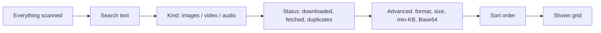

A busy page can turn up hundreds of items. The toolbar above the grid is how you
get from all of them to the ones you actually want. Nothing here changes your
media or your settings; it only decides what the grid shows and in what order.

Every filter is live: the grid updates as you type or click. A count pill on the
**More** button and an active-filter tally tell you how much is currently hidden,
and **Clear all** puts everything back.

## Search

Type in the search box to match items by their file name, `alt` text, and URL. It
filters as you type, so you can find one file in a large scan by any word that
appears in its name or link.

## Sort

Pick an order from the **Sort** menu:

| Sort by | Orders by |
|---|---|
| Default | The order items were found on the page |
| Name | File name |
| Size | File size in bytes |
| Dimensions | Pixel area (width × height) |
| Type | Media format |

The arrow button next to the menu flips between ascending and descending. It is
disabled while **Sort: Default** is selected, since the found-order has no
direction.

Size and dimensions are only known for items the page reported them for. Use
**Check sizes** in the footer to fetch real byte sizes for unsized items first if
you want to sort or filter by size accurately.

## Filter by kind

The segmented control is the primary filter: **All**, **Images**, **Video**,
**Audio**. Only the kinds actually present on the page appear, so a page with no
audio never shows an Audio segment.

## Status filters

Two chips filter by an item's state. They appear only when they have something to
act on, so the row stays uncluttered:

- **State** filters by download status: all items, only downloaded, or only
  not-downloaded. Handy for picking up where you left off.
- **Fetched** appears only when some items are still poster-only and awaiting the
  opt-in network resolve (see [Resolve originals](/media-bulk-downloads/how-it-works/resolve-originals/)).
  It filters by fetched, not-fetched, or all.
- **Duplicates** appears only after a near-duplicate pass has hidden something.
  See [Find near-duplicates](/media-bulk-downloads/guides/near-duplicates/).

## Advanced filters (More)

The **More** button reveals the finer filters:

| Filter | What it does |
|---|---|
| Format | Restrict to one format (JPG, PNG, MP4, and so on). The list adapts to the current kind. |
| Size | Bucket images as Any, Small, Medium, or Large. Images only. |
| Min | Hide anything below a minimum size in KB. |
| Base64 | Include or exclude inline `data:` images. Disabled if you already exclude Base64 in Settings. |

Each active advanced filter also shows as a removable chip in the main row, so you
can drop one without reopening the panel. The pill on **More** counts how many
advanced filters are set.

## Clearing filters

**Clear all** appears whenever any filter or a non-default sort is active, and
resets the whole toolbar in one click. Filters also self-correct: if the last
video is filtered out, or a near-duplicate pass is undone, the chip that no longer
applies resets itself so the grid is never left blank with no visible control to
recover.

## Related

- [Select & bulk actions](/media-bulk-downloads/guides/select-and-bulk-actions/) to act on what you filtered.
- [Deep scan](/media-bulk-downloads/guides/deep-scan/) to surface more items before filtering.
- [Settings reference](/media-bulk-downloads/reference/settings/) for the collection defaults that seed these filters.

---
