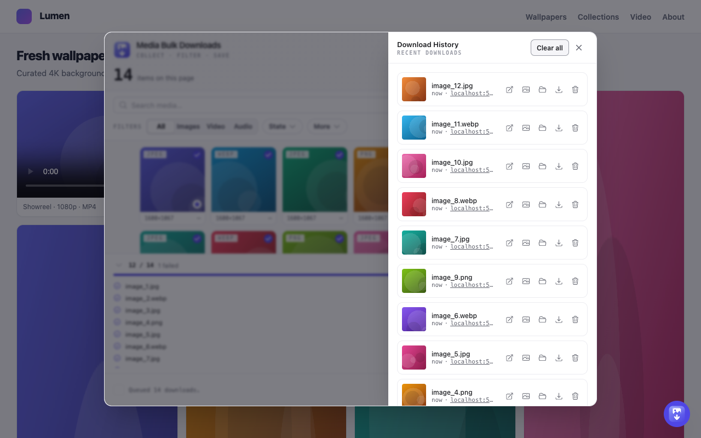
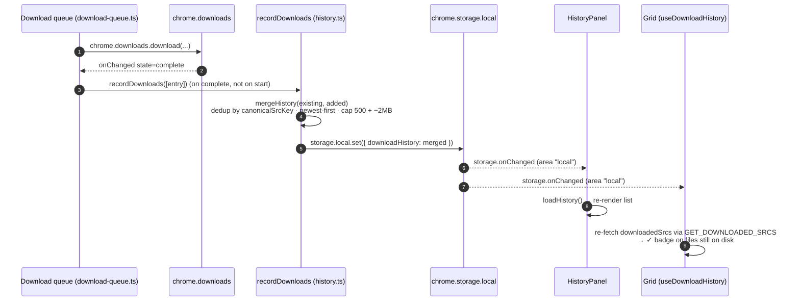

Every completed download is recorded to a **Download History** list. The list survives across pages, tabs, and browser restarts, so you can find, re-open, or re-download something you saved earlier
without digging through the OS downloads folder.

## Using it

- Open the **Download History** panel from the clock button in the popup header (labelled "Download history").
- Each row offers:

| Action             | Needs `downloadId`? | Effect                                                                                           |
|--------------------|---------------------|--------------------------------------------------------------------------------------------------|
| **Open source**    | no                  | Opens the entry's media URL (`entry.src`) in a new tab (`OPEN_URL`; `http(s)` URLs only)         |
| **Open file**      | yes                 | Opens the downloaded file in the OS default app (`OPEN_DOWNLOAD_FILE` → `chrome.downloads.open`) |
| **Show in folder** | yes                 | Reveals the file in the OS file manager (`SHOW_DOWNLOAD` → `chrome.downloads.show`)              |
| **Re-download**    | no                  | Re-runs the [Download](/media-bulk-downloads/guides/download/) flow for this one item (`DOWNLOAD_IMAGES`)                 |
| **Remove**         | no                  | Deletes this one entry (`REMOVE_HISTORY_ENTRY`)                                                  |
| **Clear all**      | no                  | Empties the whole history (`CLEAR_HISTORY`); header button, disabled when empty                  |

"Open file" and "Show in folder" render only when the entry carries a
`downloadId`. Every download recorded going forward has one. It is absent on entries carried over from before this was tracked.

Re-download sends the item with `explicit: true`. That bypasses the collection size, base64, and blocklist filters and the "skip already-downloaded" dedup, so an item you picked from history is never
silently dropped. It mirrors the context-menu single download.

A collected tile that is still on disk shows a ✓ badge in the grid. That badge comes from `downloadedSrcs`, which the grid fetches with `GET_DOWNLOADED_SRCS`
(see below), not from raw history membership. It is distinct from the toolbar count in [Badge](/media-bulk-downloads/how-it-works/badge/).

## How it works

- Stored in `chrome.storage.local` under the `downloadHistory` key (`HISTORY_KEY`). Writes go through `durableSet`, which sets `chrome.storage.local`
  (the reactive copy that fires `onChanged`) and mirrors to an IndexedDB durable copy best-effort.
- `mergeHistory` dedups by `canonicalSrcKey(entry.src)`, not by the raw `src`. Re-downloading the same image with a fresh CDN query signature updates its existing entry instead of adding a duplicate.
  Newest wins on a key collision, and the list is sorted newest-first.
- The list is capped two ways: at 500 entries (`HISTORY_CAP`) and at ~2 MB of serialized JSON (`HISTORY_MAX_BYTES`, 2,000,000 bytes). The byte cap exists because a `src` can be a full base64 data URL,
  and 500 of those would blow the shared `chrome.storage.local` quota.
- Every history write runs in the background service worker and serializes through one `writeChain` (the `serialize` helper in `history.ts`). Automatic recording and user edits (remove, clear) share
  that single writer, so two concurrent read-modify-write operations cannot clobber each other.
- The popup and the on-page bubble run the same app. Each listens on
  `chrome.storage.onChanged` and reloads when `downloadHistory` changes. Nothing polls.
- History is independent of [Favourites](/media-bulk-downloads/guides/favourites/). An item can be in both, either, or neither.

## When history is recorded

A download reaches history through one of two paths, both of which call
`recordDownloads`:

- **Popup bulk downloads and panel re-downloads** send `DOWNLOAD_IMAGES` to the persistent download queue (`enqueueDownloads`). The queue records the entry when Chrome reports the file `complete`
  (`handleDownloadChanged` in
  `download-queue.ts`), not when the download starts. If the service worker died before that `complete` event arrived, `reconcileQueue` records it on the next startup, so a file on disk is never
  missing from history.
- **Keyboard-command and context-menu downloads** go through `downloadAndRecord`
  (`download/downloads.ts`), which records each item once Chrome returns a
  `downloadId`.

Failed downloads (a `runtime.lastError`, or no `downloadId`) are not recorded.

## Recording a download → live sync

The grid's ✓ badge is reconciled against files still on disk, not just against what history records. `GET_DOWNLOADED_SRCS` loads history, runs one
`chrome.downloads.search({ limit: 0 })`, and keeps only srcs whose file Chrome has not reported as deleted (`srcsStillOnDisk`). An item you deleted from disk drops off the badge and becomes
re-downloadable rather than a false duplicate.

Row actions take the same route back to the UI. Remove sends
`REMOVE_HISTORY_ENTRY` (`removeEntry`), Clear all sends `CLEAR_HISTORY`
(`clearHistory`); both land at the same `storage.onChanged` fan-out. The panel also updates its own local state optimistically for responsiveness, then the listener reconciles. There is no separate
storage path for user edits versus automatic recording.

## Implementation

- `packages/storage/src/history.ts` — `HISTORY_KEY`, `HISTORY_CAP` (500),
  `HISTORY_MAX_BYTES` (2,000,000), `mergeHistory`, `recordDownloads`,
  `removeEntry`, `clearHistory`, `srcsStillOnDisk`, and the `writeChain`
  serializer.
- `apps/extension/src/extension/background/download/downloads.ts` —
  `downloadAndRecord` (keyboard-command / context-menu path).
- `apps/extension/src/extension/background/download/download-queue.ts` —
  `handleDownloadChanged` and `reconcileQueue`, which call `recordDownloads` on completion and on restart reconcile.
- `apps/extension/src/extension/background/message-router.ts` — the
  `CLEAR_HISTORY` / `REMOVE_HISTORY_ENTRY` / `OPEN_DOWNLOAD_FILE` /
  `SHOW_DOWNLOAD` / `GET_DOWNLOADED_SRCS` / `OPEN_URL` handlers.
- `apps/extension/src/extension/popup/components/panels/HistoryPanel.tsx` — the panel UI.
- `apps/extension/src/extension/popup/hooks/useDownloadHistory.ts` — the grid's downloaded-on-disk set.

See also: [Download](/media-bulk-downloads/guides/download/) · [Favourites](/media-bulk-downloads/guides/favourites/) ·
[Architecture](/media-bulk-downloads/how-it-works/architecture/).

---

