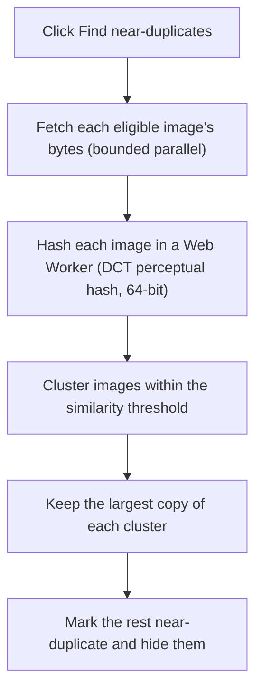

Sites often serve the same picture several times: a thumbnail, a medium
rendition, and the full-size original, each at a different URL. Exact-URL
de-duplication can't catch these because the URLs and bytes differ. The
near-duplicate pass compares the images themselves and hides the smaller copies,
keeping the largest of each set.

It is on-demand, not automatic. Run it from the **Find near-duplicates** button
in the popup header (the stacked-squares icon). Nothing is fetched or hashed
until you ask.

## What it does

Each eligible image is fetched (from the extension's own context, which bypasses
page CORS) and hashed off the main thread in a Web Worker, so the popup stays
responsive. The hash is a classic DCT perceptual hash: a 64-bit fingerprint that
is close for two versions of the same picture even at different resolutions or
after a re-encode.

Images whose fingerprints are within the similarity threshold are grouped, and
each group keeps one copy: the largest pixel area, then the largest byte size on
a tie. Every other member is marked a near-duplicate and hidden.

Only real, fetchable images are considered: not Base64 data images, not stream or
pending placeholders, and only http(s) URLs. Videos and audio are never touched.

## The Duplicates filter

After a pass finds at least one near-duplicate, a **Duplicates** filter appears
in the toolbar with three choices:

| Choice | Shows |
|--------|-------|
| Hide near-duplicates | Only the kept copies (the default after a pass) |
| Show all | Every image, including the hidden copies |
| Only near-duplicates | Just the copies that were hidden |

The marks are non-destructive. Switch to **Show all** to see everything again, or
re-run the pass at a different threshold. Hidden copies are left out of the grid,
ZIP, download, and select-all at once, so a bulk download keeps only the keepers.

## The similarity threshold

The pass compares fingerprints by Hamming distance (how many of the 64 bits
differ). The threshold is the largest distance still treated as a match. Set it
under **Settings → Downloads → Advanced → Near-duplicate similarity threshold**:

- Range 2 to 16, default 8.
- Lower is stricter: fewer images are treated as duplicates.
- Higher is more forgiving: more images collapse into one group.

A faithful thumbnail-versus-original pair usually lands around 4 to 6 bits apart,
while genuinely different pictures sit far higher, so the default of 8 catches
resolution and CDN variants with margin. If distinct images are being collapsed,
lower it. If obvious duplicates slip through, raise it.

## Example: collapse resized copies

1. Collect a gallery that serves each image at several sizes.
2. Click **Find near-duplicates** in the popup header. Progress shows as a
   hashing count while it runs.
3. When it finishes, the status reports how many near-duplicates were found and
   the grid shows only the largest copy of each.
4. To check what was hidden, open the **Duplicates** filter and choose **Only
   near-duplicates** (or **Show all** to see everything).
5. If the grouping is too loose or too tight, adjust the threshold in Settings
   and run the pass again.

## Related

- [Deep Scan](/media-bulk-downloads/guides/deep-scan/) to surface lazy-loaded images before de-duplicating.
- [Download](/media-bulk-downloads/guides/download/) for how the kept copies are saved.
- [FAQ & troubleshooting](/media-bulk-downloads/help/faq/) for lots of near-identical copies.

---
