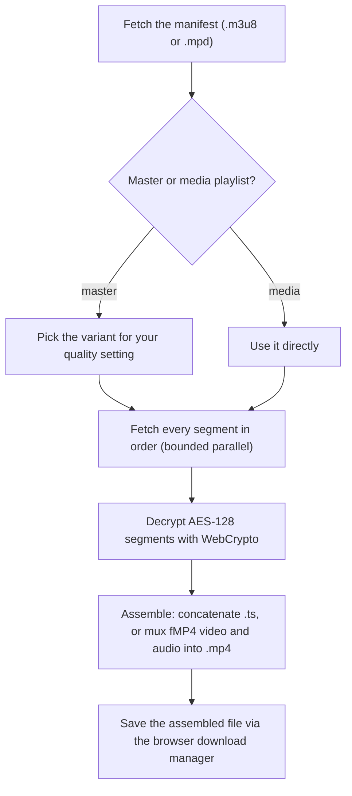

Adaptive video is not one file. An HLS (`.m3u8`) or DASH (`.mpd`) manifest points
at dozens or hundreds of small segments that the player fetches and stitches
together as you watch. There is nothing for the browser's download manager to
save. Stream capture does the stitching for you: it fetches the manifest and
every segment, decrypts standard AES-128 where it is present, and assembles them
into a single playable file.

Capture is off by default. Turn it on under **Settings → Media → Capture video
streams (HLS & DASH)**. It is more work than a plain download (every segment is
fetched and held in memory), which is why it is opt-in.

## How a stream shows up

When a page exposes a manifest, the item appears in the grid tagged
**HLS · capture** (DASH items use the same tag). Its action button reads
**Capture stream** rather than **Download**, because saving it means assembling
the segments, not pulling one URL. A stream item can't be added to a ZIP or
multi-selected: it is captured one at a time.

Streams are found two ways:

- **In the page DOM**: a `.m3u8` / `.mpd` in a native video element, a source
  tag, an `og:video` tag, or a direct link.
- **From a passive network sniffer.** Most modern players (hls.js and friends)
  fetch the manifest over `fetch` / XHR, so it never appears in the DOM. A
  MAIN-world content script wraps those calls and notes the manifest URLs the
  page requests. It reads request URLs only, never response bodies, and forges no
  requests of its own. See [Collection Pipeline](/media-bulk-downloads/how-it-works/collection-pipeline/).

## What capture does

The assembled file's type depends on the stream:

- **MPEG-TS segments** concatenate into a `.ts`.
- **fMP4 segments** (with their init segment) concatenate into an `.mp4`.
- **Demuxed streams** (a video-only track plus a separate audio rendition, common
  for DASH and modern HLS) are muxed into one `.mp4` so the result has sound.

The captured file, never the manifest URL, is handed to the browser's download
manager, so it lands in Downloads like any other file and follows your naming and
[folder template](/media-bulk-downloads/guides/download-paths/) settings.

### AES-128 decryption

Standard HLS AES-128 is supported. The decryption key is served openly in the
manifest to every player, so the extension fetches it the same way the player
would and decrypts each segment with the browser's built-in WebCrypto. No key is
guessed or cracked.

### Audio only, and MP3 transcode

A stream with a separate audio track can be captured as audio only. By default
that is an `.m4a` (AAC) passthrough with no re-encode. You can instead transcode
it to MP3 at 128, 192, or 320 kbps under **Settings → Downloads → Audio download
format** (the same choice is available per item in the preview panel). MP3
re-encodes for wider compatibility, M4A keeps the original quality. A
single-muxed stream with no separable audio track has no audio-only option.

### Quality selection

Set which rendition to capture under **Settings → Downloads → Stream capture
quality**:

| Choice | Captures |
|--------|----------|
| Auto (recommended) | The variant closest to 720p (the default) |
| Best available | The highest-bandwidth variant |
| 1080p / 720p / 480p | The variant closest to that height |
| Smallest (data saver) | The lowest-bandwidth variant |

A fixed resolution picks the closest the stream actually offers. A
single-quality stream ignores this setting.

### The size cap

The whole file is held in memory before it is saved, so capture stops at about
1 GB and reports a message rather than exhausting memory. Most clips are far
below this.

## Where capture runs

Capture needs a page that can fetch, decrypt, and mux, which the background
service worker itself can't do. So the extension runs the capture in a hidden
helper page:

- **Chrome and Edge**: an offscreen document.
- **Firefox and Safari**: the extension's own DOM-capable background page.

Either way capture runs in the background, so it keeps going even if you close
the popup, and progress is reported back to the popup or bubble.

## What is refused

Some streams can't be captured, by design:

- **DRM**: Widevine, PlayReady, FairPlay, and `SAMPLE-AES`. Working around the
  protection would breach the stream's DRM and the Chrome Web Store policy.
- **Live streams**: an HLS playlist with no end marker, or a DASH manifest of
  type `dynamic`. A live stream has no finite end, so there is no single file to
  save.

When capture is refused, the extension says why instead of saving a broken or
silent file. If a stream fails another way, check the download queue in the popup
and use Retry.

## Example: capture a video

1. Open **Settings → Media** and turn on **Capture video streams (HLS & DASH)**.
2. (Optional) Set **Settings → Downloads → Stream capture quality** to the
   resolution you want.
3. Open the page and play the video, so its player requests the manifest.
4. Open the popup. The stream shows in the grid tagged **HLS · capture**.
5. Click **Capture stream**. Watch progress in the popup, then find the assembled
   file in your Downloads folder.

For audio only, use the audio action on the stream item and pick M4A or an MP3
bitrate.

## Related

- [Download](/media-bulk-downloads/guides/download/) for how saved files are named and de-duplicated.
- [Collection Pipeline](/media-bulk-downloads/how-it-works/collection-pipeline/) for how streams are found.
- [FAQ & troubleshooting](/media-bulk-downloads/help/faq/) for videos that won't download.

---
