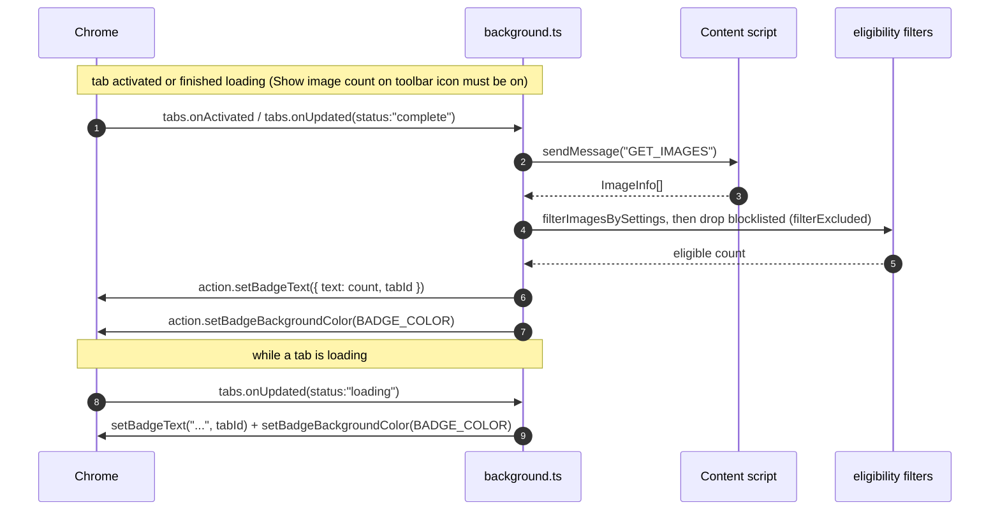
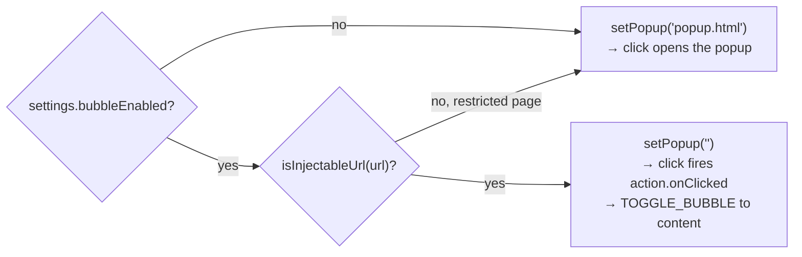

The toolbar icon shows the count of **eligible** media on the active tab. The service worker keeps it in sync. It only draws the count when the **Show image count on toolbar icon** setting is on (`showImageCount`,
default on).

## Flow

## What the count counts

Two filters run, in order, in `updateTabBadge`:

1. `filterImagesBySettings` keeps items that pass the global settings: the minimum-size floor, plus the opt-in excludes for base64 images, emoji graphics, and HLS (`.m3u8`) streams. An item with
   unknown dimensions (0×0 — srcset candidates, CSS backgrounds, video, audio) never fails the size rule.
2. `filterExcluded` drops anything on the user's exclusion blocklist (by canonical URL or registrable domain).

The remaining count is the badge text. The same two filters gate the visible list and downloads, so **badge = what the panel shows = what downloads**. Before counting, the worker waits for its
settings and blocklist caches to load, so a cold-started worker doesn't over-count against an empty blocklist.

## Behavior

- **Loading** tabs show `...` until the tab finishes loading, then the real count.
- If the content script can't run — `chrome://`, `about:`, the Chrome Web Store, AMO — the `GET_IMAGES` call returns a `lastError`. The worker clears that tab's badge, so a stale `...` placeholder
  doesn't stay stuck on it.
- When **Show image count on toolbar icon** is off, existing badges are cleared and no counts are drawn. The activation and load listeners skip the badge entirely.

## Popup vs. bubble mode

The worker also decides what clicking the icon does, via `action.setPopup`, in
`updateTabActionMode`. Two gates must both pass for the bubble to take over —
`settings.bubbleEnabled`, and `isInjectableUrl(url)`:

`isInjectableUrl` (`apps/extension/src/extension/background/badge.ts`) passes only `http:`, `https:`, and `file:` URLs. It then rejects three store hosts even though they're `https:`:
`chromewebstore.google.com`,
`chrome.google.com/webstore`, and `addons.mozilla.org`. So even with the bubble enabled, those pages (and any `chrome://`, `about:`, etc. page) fall back to the popup. The popup is the only surface
that works everywhere.

This mode switch is independent of the badge count — it runs whether or not **Show image count on toolbar icon** is on.

See [In-page Bubble](/media-bulk-downloads/guides/bubble/) for what `TOGGLE_BUBBLE` does.

---

