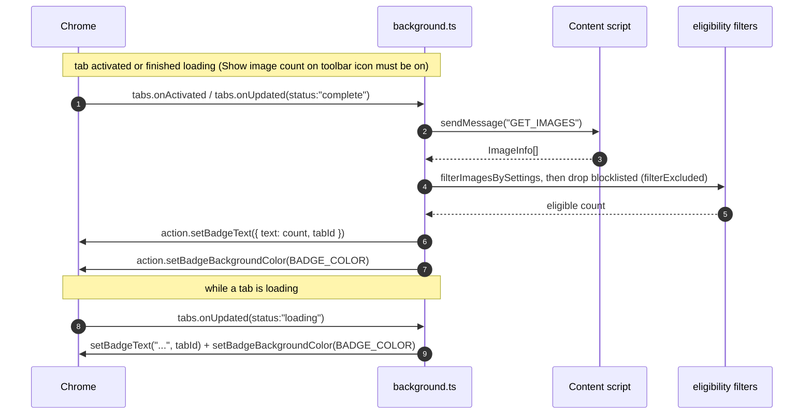
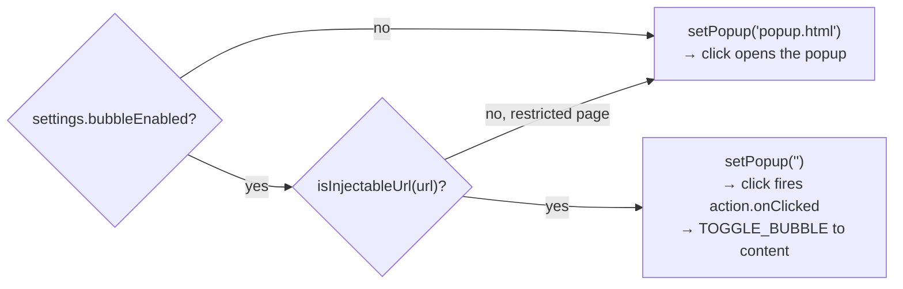

The toolbar icon shows the count of eligible media on the active tab. The service worker keeps it in sync. It only draws the count when the **Show image count on toolbar icon** setting is on (`showImageCount`,
default on). A failed download in the queue is the one exception: it paints a red alert count that overrides the media count on every tab, and shows even when the count is off (see below).

## Flow

```mermaid
sequenceDiagram
  autonumber
  participant CH as Chrome
  participant SW as background.ts
  participant CS as Content script
  participant F as eligibility filters

  Note over CH,SW: tab activated or finished loading (Show image count on toolbar icon must be on)
  CH->>SW: tabs.onActivated / tabs.onUpdated(status:"complete")
  SW->>CS: sendMessage("GET_IMAGES")
  CS-->>SW: ImageInfo[]
  SW->>F: filterImagesBySettings, then drop blocklisted (filterExcluded)
  F-->>SW: eligible count
  SW->>CH: action.setBadgeText({ text: count, tabId })
  SW->>CH: action.setBadgeBackgroundColor(BADGE_COLOR)

  Note over CH,SW: while a tab is loading
  CH->>SW: tabs.onUpdated(status:"loading")
  SW->>CH: setBadgeText("...", tabId) + setBadgeBackgroundColor(BADGE_COLOR)
```

## What the count counts

Two filters run, in order, in `updateTabBadge`:

1. `filterImagesBySettings` keeps items that pass the global settings: the minimum-size floor, plus the opt-in excludes for base64 images, emoji graphics, and HLS (`.m3u8`) streams. An item with
   unknown dimensions (0×0: srcset candidates, CSS backgrounds, video, audio) never fails the size rule.
2. `filterExcluded` drops anything on the user's exclusion blocklist (by canonical URL or registrable domain).

The remaining count is the badge text. The same two filters gate the visible list and downloads, so badge = what the panel shows = what downloads. Before counting, the worker waits for its
settings and blocklist caches to load, so a cold-started worker doesn't over-count against an empty blocklist.

## Download-failure alert

When items in the download queue fail, the badge switches to a red failed-count across every tab, overriding the per-tab media count so a failure isn't silent while the popup is closed. It shows
even when **Show image count on toolbar icon** is off.

- `setDownloadFailedCount(failed)` takes the number of failed items from the persistent queue and repaints all tabs. It runs on every queue change and once when the service worker wakes (re-derived
  from the stored queue), so a failure that happened while the worker was asleep still surfaces.
- While the alert is active, `updateTabBadge` draws `String(failed)` in red (`BADGE_ALERT_COLOR`, `#DC2626`) ahead of the normal count. The normal media count uses `BADGE_COLOR` (`#4F46E5`).
- Opening the popup or bubble sends `DOWNLOADS_SEEN`, which calls `ackDownloadAlerts()` and clears the alert, because you can now see the failed rows in the queue. A new failure re-arms the alert
  even after a previous acknowledgement.
- The alert state is in-memory. After a service-worker restart it is re-derived from the persisted queue, so it simply re-alerts, which is harmless.

## Behavior

- **Loading** tabs show `...` until the tab finishes loading, then the real count.
- If the content script can't run (`chrome://`, `about:`, the Chrome Web Store, AMO), the `GET_IMAGES` call returns a `lastError`. The worker clears that tab's badge, so a stale `...` placeholder
  doesn't stay stuck on it.
- When **Show image count on toolbar icon** is off, existing badges are cleared and no counts are drawn (unless a download-failure alert is active). The activation and load listeners skip the badge entirely.

## Popup vs. bubble mode

The worker also decides what clicking the icon does, via `action.setPopup`, in
`updateTabActionMode`. Two gates must both pass for the bubble to take over:
`settings.bubbleEnabled`, and `isInjectableUrl(url)`:

```mermaid
flowchart LR
  S{"settings.bubbleEnabled?"} -->|no| POP["setPopup('popup.html')<br/>→ click opens the popup"]
  S -->|yes| I{"isInjectableUrl(url)?"}
  I -->|no, restricted page| POP
  I -->|yes| BUB["setPopup('')<br/>→ click fires action.onClicked<br/>→ TOGGLE_BUBBLE to content"]
```

`isInjectableUrl` (`apps/extension/src/extension/background/badge.ts`) passes only `http:`, `https:`, and `file:` URLs. It then rejects three store hosts even though they're `https:`:
`chromewebstore.google.com`,
`chrome.google.com/webstore`, and `addons.mozilla.org`. So even with the bubble enabled, those pages (and any `chrome://`, `about:`, etc. page) fall back to the popup. The popup is the only surface
that works everywhere.

This mode switch is independent of the badge count. It runs whether or not **Show image count on toolbar icon** is on.

See [In-page Bubble](/media-bulk-downloads/guides/bubble/) for what `TOGGLE_BUBBLE` does.

---

