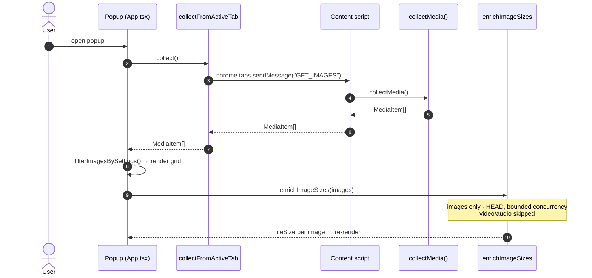
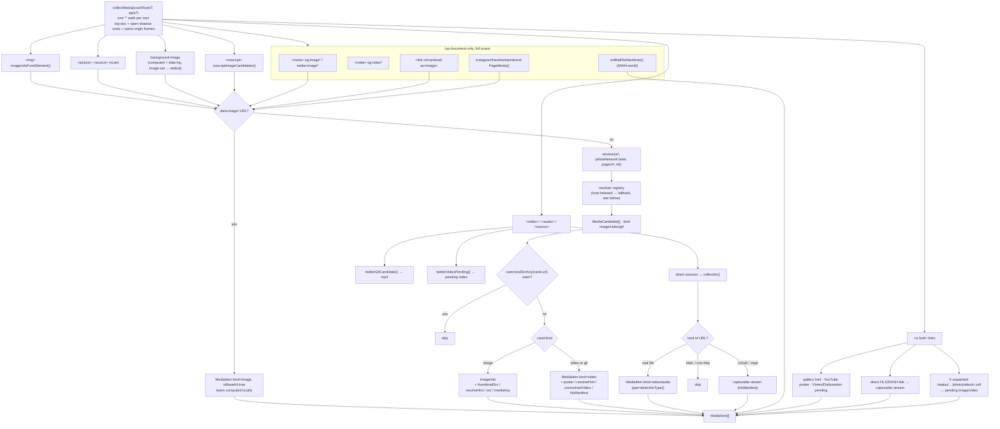
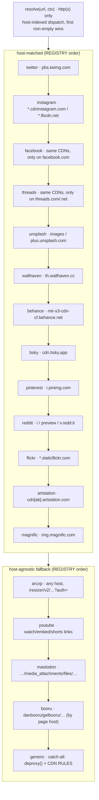

How a page's media is found, resolved to its original through a per-host resolver registry, de-duplicated, and shown.

## End-to-end (popup scan)

## Inside `collectMedia()`

`collectMedia()` walks **multiple roots**: the top document, every open shadow root, and every reachable same-origin `<iframe>` document. Shadow roots and frames are discovered while walking and
appended to the root list, so nested ones are reached too. Closed shadow roots and cross-origin frames are unreachable and skipped.

Each root gets **one** `querySelectorAll('*')` traversal. That single pass buckets the media tags (`img`, `picture`, `video`, `audio`, `a`, `noscript`,
`iframe`), reads each element's computed `background-image`, and discovers any open shadow root — instead of firing a separate full-subtree query per tag type. The buckets are then processed in a
fixed order (img → picture → background → video → audio → link → noscript → frame) so first-seen dedup priority is stable.

A base64 `data:image/` URL short-circuits: it becomes an `isBase64:true`
`MediaItem` with its byte size computed locally, and never hits the network or the resolver. Every other raw URL goes through `resolve()` (the resolver registry) before dedup.

`<video>`/`<audio>` take a separate path. For each `<video>` the collector tries `twitterGifCandidate()` (a GIF thumb that maps to a real `.mp4`), then
`twitterVideoPending()` (a real-video poster that becomes a pending video), then the element's direct file sources via `collectAv()`. `collectAv()` routes
`.m3u8`/`.mpd` manifests to the HLS/DASH capture path, drops `blob:` and other undownloadable schemes, and keeps only real http (s) files.

`<a href>` links can produce media on their own: a gallery/lightbox link whose href `looksLikeMediaUrl` (with the inner `` as its thumbnail), a YouTube link (poster thumbnail), a Vimeo or
Dailymotion link (pending video), a direct HLS/DASH manifest link, or — on x.com/twitter.com — an unpainted grid-cell permalink (`/user/status/<id>/photo|video/<n>`) that never rendered its media,
surfaced as a pending image or video keyed by the status id.

After the DOM walk, a full scan runs top-document-only head and tail passes:

- `<meta>` hero images (`og:image`, `og:image:url`, `og:image:secure_url`,
  `twitter:image`, `twitter:image:src`).
- `<meta property="og:video*">` — a direct downloadable `.mp4` (or a capturable
  `.m3u8`/`.mpd`) that never appears as a `<video>`.
- `<link rel=preload as=image>` — `href` plus the highest-width `imagesrcset`
  candidate.
- `instagramPageMedia()`, `facebookPageMedia()`, `pinterestPageMedia()` — pull the whole post/photo/pin (every carousel slide, the real progressive `.mp4`)
  from the page's own hydration JSON and the responses a MAIN-world sniffer caught, covering media the DOM hides (virtualized slides, `blob:`-backed players). Each no-ops off its own page type.
- `sniffedHlsManifests()` — `.m3u8`/`.mpd` URLs the MAIN-world sniffer saw hls.js/native players fetch, which never touch the DOM.

Passing `smartPageDefaults` flips one thing: on a page classified
`single-media` or `article`, the meta and preload hero passes run **before** the DOM walk so the hero image wins first-come dedup over an inline thumbnail of the same asset. Off, or unclassified, the
hero passes run after the walk as usual.

Deep-scan rounds call `collectMedia(scanRoots)` with an explicit root list; that incremental mode skips the head and tail passes (they only make sense on a full document scan).

A perf guard skips the computed-`background-image` read for elements with no layout box (`offsetWidth === 0 && offsetHeight === 0`, e.g. `display:none`). The guard itself is gated on the document
actually having layout, so jsdom (no layout engine, every element 0×0) is not wrongly emptied under test.

### Extraction sources (`@mbd/core/collection/extract.ts`)

| Source             | Attributes / pattern                                                                                                                                                                                                                                                                                                                                                                                                     |
|--------------------|--------------------------------------------------------------------------------------------------------------------------------------------------------------------------------------------------------------------------------------------------------------------------------------------------------------------------------------------------------------------------------------------------------------------------|
| Lazy `src`         | In preference order: `data-orig-file`, `data-large-file` (WordPress/Jetpack **true original** — surfaced first so it wins with no CDN rule), then `data-src`, `data-original`, `data-original-src`, `data-actualsrc`, `data-lazy-src`, `data-lazy`, `data-lazyload`, `data-hi-res-src`, `data-src-large`, `data-full-src`, `data-image`, `data-echo`, `data-flickity-lazyload`. `currentSrc`/`src` slots in after these. |
| Srcset             | `srcset`, `data-srcset`, `data-lazy-srcset` — the widest `w` candidate (or densest `x` for a pure-density set) is kept, plus every candidate URL.                                                                                                                                                                                                                                                                        |
| Background         | `data-bg`, `data-background`, `data-background-image`, plus computed `background-image` (`image-set()`/`-webkit-image-set()` contribute only the highest-resolution candidate per layer).                                                                                                                                                                                                                                |
| `<noscript>`       | Parsed with `DOMParser` (entities un-escaped first if needed); the real image often lives here for no-JS users.                                                                                                                                                                                                                                                                                                          |
| Gallery `<a href>` | Anchor whose href `looksLikeMediaUrl` → href is the original, inner `` is the `thumbnailSrc`.                                                                                                                                                                                                                                                                                                                       |

`imageUrlsFromElement()` returns the primary candidate at index 0; `collect.ts`
pairs index 0 with the element's DOM dimensions. When index 0 is a
`data-orig-file`/`data-large-file` original (not what the element is displaying), those dimensions are withheld so the on-screen thumbnail's size doesn't mislabel the larger original and get it
wrongly dropped by the minimum-size filter.

## Resolver registry (`@mbd/core/resolvers/`)

`resolve(rawUrl, ctx)` parses the URL and returns `[]` for any non-http (s)
scheme (`javascript:`, `data:`, `blob:`, `file:`, …) so those never reach a download or tab-open sink. It then dispatches through a **host index**, not a flat scan: `candidatesFor()` collects the
resolvers whose declared `hosts`
suffix matches the URL's hostname (kept in `REGISTRY` order), appends the host-agnostic resolvers (those with no `hosts`), runs each one's `match()` to confirm, and returns the first non-empty
`MediaCandidate[]`.

`REGISTRY` has **31 entries** — 30 dedicated resolvers plus the generic catch-all — in this order:

`twitter → instagram → facebook → threads → unsplash → wallhaven → behance →
bsky → pinterest → reddit → flickr → artstation → pixiv → magnific → arcxp →
youtube → mastodon → booru → zerochan → wallpaperscraft → sankaku → postimages →
fourchan → foolfuuka → pikabu → wallpaperHosts → xiaohongshu → spiegel → onedio →
animePictures → generic`

Several are host-agnostic (no `hosts`, always tried as a fallback in registry order): `arcxp`, `youtube`, `mastodon`, `booru`, and `generic` among them.
`genericResolver`
matches everything (`match: () => true`), so it always fires last — either as the real handler for an unrecognized host, or as the fallback when a dedicated resolver claimed the host but returned `[]`
for that particular path.

| Resolver             | Matches                                                                                                                          | Behavior                                                                                                                                                                                                                                                                                                                                                                                                                                                                                                                                           |
|----------------------|----------------------------------------------------------------------------------------------------------------------------------|----------------------------------------------------------------------------------------------------------------------------------------------------------------------------------------------------------------------------------------------------------------------------------------------------------------------------------------------------------------------------------------------------------------------------------------------------------------------------------------------------------------------------------------------------|
| `twitterResolver`    | `pbs.twimg.com`                                                                                                                  | `/media/<id>` → `name=orig` with the real format; `/profile_images/`, `/profile_banners/`, `/card_img/` normalized. GIF thumb (`/tweet_video_thumb/`) → `video.twimg.com/…mp4`, `kind:'gif'`. Real-video poster (`/ext_tw_video_thumb/`, `/amplify_video_thumb/`) → pending `kind:'video'` with `resolveHint:{platform:'twitter', id}`; the status id comes from a nearby `/status/<id>` link, else the enclosing tweet's own permalink, else the page URL.                                                                                        |
| `instagramResolver`  | `*.cdninstagram.com`, `*.fbcdn.net`                                                                                              | The CDN URLs are signed (the `stp` size token is covered by the `oh` HMAC), so nothing is rewritten. Finds the post shortcode from the enclosing `/p\|reel\|tv/<code>` link (else `ctx.pageUrl`) and returns every slide from the page's hydration JSON and the GraphQL/`api/v1` responses a passive MAIN-world sniffer (`ig-media-sniffer`) reads: images at their largest candidate, videos as their real progressive `.mp4`. Non-post images (avatars, UI chrome) return `[]` → generic.                                                        |
| `facebookResolver`   | `*.fbcdn.net`, `*.cdninstagram.com` (only on `facebook.com`)                                                                     | Same signed-CDN problem, so nothing is rewritten. Recovers the tile's fbid from the enclosing `/photo\|photos\|videos\|watch\|reel` link (else `ctx.pageUrl`) and returns every media entry known for it from the `fb-media-sniffer` and the page hydration — largest image plus every video — tagged `mediaKey:'fb:<fbid>'` so a later original upgrade-replaces the row instead of duplicating it. No fbid → `[]` → generic. See [Benchmark → Facebook accuracy](/media-bulk-downloads/benchmark/accuracy/#g-facebook-original-image-accuracy-passive-sniff--2026-07-10).       |
| `threadsResolver`    | `*.cdninstagram.com`, `*.fbcdn.net`, **only on `threads.com`/`threads.net`**                                                     | Threads runs on Instagram's CDNs but ships the full original directly in each grid ``'s `srcset` (up to ~2610w). The generic path loses it (all srcset variants share one path, so `canonicalSrcKey` keeps the first-seen thumbnail); this returns the element's widest srcset candidate instead. Images only — a mounted Threads `<video>` already carries a real progressive `.mp4`.                                                                                                                                                        |
| `unsplashResolver`   | `images.unsplash.com`, `plus.unsplash.com`                                                                                       | Strips resize params (`w`, `h`, `fit`, `crop`, `q`, `quality`, `dpr`, `ar`, `cs`, `fm`, `auto`, `bg`, `blend*`, `ixlib`; a smaller set on `plus.`). A **signed** URL (has `s`, the imgix signature over the whole query) is left untouched — stripping params 403s it. Attaches `resolveHint:{platform:'unsplash', id}` when the element sits in an `<a href="/photos/<id>">`.                                                                                                                                                                     |
| `wallhavenResolver`  | `th.wallhaven.cc`                                                                                                                | Reads the wallpaper id from the thumb path or a `figure[data-wallpaper-id]`/`/w/<id>` link. If the real extension is readable from the DOM (a full ``, or a `span.png`/`span.gif` badge), rewrites to `w.wallhaven.cc/full/<ab>/wallhaven-<id>.<ext>`; an unbadged figure is jpg. With no extension evidence it returns the guaranteed `/orig/` jpg plus `resolveHint:{platform:'wallhaven', id}` (never a blind full URL that could 404 for a png). Bumps the preview `/small`→`/lg` and reads `span.wall-res` for the true full resolution. |
| `behanceResolver`    | `mir-s3-cdn-cf.behance.net`                                                                                                      | Rewrites `/project_modules/<size>/` (`disp`/`max_1200`/`1400`/`fs`) → `/project_modules/source/` and strips the search-grid base64 crop token. If the element's own `src`/`srcset`/`data-src` (or a sibling `<source>`) already exposes a host-pinned `source`/`fs` URL, that wins. Returns `[]` → generic only when the upgrade leaves the URL unchanged.                                                                                                                                                                                         |
| `bskyResolver`       | `cdn.bsky.app`                                                                                                                   | Reads the atproto rendition from `/img/<rendition>/plain/<did>/<cid>@<fmt>`. Network-free `feed_thumbnail`→`feed_fullsize` and `avatar_thumbnail`→`avatar`, plus `resolveHint:{platform:'bsky', id:'blob <did> <cid>'}` for the opt-in `getBlob` original. A `feed_video_blob` rendition (poster only) returns a pending video with `resolveHint id:'video <did> <cid>'`.                                                                                                                                                                          |
| `pinterestResolver`  | `i.pinimg.com`                                                                                                                   | A still pin gets the size-folder → `/originals/` upgrade (via `upgradeToOriginal`). A video-pin poster (durable `<video>`/`aria-label` signal + a pin id from `/pin/<id>` or the page URL) becomes a pending video with `resolveHint:{platform:'pinterest', id}` for the opt-in progressive-mp4/HLS lookup.                                                                                                                                                                                                                                        |
| `redditResolver`     | `i.redd.it`, `preview.redd.it`, `v.redd.it`                                                                                      | `preview.redd.it` (signed, resized) → the unsigned `i.redd.it` original (host swap, query dropped); `i.redd.it` → itself, query stripped; `v.redd.it/<id>/…` → a pending video with `resolveHint:{platform:'reddit', id}` for the signature-free HLS master (audio muxed back in). `external-preview.redd.it` is left to generic.                                                                                                                                                                                                                  |
| `flickrResolver`     | `*.staticflickr.com`                                                                                                             | The `_b` (1024) upgrade `upgradeToOriginal` already does, plus `resolveHint:{platform:'flickr', id}` so the opt-in tier can fetch a genuinely larger size served under a different secret (not suffix-swappable). Non-photo assets (buddyicons, …) return `[]` → generic.                                                                                                                                                                                                                                                                          |
| `artstationResolver` | `cdn[ab].artstation.com` (asset paths under a size bucket)                                                                       | An image gets the `/large/` upgrade the generic rule does, plus `resolveHint:{platform:'artstation', id:'img <url>'}` to probe the `/4k/` sibling (`/original/` is 403). A video-clip artwork (durable video signal + a `/artwork/<hash>` id) becomes a pending video with `resolveHint id:'vid <hash>'`.                                                                                                                                                                                                                                          |
| `magnificResolver`   | `img.magnific.com`                                                                                                               | One photo is served at several signed, width-specific `srcset` URLs; collapses the element's same-host variants to the single widest (largest wins, smaller becomes `thumbnailSrc`) without touching the page-issued signature/width. Network-free.                                                                                                                                                                                                                                                                                                |
| `arcxpResolver`      | any host, path matching `/resizer/v2/…?auth=` (Arc XP / Fusion CMS, e.g. Reuters)                                                | Like magnific: collapses the element's same-host resizer `srcset` variants to the widest, reusing the page-issued `auth` token verbatim (the token signs the source, not a width, so any offered width is legitimate) — never forged, never wider than the page offered. Every candidate is pinned to the input host. Network-free.                                                                                                                                                                                                                |
| `youtubeResolver`    | watch/embed/shorts/live/v/e links on `*.youtube.com`, `youtube-nocookie.com`, `youtu.be` (not the `i.ytimg.com` thumbnail CDN)   | Never touches the ciphered stream (policy). Turns any single-video reference into its public `hqdefault.jpg` poster (`mqdefault.jpg` as `thumbnailSrc`) — the largest thumbnail guaranteed to exist for every id.                                                                                                                                                                                                                                                                                                                                  |
| `mastodonResolver`   | any host, path matching `…/media_attachments/files/…/<size>/<hash>.<ext>`                                                        | The `<hash>.<ext>` basename is identical across sizes, so `/small/` → `/original/` is a 404-safe swap with no extension guessing. Already-`/original/` (or `/static/`) URLs return `[]`.                                                                                                                                                                                                                                                                                                                                                           |
| `booruResolver`      | danbooru/safebooru.donmai.us, gelbooru.com, safebooru.org, yande.re, konachan.com/.net (matched by **page host**, `ctx.pageUrl`) | Reads the true original from the DOM (`data-file-url`/`data-large-file-url` on the post/article, or a Moebooru/Gelbooru `#image` highres link), pins it to the site's allowed image-host suffix over https, and returns it (with a `booru <host> <id>` `mediaKey` and grid dimensions when present). No original, or already the original → `[]`.                                                                                                                                                                                                  |
| `genericResolver`    | everything else (catch-all, `match: () => true`)                                                                                 | Calls `upgradeToOriginal()` — `deproxy()` then the first matching CDN rule. See below.                                                                                                                                                                                                                                                                                                                                                                                                                                                             |

## Generic resolver: URL intelligence (`@mbd/core/collection/imageUrl.ts`)

`genericResolver.resolve()` calls `upgradeToOriginal(url)`, which runs
`deproxy()` first and then applies the first matching CDN rule from `RULES`. It's reached for any host no dedicated resolver above claims, plus the fall-through cases where a dedicated resolver
matched the host but returned `[]`
(a `pbs.twimg.com` path Twitter doesn't recognize, a Behance URL already at
`source`, a non-photo Flickr asset, and so on). `RULES` still carries a legacy
`pbs.twimg.com` `name=orig` rewrite as a safety net for the Twitter case.

### De-proxy (unwrap once)

`deproxy()` returns the inner URL only when it clearly points at media (a media extension, a known media-CDN host, or a real `format=`/`fm=` value — so
`?format=csv` is rejected). A URL whose own path is already a media file (`…/photo.jpg?src=…`) is treated as a real asset, not a proxy, and left alone.

| Proxy             | Example                                                     | Result                                                                            |
|-------------------|-------------------------------------------------------------|-----------------------------------------------------------------------------------|
| Next.js           | `/_next/image?url=<enc>&w=640`                              | decoded inner URL (absolute, or same-origin path resolved against the proxy host) |
| weserv / wsrv.nl  | `images.weserv.nl/?url=cdn.com%2Fb.png`                     | `https://cdn.com/b.png`                                                           |
| Cloudinary fetch  | `/image/fetch/w_200/https://cdn.com/d.jpg`                  | `https://cdn.com/d.jpg`                                                           |
| Cloudflare Images | `/cdn-cgi/image/width=800,quality=75/https://cdn.com/e.jpg` | inner `<src>` (absolute or same-origin)                                           |
| Generic param     | `?url=` / `?u=` / `?src=` / `?image=` / `?imgurl=`          | inner URL, only if `looksLikeMediaUrl`                                            |

Substack's `substackcdn.com/image/fetch/$s_!sig!,w_160,…/https%3A%2F%2F…` fits the Cloudinary-fetch shape unchanged — no Substack-specific branch, just a regression test.

### Safe path-based CDN upgrades (`RULES`)

`RULES` is an ordered list of over 90 host rules; `upgradeToOriginal()` applies the first whose `match` fits. Each rewrites the URL toward the largest openly served rendition. A rewrite that would
empty the path or drop the last segment is discarded, and the rule never throws. The families:

| Rule family              | Hosts / shape                                                                                                                                                                                                                                         | Rewrite                                                                                           |
|--------------------------|-------------------------------------------------------------------------------------------------------------------------------------------------------------------------------------------------------------------------------------------------------|---------------------------------------------------------------------------------------------------|
| Query-strip resizers     | Unsplash + `*.imgix.net` + `images.rawpixel.com`, Pexels, NatGeo, IKEA, Dribbble, Walmart, Temu (`imageView2`), The Verge (WP uploads)                                                                                                                | drop the resize/transform query → origin (delivery signatures, when present, are left intact)     |
| Strip-transform CDNs     | Sanity, Contentful, Sirv, Storyblok, Uploadcare, ImageKit (bails on a signed `ik-s=` URL), Cloudinary, Wix, Squarespace                                                                                                                               | remove the transform segment/params → the stored master (dimensions live in the path/filename)    |
| Path size token → max    | Shopify (`_WxH`), Pixabay (`_1280`), Flickr (`_b`), BBC (`2048`), Etsy (`il_fullxfull`), eBay (`s-l1600`), Amazon, NYT (`-superJumbo`), imgur (8→7-char id), AliExpress, Newegg, StockSnap, Zillow, Bandcamp (`_0`), Google usercontent/ggpht (`=s0`) | swap the size token/segment for the largest present                                               |
| Size folder → original   | Pinterest (`/originals/`), YouTube thumbs (`hqdefault`), ArtStation (`/large/`), The Met (`/original/`), NASA (`~orig`), Bluesky (`feed_thumbnail`→`feed_fullsize`), Flaticon, pxhere (`!d`), AlphaCoders, WallpaperFlare                             | rewrite the folder/segment to the full rendition                                                  |
| Custom-domain Cloudinary | Nike (`static.nike.com`), adidas (`assets.adidas.com`)                                                                                                                                                                                                | set/raise the width transform (`c_limit`/`if_w_gt` clamp at source)                               |
| Host-agnostic specs      | MediaWiki `/thumb/…px-…`, IIIF Image API `/{region}/{size}/{rotation}/{quality}.{fmt}`, self-hosted WordPress `/wp-content/uploads/`                                                                                                                  | strip the thumbnail/size segment → origin                                                         |
| Signed-cap upgrade       | DeviantArt (`*.wixmp.com`)                                                                                                                                                                                                                            | read the JWT's per-image cap, request that size at `q_100`, keep the token (fail-safe: unchanged) |

The single IIIF rule rewrites the `{size}` segment to `full`, covering Met, Library of Congress, Rijksmuseum, Smithsonian, Harvard, Yale, Vatican, and most open-access library/museum programs. Its
`{region}`/`{size}` grammar is validated so an ordinary `/2020/03/15/default.jpg`-shaped path is not mistaken for IIIF.

**Wallhaven and Behance have no `RULES` entry** — their upgrades live entirely in their resolvers. A URL either resolver claims but can't upgrade falls through and is collected unmodified.

**Signed hosts get no rule and no query strip** (`*.fbcdn.net`,
`preview.redd.it`, `*.cdninstagram.com`, `*.tiktokcdn.com`, `media.licdn.com`). Their signature is an HMAC bound to the URL — including the size on LinkedIn's
`dms/image/v2` renditions — so rewriting it would 401/403. They are still collected, just not upgraded. Instagram and Facebook are the deliberate exception: their resolvers never rewrite the signed
URL either; they **read**
the largest already-signed URL from the page's own JSON.

Every upgrade returns `{ original, thumbnail: <input> }`, so the pre-upgrade URL is kept as `thumbnailSrc` and the grid preview still renders if the upgraded original later fails to download.

## `resolveHint` and `unresolvedVideo` / `unresolvedImage`

Collection never issues a network request (`ctx.allowNetwork: false`). Some candidates can't be fully resolved without one — a Twitter real-video poster, an Unsplash photo whose exact master needs its
own endpoint, a Wallhaven thumb with no extension evidence, a Vimeo/Dailymotion embed. Instead of fetching, the resolver attaches:

- **`resolveHint: { platform, id }`** — enough to look the original up later, over the network, if the user opts in (a Twitter status id, a Bluesky
  `blob <did> <cid>`, a Vimeo id, and so on).
- **`unresolvedVideo: true`** — this item's only known `src` is a still poster, not a downloadable video file.
- **`unresolvedImage: true`** — used for an X grid cell whose photo never painted; its `src` is the status permalink, resolved to the real image on demand.

A pending item is still **shown** in the popup grid — poster, ▶ badge, and (when it carries a `resolveHint`) a "Get video" action — but it's excluded from the downloadable set until it resolves. A
pending video with no `resolveHint` at all is shown with no action.

Getting from pending to downloadable happens over the network two ways:
automatically when `resolveOriginals` is on, or on demand via the per-item button regardless of the setting. See [Resolve Originals](/media-bulk-downloads/how-it-works/resolve-originals/)
for both paths, the exact endpoints, how the popup swaps the resolved URL in, and how an empty resolve (a tombstoned, age-restricted tweet) is surfaced rather than dropped.

## Dedup

`collectMedia()` keeps one `Set` of **canonical src keys** for the whole scan. The key is `canonicalSrcKey(cand.url)` (`@mbd/core/collection/canonical.ts`), not the raw candidate URL. It collapses the
volatile parts a CDN varies per request — rotating edge hosts, signed query tokens, cache-busters, resize transforms — so two thumbnails or proxies that resolve to the same underlying media dedup to
one
`MediaItem`. Per-host rules cover Facebook/Instagram (host collapsed, path is the identity), Photon `i0/i1/i2.wp.com`, Google usercontent `=size` suffixes, imgix, Cloudinary, Twitter, and Pinterest;
everything else drops its query for a real-media-file path, or strips volatile/transform params for a dynamic (`.php`/extension-less) path.

A resolver-supplied `mediaKey` overrides the canonical key for cross-scan merges (`merge.ts`): a later, upgraded rendition that repeats an existing `mediaKey`
replaces the earlier row in place instead of adding a duplicate.

---

Related: [Resolve Originals](/media-bulk-downloads/how-it-works/resolve-originals/) (the opt-in network step for `resolveHint`/`unresolvedVideo` items) · [Deep Scan](/media-bulk-downloads/guides/deep-scan/) (each scan round re-runs this
pipeline) · [Download](/media-bulk-downloads/guides/download/).

---

