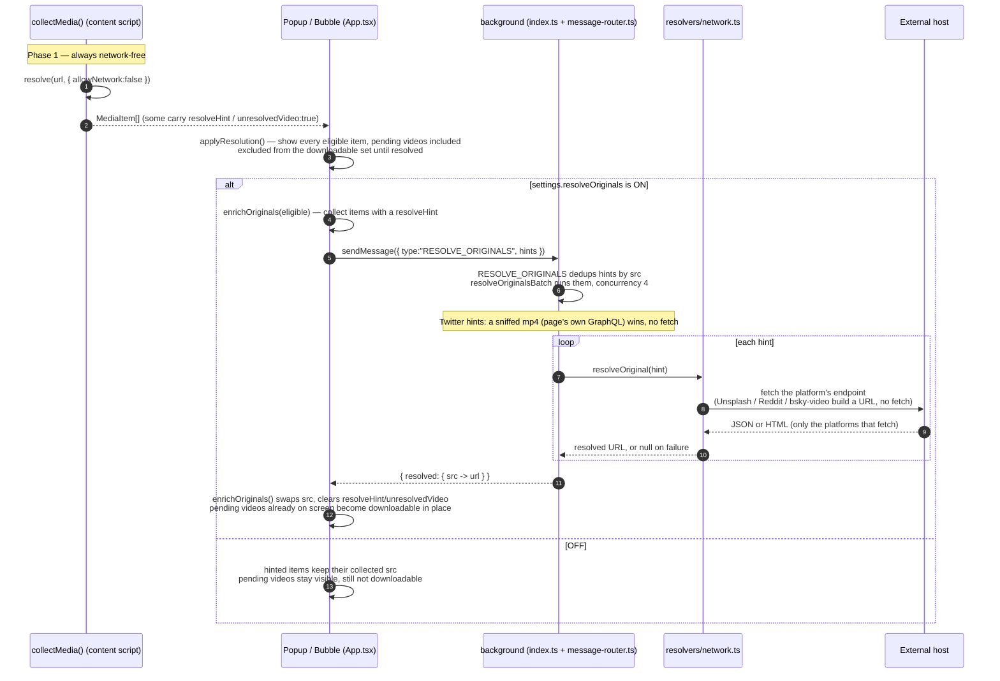

**Resolve exact originals** is an opt-in setting (`resolveOriginals`, default **off**). When on, it fetches the exact highest-resolution file for a hinted item from the media's own host: a Twitter
video's mp4, a Wallhaven wallpaper's full-size file, an Unsplash photo's download original. It is the only feature in the extension that contacts a host other than the page you're on.

## Two phases

Resolution runs in two phases. Phase one never touches the network and always runs. Phase two makes the `fetch()` calls, and runs only when the setting is on.

| Phase                      | When                             | Network?                    | Where                                                |
|----------------------------|----------------------------------|-----------------------------|------------------------------------------------------|
| **Passive URL resolution** | Every collection / deep scan     | None — `allowNetwork:false` | `resolve()` registry, in-page (`content/collect.ts`) |
| **Opt-in network resolve** | Only if `resolveOriginals` is on | Yes — a few `fetch()` calls | Background service worker (`resolvers/network.ts`)   |

Phase one is [Collection Pipeline](./collection-pipeline.md)'s `resolve()`
registry: 30 dedicated resolvers (Twitter, Instagram, Facebook, Threads, Unsplash, Wallhaven, Behance, Bluesky, Pinterest, Reddit, Flickr, ArtStation, Pixiv, Magnific, Arc XP, YouTube, Mastodon,
Booru, Sankaku, Xiaohongshu, Der Spiegel, Onedio, and more — the full ordered list is in
[Collection Pipeline](./collection-pipeline.md)) plus a generic fallback, run in-page. For most URLs it resolves the original with no network call: Twitter `name=orig`, Unsplash query-param stripping,
Wallhaven full-file paths built from the DOM's own extension evidence. When it can't finish locally it attaches a `resolveHint` (or marks a video `unresolvedVideo`) instead of guessing or fetching,
and leaves the rest to phase two. Iframe-embedded players are handled separately: the collector's embed scan (`content/collect.ts`) attaches the `vimeo` and `dailymotion` hints, since neither has a
registry resolver.

## What it contacts

Phase two is `resolveOriginal(hint, deps)` in
`packages/core/src/resolvers/network.ts`. It runs in the background service worker only — never in a content script or the popup — and dispatches on `hint.platform`:

| Platform       | Endpoint                                                                                                                                                                                                                                                                                  | What it fetches                                                                                                                                                                                                                                                                                                                                                                                                                                                                                                                                                                                          |
|----------------|-------------------------------------------------------------------------------------------------------------------------------------------------------------------------------------------------------------------------------------------------------------------------------------------|----------------------------------------------------------------------------------------------------------------------------------------------------------------------------------------------------------------------------------------------------------------------------------------------------------------------------------------------------------------------------------------------------------------------------------------------------------------------------------------------------------------------------------------------------------------------------------------------------------|
| `twitter`      | `https://cdn.syndication.twimg.com/tweet-result?id=<id>&token=<token>&lang=en`                                                                                                                                                                                                            | The tweet's syndication JSON. A video hint picks the highest-bitrate `video/mp4` from `mediaDetails[].video_info.variants`, and falls back to the `application/x-mpegURL` (HLS) master when there is no progressive mp4. A `photo <sid> <n>` hint returns the n-th entry's `media_url_https` forced to `name=orig`. The token uses react-tweet's `getToken` algorithm (public, no key).                                                                                                                                                                                                                  |
| `wallhaven`    | `https://wallhaven.cc/api/v1/w/<id>`                                                                                                                                                                                                                                                      | The wallpaper's public API record; reads `data.path`, the full-size file URL.                                                                                                                                                                                                                                                                                                                                                                                                                                                                                                                            |
| `unsplash`     | *(no fetch)*                                                                                                                                                                                                                                                                              | Builds `https://unsplash.com/photos/<id>/download`, Unsplash's own download-redirect URL. The request only happens later, if the item is downloaded, via `chrome.downloads`.                                                                                                                                                                                                                                                                                                                                                                                                                             |
| `vimeo`        | `https://player.vimeo.com/video/<id>/config`                                                                                                                                                                                                                                              | The public, refererless player config. Picks the highest progressive mp4 from `request.files.progressive[]`, and falls back to the `request.files.hls` master to capture. Domain-locked embeds 403 and stay unresolved.                                                                                                                                                                                                                                                                                                                                                                                  |
| `dailymotion`  | `https://www.dailymotion.com/player/metadata/video/<id>`                                                                                                                                                                                                                                  | The public player metadata. Returns the `qualities.auto` HLS master to capture — modern Dailymotion is HLS-only. Videos flagged `protected_delivery:true` or carrying an `error` (DRM or geo-locked) return `null`.                                                                                                                                                                                                                                                                                                                                                                                      |
| `rutube`       | `https://rutube.ru/api/play/options/<id>/?format=json`                                                                                                                                                                                                                                    | The public play-options API (no auth). Returns `video_balancer.m3u8`, the unsigned `bl.rutube.ru` HLS master (the balancer mints the signed per-variant playlists itself), pinned to `rutube.ru`. HLS-only; adult/premium/geo-gated streams simply yield no usable master.                                                                                                                                                                                                                                                                                                                               |
| `rumble`       | *(hint = the rumble.com-pinned watch/embed URL)* the embed id from an `/embed/<id>/` URL, else `https://rumble.com/api/Media/oembed.json?url=<watch>`, then `https://rumble.com/embedJS/u3/?request=video&ver=2&v=<embedId>`                                                              | The watch HTML is Cloudflare-gated, but the JSON APIs are open. Derives the embed id (oEmbed when needed), then returns the `ua.hls.auto.url` HLS master, pinned to the Rumble-CDN allowlist. HLS-only — 2026 samples expose no progressive mp4.                                                                                                                                                                                                                                                                                                                                                         |
| `peertube`     | *(hint = the canonical `https://<instance>/videos/embed/<id>` URL)* `<instance>/api/v1/config`, then `<instance>/api/v1/videos/<id>`                                                                                                                                                      | Host-agnostic across the federation. The instance host is SSRF-guarded, then `/api/v1/config` must report a `serverVersion` (confirming PeerTube) before the video is fetched — a `/w/<id>` shape on an arbitrary host can't drive a blind fetch. Returns the widest direct `fileUrl` (progressive + HLS rendition lists), else the `streamingPlaylists[0].playlistUrl` master. The media host is not fixed (instance / object storage / federated), so **every returned URL is re-guarded with `isSafeCaptureUrl()`** instead of host-pinned. Private/password/internal videos expose no file → `null`. |
| `loom`         | *(POST, unauthenticated)* `https://www.loom.com/api/campaigns/sessions/<id>/transcoded-url`, then `.../raw-url` on a 204                                                                                                                                                                  | The public transcode endpoint returns a CloudFront-signed `cdn.loom.com` mp4 (a direct, time-limited download — resolved on demand, never cached). A recording with no transcoded render yet answers 204; the resolver then reads `raw-url` → the `luna.loom.com` HLS master to capture. Both hosts are pinned to `loom.com`. Workspace-restricted looms 401/403 and resolve to `null`.                                                                                                                                                                                                                  |
| `bsky`         | *(video)* `https://video.bsky.app/watch/<did>/<cid>/playlist.m3u8`, built directly. *(blob)* the account's PDS, resolved from its DID doc (`plc.directory` for `did:plc`, the `did:web` domain's `/.well-known/did.json`), then `<pds>/xrpc/com.atproto.sync.getBlob?did=<did>&cid=<cid>` | A video hint returns the HLS master with no fetch. A blob hint fetches the uploaded original via `getBlob`.                                                                                                                                                                                                                                                                                                                                                                                                                                                                                              |
| `pinterest`    | `https://widgets.pinterest.com/v3/pidgets/pins/info/?pin_ids=<id>`                                                                                                                                                                                                                        | The public, unauthenticated pin-widget record. Returns the progressive mp4 (`V_720P`) when present, else an HLS master (`V_HLSV4` / `V_HLSV3_MOBILE`) to capture.                                                                                                                                                                                                                                                                                                                                                                                                                                        |
| `reddit`       | *(no fetch)*                                                                                                                                                                                                                                                                              | Builds `https://v.redd.it/<id>/HLSPlaylist.m3u8`, the signature-free HLS master. The extension's HLS engine muxes back its separate audio rendition.                                                                                                                                                                                                                                                                                                                                                                                                                                                     |
| `flickr`       | `https://www.flickr.com/photo.gne?id=<id>`, then that photo's `/sizes/` page                                                                                                                                                                                                              | Two chained keyless fetches: the canonical photo page (host-pinned to `flickr.com`), then its sizes page, whose HTML carries the correct-secret URL for the largest size — a size served under a different secret than the thumbnail.                                                                                                                                                                                                                                                                                                                                                                    |
| `artstation`   | *(image)* the `/4k/` sibling of the `/large/` URL. *(video)* `https://www.artstation.com/projects/<hash>.json`, then the clip's signed embed page                                                                                                                                         | An image hint probes `/4k/` and returns it only on an ok image response. A video hint reads the project JSON, fetches its embed page, and returns the largest unsigned `<source>` mp4.                                                                                                                                                                                                                                                                                                                                                                                                                   |
| `twitch` (VOD) | *(hint = `vod <id>`)* an anonymous `PlaybackAccessToken` GQL query (raw, not persisted; public web Client-ID) at `https://gql.twitch.tv/gql`                                                                                                                                              | Mints the sig+token authorizing `https://usher.ttvnw.net/vod/<id>.m3u8`, the HLS master (a VOD has no single mp4), returned to capture and pinned to `ttvnw.net`. Shares the `twitch` platform tag with the clip resolver, told apart by the `vod ` id prefix. Sub-only/private VODs mint a token usher then 403s — capture fails (no circumvention).                                                                                                                                                                                                                                                    |
| `soundcloud`   | *(hint = the track-page URL)* the page → its `a-v2.sndcdn.com` bundle (client_id) → `https://api-v2.soundcloud.com/resolve?url=<track>&client_id=<id>` → a `media.transcodings[]` entry → that entry's `?client_id=` URL                                                                  | SoundCloud's `api-v2` needs an anonymous `client_id`, scraped from the page's own JS bundle. Prefers the HLS transcoding (captured to m4a/mp3 by the audio-only path, honouring the MP3-transcode setting), else a progressive single file. The track URL is pinned to `soundcloud.com`, the final stream to `sndcdn.com`. A non-track (user/playlist) or a private/go+ track yields nothing.                                                                                                                                                                                                            |
| `streamable`   | `https://api.streamable.com/videos/<id>`                                                                                                                                                                                                                                                  | The public video API (no auth). Returns `files.mp4.url` (else `files['mp4-mobile'].url`), the direct progressive mp4, pinned to `streamable.com`.                                                                                                                                                                                                                                                                                                                                                                                                                                                        |
| `redgifs`      | `https://api.redgifs.com/v2/auth/temporary` (anon token), then `https://api.redgifs.com/v2/gifs/<id>` (Bearer)                                                                                                                                                                            | Two keyless hops — an anonymous temporary token, then the gif record. The mp4 sits on the Referer/UA-protected `media.redgifs.com`, so the resolver only *derives* the URL and hands it to the download path (the Referer rewrite + the browser's real UA clear the 403); it never fetches the media host itself.                                                                                                                                                                                                                                                                                   |
| `sankaku`      | `https://sankakuapi.com/v2/posts/<id>?lang=en`                                                                                                                                                                                                                                            | The post's API record (`credentials: include`, so a logged-in session reaches restricted posts). Returns `data.file_url`, pinned to `sankakucomplex.com`.                                                                                                                                                                                                                                                                                                                                                                                                                                                |
| `9gag`         | *(no fetch)*                                                                                                                                                                                                                                                                              | Builds `https://img-9gag-fun.9cache.com/photo/<id>_460sv.mp4`, 9GAG's deterministic video-CDN URL, pinned to `9cache.com`.                                                                                                                                                                                                                                                                                                                                                                                                                                                                               |
| `gallery-page` | *(the page URL carried in the hint)*                                                                                                                                                                                                                                                      | Host-agnostic fallback for gallery/post pages: `isSafeCaptureUrl()`-guarded, it fetches the page, extracts the main image, and strips URL secrets. The returned media URL is re-guarded, not host-pinned.                                                                                                                                                                                                                                                                                                                                                                                                |

Every URL pulled from a fetched response — JSON or HTML — passes through
`pinnedUrl()` before it's trusted. It must be `https:`, and its hostname must equal (or be a subdomain of) the expected host family: `twimg.com`,
`wallhaven.cc`, `vimeocdn.com`, `dailymotion.com`, `rutube.ru`, the Rumble-CDN allowlist (`rumble.com`, `1a-1791.com`, `rmbl.ws`, `rumble.cloud`), `bsky.app`,
`pinimg.com`, `v.redd.it`, `staticflickr.com`, `artstation.com`, `loom.com`,
`ttvnw.net` (Twitch VOD master), `sndcdn.com` (SoundCloud stream),
`streamable.com`, `sankakucomplex.com`, `9cache.com` (9GAG), or the account's own PDS host for a Bluesky blob. Anything else — a malformed URL, an unexpected redirect target — resolves to `null`
instead of becoming a downloadable URL.

Three host-agnostic resolvers can't name a fixed family. The Bluesky blob path, PeerTube, and the `gallery-page` scraper instead require `https:` **plus**
`isSafeCaptureUrl()` — the SSRF policy that rejects any internal / loopback / link-local / object-storage-metadata target — on both the page-controlled request host and the returned media URL.
PeerTube uses this because a video's media may sit on the instance, an object-storage subdomain, or another federated instance entirely, so there is no suffix to pin.
`resolveOriginal()` never throws; a failed lookup for one item just leaves that item as collected, or (for a per-item "Get video" request) surfaces it as failed rather than silently dropping it
(see [On-demand](#on-demand-the-get-video--get-all-videos-buttons)
below).

The Bluesky blob path adds a second check. Its `did:web` domain and the resolved PDS origin both come from data the page can influence (the DID and its DID document), so the did-document fetch and the
final `getBlob` URL each pass
`isSafeCaptureUrl()` — the same SSRF guard the HLS/DASH capture engines use (`packages/core/src/download/stream/ssrf-guard.ts`). That blocks loopback, private, link-local, CGNAT, and cloud-metadata
hosts (e.g. `169.254.169.254`), so a hostile DID document can't steer the fetch at an internal address.

For Twitter, a real mp4 the page's own GraphQL responses already exposed wins over any fetch. `resolveOriginalsBatch` checks the sending tab's sniffed mp4 map (keyed by the poster's media id) first,
so a clip the user can see — including age-restricted ones — usually resolves with no request at all. Only when the page exposed no mp4 does `twitter()` call syndication. That endpoint returns a
tombstone-shaped response — no usable `mediaDetails` — for tweets it won't serve, commonly ones marked **age-restricted or sensitive**; `twitter()` finds no
`video/mp4` variant and returns `null`, the same as any other miss.

## End-to-end flow

- `applyResolution()` (`popup/hooks/useMediaEngine.ts`) displays every eligible item straight away — poster-only pending videos included — then calls
  `enrichOriginals` only `if (s.resolveOriginals)`. It runs on every path that populates the grid: the initial scan, a manual rescan, a deep-scan merge, and a settings change. So **toggling the
  setting on later retroactively resolves already-collected items** without a fresh scan.
- `enrichOriginals()` never mutates an item in place. A resolved hit becomes a new object with `src` swapped to the resolved URL and `resolveHint` /
  `unresolvedVideo` cleared, then replaces the old entry wherever its old `src` is found. A pending video already on screen swaps its poster for the mp4 in place — moving from "shown, not
  downloadable" to downloadable without disappearing. An item whose hint never resolves stays as it was: visible, still excluded from the downloadable set.
- A generation counter (`resolveGenRef`) discards a resolution that finishes after a newer scan or rescan has started, so a slow request can't clobber fresher results.

## On-demand: the "Get video" / "Get all videos" buttons

Phase two has three triggers. The diagram above is the first:

| Trigger                       | Where it lives                                                                                                                                                   | Gated by `resolveOriginals`?                   |
|-------------------------------|------------------------------------------------------------------------------------------------------------------------------------------------------------------|------------------------------------------------|
| **Global auto-resolve**       | `enrichOriginals()`, run from `applyResolution()` on every scan, rescan, deep-scan merge, and settings change                                                    | Yes — only fires `if (s.resolveOriginals)`     |
| **Bulk "Get all videos (N)"** | Footer button, `handleFetchAllVideos()` (`useMediaEngine.ts`) — resolves every pending video in the current view in one batched request; shown only when `N > 0` | No — one explicit user action for all N        |
| **Per-item "Get video"**      | The action button on a pending video's grid tile / preview modal, `handleFetchVideo()` (`useMediaEngine.ts`)                                                     | No — fires unconditionally, one hint at a time |

All three end up sending the same `RESOLVE_ORIGINALS` message and calling the same
`resolveOriginal(hint, deps)` in the background. They differ only in how many hints go in the request (the whole eligible batch vs. a single one) and whether the setting gates the call. The button is
a deliberate, one-item request the user just made, so it doesn't wait for the passive-collection setting to be on. A pending video that never picked up a `resolveHint` — no `/status/` link nearby and
no status id recoverable from the page URL — has no button to press; its tile reads
"can't fetch".

While a per-item fetch is in flight the tile shows a spinner and the button is disabled. On success the item's `src` swaps to the resolved mp4 in place,
`unresolvedVideo` clears, and it joins the downloadable set — the same end state as the automatic path, for one item on request.

### Graceful failure

When the resolver returns `null` — a tombstoned tweet, a rejected redirect, a network error — a per-item request records the failure instead of dropping it silently. `handleFetchVideo()` marks the
failed `src`, the tile's label switches to "couldn't fetch" (the preview modal shows "Couldn't fetch — retry"), and the button becomes "Retry video" so the user can try again — for example once an
age-restricted tweet is no longer tombstoned, or after a transient network blip. (An HLS-only video with stream capture turned off is a separate case: it resolves, but `applyResolved` returns `null`
and the tile stays quietly pending rather than marked failed — turning on stream capture resolves it next time.)

## Privacy

- **Off by default.** Every other feature — collection, deep scan, size enrichment — either reads only what the page already loaded, or (image-size
  `HEAD` requests) stays on the same host. This is the one setting that talks to an external host on your behalf: Twitter, Wallhaven, Unsplash, Vimeo, Dailymotion, Rutube, Rumble, PeerTube (whichever
  instance the video is on), Loom, Bluesky, Pinterest, Reddit, Flickr, ArtStation, Twitch (a VOD's access token + master), or SoundCloud (the track page + api-v2), whichever the hinted item came from.
- What's sent is minimal: the id already visible in the page's own URL (a tweet status id, a Wallhaven wallpaper id, a Flickr photo id, and so on), or nothing at all — Unsplash, Reddit, and Bluesky
  video just build a URL. No cookies or auth are attached; the fetch runs from the background service worker, not the page.
- Toggling **Resolve exact originals (network requests)** in Settings is the single switch for *automatic* resolution; see
  [Getting Started](../getting-started/quick-start.md#settings).
- The per-item **"Get video"** button contacts the same host even with that setting off — it's an explicit, one-item request the user just triggered, not passive background collection.

## Adding a new resolver

1. Implement the `Resolver` interface (`packages/core/src/resolvers/types.ts`): a
   `match(u, ctx)` guard and a synchronous, network-free `resolve(u, ctx)` that returns `MediaCandidate[]` (`[]` means "not mine / try the next one").
2. Add it to `REGISTRY` in `packages/core/src/resolvers/index.ts`, **before**
   `genericResolver` — order matters, since the first resolver to return a non-empty array wins.
3. If the exact original needs a network fetch, add the platform to
   `ResolvePlatform` (`packages/core/src/types.ts`), attach a `resolveHint` from
   `resolve()`, and add a case to `resolveOriginal()`
   (`packages/core/src/resolvers/network.ts`). Run any URL pulled from a response through `pinnedUrl()` before returning it.
4. A resolver that only needs DOM evidence (no network case) can skip step 3 — see
   `wallhavenResolver` when it has extension evidence.

---

Related: [Collection Pipeline](./collection-pipeline.md) (the `resolve()` registry and passive resolution) · [Deep Scan](../guides/deep-scan.md) (merged results carry the same
hints) · [Architecture](./architecture.md) · [Download](../guides/download.md).

---

