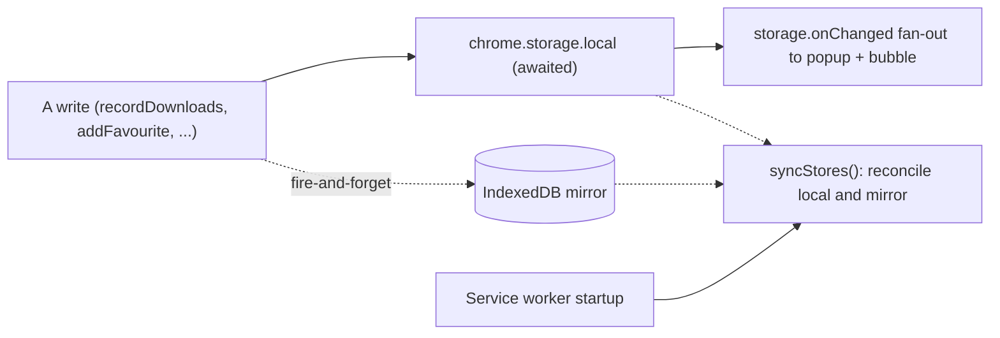

The extension stores everything on your device. Two layers do the work: the
browser's `chrome.storage` for reactive reads and writes, and an IndexedDB mirror
that keeps the data durable if the browser evicts local storage. This page maps
what is stored where, what (if anything) leaves the device, and how the mirror
stays consistent. For the surfaces and message flow around these stores, see
[Architecture](/media-bulk-downloads/how-it-works/architecture/).

## What is stored, and where

| Store | Area | Key | Holds |
|---|---|---|---|
| Settings | `chrome.storage.sync` | `settings` | Your preferences (`SettingsData`). |
| Download history | `chrome.storage.local` | `downloadHistory` | Completed downloads. |
| Favourites | `chrome.storage.local` | `favourites` | Starred media. |
| Blocked sources | `chrome.storage.local` | `excluded` | The per-profile blocklist. |
| Download queue | `chrome.storage.local` | `downloadQueue` | In-flight and recent downloads. |
| Per-site overrides | `chrome.storage.local` | `perHostSettings` | Per-domain settings overrides. |
| Per-site scan memory | `chrome.storage.local` | `perHostScanMemory` | Learned scroll/settle timings (numbers only). |

## The sync boundary: what leaves the device

Only one store rides the browser's own account sync:

- **Settings** live in `chrome.storage.sync`, so they follow you across devices
  signed into the same browser. This is the one store that leaves the device, and
  it goes to your browser account, not to any server of ours.
- **Everything else** lives in `chrome.storage.local` and its IndexedDB mirror,
  and never leaves the device.

History, favourites, and the blocklist are deliberately kept local: they can grow
large and would blow the small per-item `chrome.storage.sync` quota. Per-site
overrides and scan memory are device-local for the same reason, and scan memory
stores only numbers, never URLs.

Your data leaves the device by exactly one other route, and only when you ask: an
explicit [backup export](/media-bulk-downloads/guides/backup-restore/).

## The durable mirror

`chrome.storage.local` is fast and reactive, but a browser can evict it under
storage pressure. So every local write is a write-through to IndexedDB:

- **`durableSet`** writes to `chrome.storage.local` and awaits it (callers depend
  on its ordering and on the `onChanged` event for live UI updates), then mirrors
  to IndexedDB fire-and-forget. A mirror failure is logged, never thrown, so a
  storage hiccup can never break a download or a scan.
- **`persistStorage`** calls `navigator.storage.persist()` on startup to ask the
  browser to make the storage non-evictable. It needs no manifest permission; the
  `storage` permission is for `chrome.storage`, not IndexedDB.
- **`syncStores`** reconciles the two on startup, local-wins-if-present: a key in
  local repairs the mirror; a key only in the mirror (local was evicted) is
  restored to local, re-checking for a concurrent write first so it never clobbers
  a fresh one.

Six keys are mirrored (`downloadHistory`, `favourites`, `excluded`,
`downloadQueue`, `perHostSettings`, `perHostScanMemory`). Settings is not: it is
sync-backed already.

## Caps and byte budgets

`chrome.storage.local` shares a modest budget (roughly 5 MB per the code's
assumptions), so each store is bounded by both a count and a byte budget, newest
kept:

| Store | Count cap | Byte budget |
|---|---|---|
| History | 500 | 2,000,000 |
| Favourites | 500 | 1,000,000 |
| Blocked sources | 500 | 500,000 |
| Queue (finished items) | 200 | 1,000,000 |
| Per-site overrides | 200 hosts (LRU) | n/a |

Live queue items (queued or active) are never pruned; only finished and failed
rows are bounded. History and favourites de-duplicate by a canonical source key
(see the [collection pipeline's dedup section](/media-bulk-downloads/how-it-works/collection-pipeline/))
and keep the newest of each.

## Per-site overrides

`perHostSettings` is a `Record<domain, Partial<SettingsData>>` merged over your
global settings so a site opens with its own remembered collection preferences.
Precedence is defaults, then global, then the host override. Only twelve
collection-related fields are ever stored (minimum size, exclude Base64/emoji,
resolve originals, capture streams, smart defaults, the four deep-scan limits, and
the two convert settings); download destination and window sizes stay global. See
the [Settings reference](/media-bulk-downloads/reference/settings/#per-site-overrides).

## Backups

A [backup](/media-bulk-downloads/guides/backup-restore/) is a versioned JSON file
(`app: "media-bulk-downloads"`, `version: 1`) containing your settings,
favourites, history, and blocklist. It does not include the transient queue or the
per-site stores. On export, favourites and history are run through a sanitizer that
strips signed-URL secrets from saved links and marks them redacted. On import,
settings pass through the same clamping as a normal load, and entries are validated
(http(s) only, numeric timestamps), so a hand-edited or foreign file cannot inject
bad values.

## Related

- [Architecture](/media-bulk-downloads/how-it-works/architecture/) for the surfaces and message catalog.
- [Backup & restore](/media-bulk-downloads/guides/backup-restore/) for exporting and importing.
- [Permissions & privacy](/media-bulk-downloads/reference/permissions/) for the privacy stance.

---
