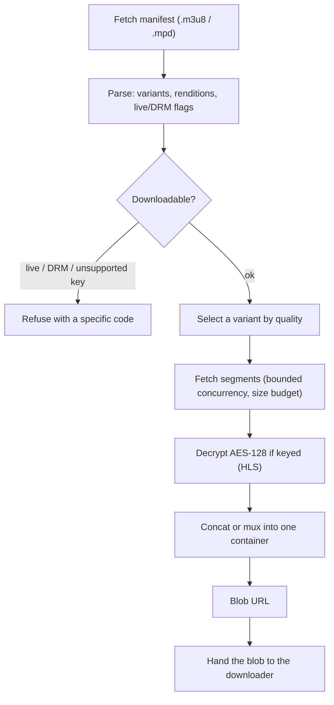

Adaptive video is not a single file: it is a manifest plus many segments. Capture
turns that back into one downloadable file. This page is the engine's internals;
for the user-facing feature (turning it on, the quality setting, what it can and
cannot grab), see the [Stream capture guide](/media-bulk-downloads/guides/stream-capture/),
and for how a `.m3u8` / `.mpd` is surfaced as a capture item in the first place,
see the [collection pipeline](/media-bulk-downloads/how-it-works/collection-pipeline/).

## The pipeline

The HLS and DASH engines live in `packages/core/src/download/stream/` and are pure
and deterministic: every fetch, and the decrypt function, are injected, so they are
fully unit-tested without a browser. The host supplies the real fetch, WebCrypto,
and muxer.

## What is refused, and why

Capture only handles media that is actually a set of files it can assemble.
Everything else is refused up front with a specific code, so the UI can explain it:

| Refused | HLS code | DASH code | Why |
|---|---|---|---|
| Live stream | `live` | `live` | No end; nothing finite to assemble. `#EXT-X-ENDLIST` (HLS) or `type="dynamic"` (DASH) decides. |
| DRM | `drm` | `drm` | Widevine / PlayReady / FairPlay and any `ContentProtection` cannot be decrypted. |
| Sample-AES | `sample-aes` | n/a | Only full-segment AES-128 is supported. |
| Non-AES-128 key | `unsupported-key` | n/a | Any other `EXT-X-KEY` method, or AES-128 with no key URI. |
| Unsupported layout | n/a | `unsupported` | DASH `SegmentList`/`SegmentBase`-only, or an open-ended `SegmentTimeline` (`r="-1"`) with no known duration. |
| Too many segments | `too-large` | `too-large` | DASH is capped at 100,000 segments. |
| Empty / no variants | `empty`, `no-variants` | `empty`, `no-representations` | Nothing to fetch. |

DASH capture is clear-only (no decryption); HLS handles AES-128 with a WebCrypto
AES-CBC decrypt, PKCS7-stripped, the 16-byte key fetched once and cached, the IV
taken from `EXT-X-KEY` or derived from the media sequence.

## Size guards

Three independent limits keep a hostile or huge stream from exhausting memory:

- **`STREAM_MAX_BYTES` = 1 GiB** is the cumulative budget across all segments of a
  capture; exceeding it aborts.
- A **per-response ceiling** (`readBounded`) aborts any single manifest or segment
  that streams past the same budget, before the cumulative total would notice.
- **MP3 transcoding** is capped at 256 MiB of input, since decoding inflates
  compressed audio roughly tenfold into PCM.

## Choosing a rendition

The `streamQuality` setting maps to the engine:

| Setting | Picks |
|---|---|
| `auto` (default) | The rendition closest to 720p. |
| `best` / `worst` | The highest / lowest bandwidth. |
| `1080` / `720` / `480` | The rendition closest to that height; ties go to the higher bandwidth. |

## Containers and audio

- **MPEG-TS** segments are concatenated into a `.ts` file.
- **fMP4** segments (with an `EXT-X-MAP` init segment) are concatenated into `.mp4`.
- **Demuxed** streams (separate audio rendition), and all DASH, are muxed with
  mp4box.js into a single `.mp4`.
- **Audio-only** honours `audioFormat`: `m4a` remuxes the AAC verbatim (no
  re-encode, best quality); `mp3-128/192/320` decode the audio and re-encode it
  with lamejs in an `OfflineAudioContext` (exempt from the autoplay gesture rule).

## Where capture runs

Capture needs a DOM-capable realm (`URL.createObjectURL`, WebCrypto, Web Audio) and
CORS-free fetch, which a background service worker lacks. The
[platform seam](/media-bulk-downloads/how-it-works/architecture/) picks the right
host per browser, by API presence rather than user-agent sniffing:

| Browser | Capture host | Realm |
|---|---|---|
| Chrome, Edge | `offscreen` | An offscreen document created on demand. |
| Firefox | `background` | The extension's background page (no offscreen API). |
| Safari | `page` | An extension page (no offscreen API). |

All three are available, so capture works on every supported browser. The engine
body is shared code; only the realm differs. The capture realm has no
`chrome.downloads`, so it returns a blob URL and the background hands that blob (not
the manifest URL) to the downloader, then records history like any other download.

## Blob lifecycle

A finished capture is published as a blob URL, revoked after
**`BLOB_TTL_MS` = 600,000 ms (10 minutes)**. The long window is deliberate: when
"Ask where to save each file" is on, the browser's Save dialog can sit open for
minutes before the download reads the blob, so the blob must outlive the dialog. A
shorter window revoked the blob mid-dialog and the download failed with no file
saved. The timeout is only a memory-cleanup fallback; a normal save reads the blob
long before it fires.

## Safety

Every capture fetch (manifest, key, and segment) passes an SSRF guard: http(s)
only, and private, loopback, link-local, CGNAT, and cloud-metadata hosts are
blocked, including DNS-rebinding tricks like `nip.io` / `sslip.io`. Fetches use a
30-second timeout and refuse redirects, so a manifest cannot bounce a request onto
an internal address.

## Related

- [Stream capture guide](/media-bulk-downloads/guides/stream-capture/) for using the feature.
- [Architecture](/media-bulk-downloads/how-it-works/architecture/) for the capture message flow and platform seam.
- [Collection pipeline](/media-bulk-downloads/how-it-works/collection-pipeline/) for how streams are surfaced.

---
